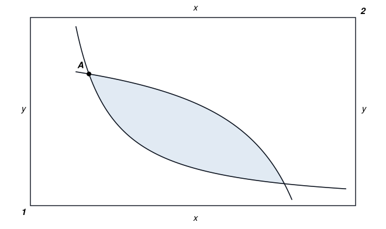
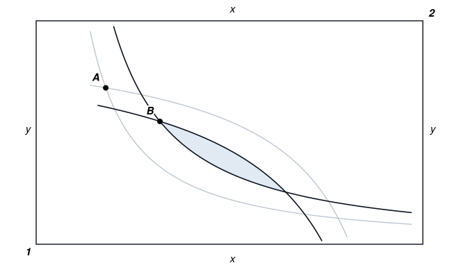
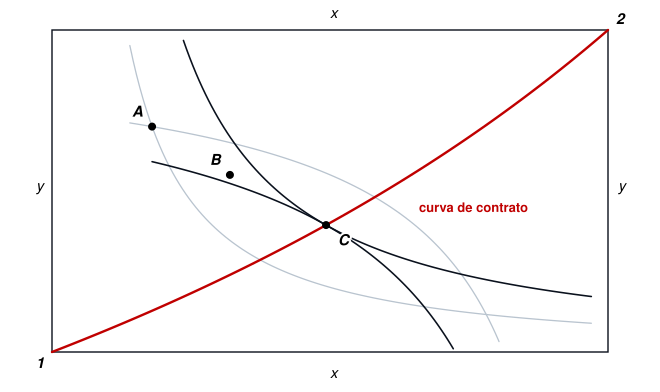
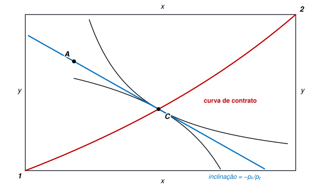
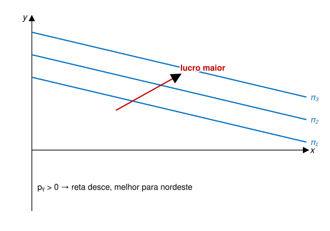
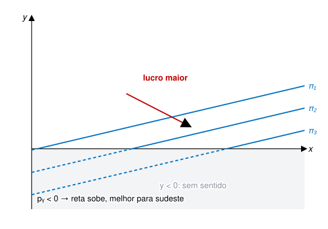
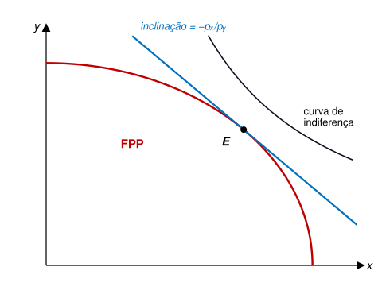

## Exemplo: redução de esgoto lançado no Tietê

::: no-bullet
Considere duas fábricas despejando a mesma carga no rio.
:::

::: no-bullet
O órgão ambiental exige um abatimento (redução) total da poluição de
**100 toneladas**.
:::

::: no-bullet
Suponha que
:::

- A fábrica **A** consegue abater poluição a **R\$ 1 mil** por tonelada
- A fábrica **B** consegue abater poluição a **R\$ 5 mil** por tonelada

::: no-bullet
**Como você dividiria o abatimento entre as duas firmas?**
:::

## Exemplo: redução de esgoto lançado no Tietê

- [**50 t em cada uma:** 50 × 1 + 50 × 5 = **R\$ 300 mil**.]{.fragment
  fragment-index="1"}
- [**100 t só na A:** 100 × 1 = **R\$ 100 mil**.]{.fragment
  fragment-index="2"}

::: no-bullet
[As duas alternativas cortam as mesmas 100 toneladas.]{.fragment
fragment-index="3"}
:::

::: no-bullet
[**A segunda é melhor? É a mais justa?**]{.fragment fragment-index="3"}
:::

## Aula Passada

- O que é Economia do Meio Ambiente?
- Introdução do Curso

## Agenda {.smaller}

- Algumas Correntes de Pensamento
  - Valor Intrínseco vs. Valor Instrumental
  - Biocentrismo vs. Antropocentrismo
  - Princípio Preventivo
  - Sustentabilidade
- Eficiência Econômica
  - Fronteira de Pareto
  - Eficiência em Trocas e em Produção
  - Princípio Equimarginal (exercício em duplas)
  - Equilíbrio Competitivo e Teoremas do Bem-Estar
  - Oferta e Demanda
    - Equilíbrio de Mercado
    - Disposição a Pagar

::: no-bullet
Referência: Kolstad, cap. 4.
:::

## Correntes de Pensamento {.section-cover}

::: section-sub
Como atribuir valor ao Meio Ambiente?
:::

## Outro exemplo: represa extinguirá espécie de planta

::: no-bullet
Suponha que a a construção de uma represa vá extinguir uma espécie de
planta. A princípio, **ninguém a usa para nada**: não é insumo para
remédio, não é comestível e não atrai turistas.
:::

::: no-bullet
**Isso é um custo ambiental? Por quê?**
:::

- [Não. Se ninguém a usa, não há perda a contabilizar.]{.fragment
  fragment-index="1"}
- [Sim. A espécie vale por si só, independentemente de nos
  servir.]{.fragment fragment-index="2"}
- [Sim. Ela poderia vir a ser útil, mas jamais saberemos.]{.fragment
  fragment-index="3"}

::: no-bullet
[As três respostas são válidas e atreladas a diferentes formas de dar
valor aos bens ambientais, que discutiremos em seguida.]{.fragment
fragment-index="4"}
:::

## Algumas Correntes de Pensamento

- Como podemos avaliar bens ou danos ambientais?
  - Há diferentes “valores” que se podem atribuir a um rio limpo, por
    exemplo.
    - Dependendo de quais valores contam (ou não), avaliação muda.
  - Há também diferentes formas de se avaliar a gravidade de um dano
    ambiental.
    - Quão incertas são as consequências e quanto destas queremos
      considerar?

## Valores Instrumental e Intrínseco

- **Valor Instrumental** tem a ver com a utilidade de alguma coisa.
  - Algo tem valor porque funciona como instrumento para atingir um
    objetivo útil.
- **Valor Intrínseco** não está atrelado à utilidade de algo.
  - Pode ser inútil e ainda assim ter valor intrínseco.
- **Exemplo 1:** mosquitos
  - Valor instrumental é, provavelmente, negativo (estorvo, não nos
    serve para nada).
  - Valor intrínseco: toda vida tem seu valor, independentemente de nos
    incomodar ou não.
- **Exemplo 2:** floresta Amazônica
  - Valor instrumental (até pouco tempo atrás) era visto como muito
    pequeno para pessoas que moram em São Paulo, por exemplo.
  - Valor intrínseco: saber que a floresta existe nos dá uma sensação
    boa.

## Biocentrismo vs. Antropocentrismo

- Biocentrismo vs. Antropocentrismo
  - **Biocentrismo** propõe que **todos os seres vivos têm valor**,
    independentemente de seus usos para nós.
    - Meio ambiente, portanto, tem valor mesmo que não nos seja útil.
  - **Antropocentrismo** propõe que meio ambiente **tem valor na medida
    em que nos proporciona gratificação material**.
    - Mosquito terá valor, por exemplo, se eu puder modificá-lo
      geneticamente para combater pragas de ratos que destroem estoques
      de alimentos.
    - Floresta Amazônica tem valor porque sua umidade traz chuvas ao
      Centro-Oeste, aumentando a produtividade das lavouras.

## Princípio Preventivo

- Outra corrente de pensamento se baseia no fato de que danos ambientais
  podem ser muito incertos e irreversíveis.
  - Por exemplo, a construção de uma represa pode extinguir uma espécie
    de planta cuja essência poderia ser usada na cura do câncer de pele.
    - Qual valor foi perdido? O valor que as pessoas dão à planta ou o
      valor das vidas que poderiam ter sido salvas?
- A ideia do Princípio Preventivo é de que deveríamos minimizar
  arrependimentos.
  - Se há alguma chance de dano irreversível, deveríamos evitá-lo, a não
    ser que custo social seja “alto demais”.
- [Problemas com esse princípio:]{.fragment fragment-index="1"}
  - [Pode ser paralisante.]{.fragment fragment-index="1"}
  - [É difícil avaliar quando um custo social se torna “alto
    demais”.]{.fragment fragment-index="1"}

## Sustentabilidade

- Usar o meio ambiente para necessidades humanas, mas sem comprometer a
  manutenção de ecossistemas no longo prazo.
- **Desenvolvimento sustentável:** “desenvolvimento que atenda às
  necessidades do presente sem comprometer a habilidade de gerações
  futuras de atender às suas próprias necessidades” (Toman, 1994).
- Ideia tem apelo em Economia, pois pressupõe que existe uma
  **utilização ótima do meio ambiente**.
  - Pescar é bom, mas pesca excessiva é ruim.
  - A partir de que ponto “é excessivo”?
- Para Robert Solow, por exemplo, sustentabilidade seria garantir que
  **gerações futuras estejam ao menos tão bem quanto as presentes**.

## Onde a Economia se posiciona

::: no-bullet
O arcabouço que construiremos a partir de agora tende a ser
**antropocêntrico e instrumental**, pois mede valor pela **disposição a
pagar** das pessoas.
:::

- Isso é mais amplo do que parece e pode incluir **valor de
  existência**.
  - Posso pagar para saber que a Amazônia continua de pé, sem nunca
    pretender visitá-la.
- [Mas há dois valores que a disposição a pagar **não**
  captura:]{.fragment fragment-index="1"}
  - [O de quem não tem renda para expressá-lo;]{.fragment
    fragment-index="1"}
  - [O de quem ainda não nasceu.]{.fragment fragment-index="2"}

::: no-bullet
[É importante que esta limitação esteja transparente, pois nos informa
sobre aquilo que ignoramos, mas que, mesmo assim, pode ser valorizado
por alguns grupos.]{.fragment fragment-index="2"}
:::

## Eficiência Econômica {.section-cover}

::: section-sub
Retomando o Conceito de Ótimo de Pareto
:::

## Eficiência Econômica

- Nos cursos introdutórios de Micro, a noção de **eficiência** aparece
  frequentemente.
  - Em Economia, eficiência é equivalente ao **Ótimo de Pareto**.
  - [Não é possível melhorar bem-estar de alguém sem piorar o do
    outro.]{.fragment fragment-index="1"}
- [Qual é um dos resultados teóricos básicos envolvendo o Ótimo de
  Pareto?]{.fragment fragment-index="1"}
  - [1º Teorema do Bem-Estar → alocações de mercado são
    Pareto-eficientes.]{.fragment fragment-index="2"}
- [Há exceções?]{.fragment fragment-index="2"}
  - [Sim, quando há **falhas de mercado**.]{.fragment
    fragment-index="3"}

## Eficiência Econômica e Meio Ambiente

- No contexto de Economia do Meio Ambiente, trataremos de eficiência ao
  pensarmos em
  - Nível ótimo de poluição, dadas as necessidades materiais;
  - Distribuição ótima dos custos de se reduzir poluição.
- [Exemplo: reduzir poluição da água no Rio Tietê.]{.fragment
  fragment-index="1"}
  - [Primeiro, queremos saber qual é o nível ideal de poluição de
    água.]{.fragment fragment-index="1"}
    - [Zero é uma potencial resposta, mas custos podem ser
      proibitivos.]{.fragment fragment-index="1"}
  - [Segundo, qual é a forma mais eficiente de se reduzir essa
    poluição.]{.fragment fragment-index="2"}
    - [Suponha que a redução ótima seja de 80% em relação ao nível atual
      e que isso possa ser feito com menos despejo de esgoto.]{.fragment
      fragment-index="2"}
    - [Uma alternativa é reduzir em 80% esgoto vindo de todos os bairros
      da cidade;]{.fragment fragment-index="2"}
    - [Entretanto, pode ser mais barato reduzir esse despejo em alguns
      bairros versus outros.]{.fragment fragment-index="2"}
      - [Neste caso, redução poderia ser maior nesses bairros e menor
        naqueles onde custo é maior.]{.fragment fragment-index="2"}

## Fronteira de Pareto

- **Definição:** a fronteira de Pareto consiste em todas as alocações
  para as quais não existe outra alocação que seja Pareto-preferida.
- Consideraremos uma alocação como eficiente se ela for Ótima de Pareto.
  - Ou seja, a alocação precisa estar na fronteira de Pareto.
- Conceito de eficiência de Pareto não deixa recursos “sobrando”.
  - Entretanto, não é possível comparar alocações na fronteira
    (**LOUSA**);
  - Exemplo: alocar todos os recursos para indivíduo 1 ou tudo para 2
    são alternativas igualmente eficientes.
    - [Mas qual é melhor?]{.fragment fragment-index="1"}
    - [Qual é mais justa?]{.fragment fragment-index="1"}

::: no-bullet
[**O critério é mudo sobre isso**, o que constitui outra limitação a ser
reconhecida.]{.fragment fragment-index="2"}
:::

## O caminho até a eficiência

:::::: step-map
::: {.step .now}
**1. Trocas** TMS igual entre os indivíduos
:::

::: step
**2. Produção** TMT igual entre as firmas
:::

::: step
**3. Mercado** TMS $=$ TMT no equilíbrio
:::
::::::

- Discutiremos essas **três condições** em sequência.
- Na próxima aula, voltaremos a elas por meio de um modelo
  formal.\]{.fragment fragment-index=1}

## Eficiência em Trocas

- Trataremos de eficiência (e ineficiência) em dois contextos:
  - Trocas e Produção.
- Recursos estão ineficientemente alocados se é possível trocá-los entre
  indivíduos e aumentar o bem-estar de pelo menos uma pessoa, sem piorar
  o de ninguém.
- Recordemos o conceito de Caixa de Edgeworth.
  - Suponha uma economia de trocas com 2 indivíduos;
  - Cada um tem uma dotação ${\omega }_{i}=({x}_{i}, {y}_{i})$ dos dois
    bens existentes nessa economia.

::: {.callout-note appearance="simple"}
Desenho na LOUSA.
:::

## Caixa de Edgeworth

- Ponto A corresponde à **dotação inicial**: o que cada um tem antes de
  qualquer troca.
- A região sombreada reúne todas as alocações **preferidas por ambos** a A.

::: diagram

:::

## Caixa de Edgeworth

- Ponto B é preferido por ambos a A. **Mas é eficiente?**
- [Não, pois ainda há trocas boas para os dois.]{.fragment
  fragment-index="1"}

::: diagram

:::

## Caixa de Edgeworth

- Em C, as curvas se **tangenciam**: não é possível melhorar um sem
  piorar outro.
- É um ponto onde se igualam as Taxas Marginais de Substituição (TMS).
- [Quantos pontos como C existem?]{.fragment fragment-index="1"}
  - [Toda a linha vermelha: a **curva de contrato**, que liga as duas
    origens.]{.fragment fragment-index="1"}
  - [É a Fronteira de Pareto desta economia, desenhada na
    caixa.]{.fragment fragment-index="2"}

::: diagram

:::

## Preços Relativos e TMS

- Sabemos que o problema de maximização de utilidade leva à equivalência
  entre **taxa marginal de substituição (TMS)** e **preços relativos**.
- No caso em que há mais indivíduos, como preço é igual para todos,
  temos

::: eq-block
$$TM{S}_{xy}^{1}=\frac{{p}_{x}}{{p}_{y}}=TM{S}_{xy}^{2}$$
:::

- Como podemos representar os preços na Caixa de Edgeworth?

## Preços Relativos e TMS

- Reta com inclinação $-\frac{{p}_{x}}{{p}_{y}}$.
  - Passa pela dotação inicial e tangente a ambas as curvas de
    indiferença no equilíbrio eficiente.
- [Partindo de A, o mercado conduz equilíbrio até a **C**.]{.fragment
  fragment-index="1"}
  - [Demais pontos da curva de contrato são **igualmente eficientes**,
    mas inalcançáveis a partir desta dotação.]{.fragment
    fragment-index="1"}

::: {.diagram style="margin-top: -50px;"}

:::

## O caminho até a eficiência

:::::: step-map
::: step
**1. Trocas** TMS igual entre os indivíduos
:::

::: {.step .now}
**2. Produção** TMT igual entre as firmas
:::

::: step
**3. Mercado** TMS $=$ TMT no equilíbrio
:::
::::::

- No caso das trocas, tratamos de como distribuir dois bens ($x$ e $y$)
  entre dois indivíduos.
- **Se há produção**, queremos alocar insumos para produzir
  eficientemente ambos esses bens.
- Suponha uma firma que produz ambos os bens e cuja função lucro seja
  dada por

::: eq-block
$$\pi ={p}_{x}x+{p}_{y}y-C$$
:::

::: {.no-bullet style="font-size: 0.7em; margin-left: 2em;"}
sendo $C$ um custo fixo.
:::

## Eficiência em Produção

- Podemos isolar $y$ na equação anterior e obter

::: eq-block
$$y=\frac{\pi +C}{{p}_{y}}-\frac{{p}_{x}}{{p}_{y}}x$$
:::

- Com isso, desenhamos curvas iso-lucro (**LOUSA**).
  - Estas curvas nos dão composições de $x$ e $y$ que geram o mesmo
    lucro;
  - Se $x$ e $y$ são dois bens, mais para “nordeste” é melhor.
- [Se $x$ é um bem e $y$ é um “mal” (poluição), gráfico
  muda(**LOUSA**).]{.fragment fragment-index="1"}
  - [Preço de $y$ passa a ser negativo (${p}_{y}<0$);]{.fragment
    fragment-index="1"}
  - [Neste caso, mais para “sudeste” é melhor;]{.fragment
    fragment-index="1"}
  - [Note que, para quantidades pequenas de $x$, precisaríamos de $y$
    negativo.]{.fragment fragment-index="1"}

## Curvas de Iso-Lucro: dois bens

- Intercepto $\frac{\pi +C}{{p}_{y}}$ **positivo**, inclinação
  $-\frac{{p}_{x}}{{p}_{y}}$ **negativa**.
- Cada reta reúne as combinações de $x$ e $y$ que dão o **mesmo lucro**.

::: diagram

:::

## Curvas de Iso-Lucro: quando *y* é um “mal”

- **O sinal de** ${p}_{y}$ se inverte, o que faz com que a reta também se inverta.
- [Inclinação **positiva**: fixando o lucro e produzindo mais $x$,
  é necessário aceitar mais poluição.]{.fragment fragment-index="1"}
- [Intercepto **negativo**: tracejado indica quantidade impossível de poluição ($y<0$).]{.fragment fragment-index="2"}

::: diagram

:::

## Fronteira de Possibilidades de Produção

- Muitas vezes, ao invés de trabalharmos com um “mal”, é mais
  conveniente **redefinir** $y$ **como “ausência de...”**
  - Ausência de poluição tem preço positivo, portanto voltamos ao caso
    usual.
- Fronteira de Possibilidades de Produção dá as combinações de $x$ e $y$
  que podem ser produzidas (**LOUSA**).
  - Produzir fora da fronteira é ineficiente, pois trabalho é
    desperdiçado.
- Maximizando lucro limitado à Fronteira de Produção nos dá que a **taxa
  marginal de substituição técnica (TMT)** é igual aos **preços
  relativos**.

::: eq-block
$$TMT=\frac{{p}_{x}}{{p}_{y}}$$
:::

## Fronteira de Possibilidades de Produção

- Note que, se houver várias firmas produzindo esses dois bens, a
  equalização pressupõe que

::: eq-block
$$TM{T}_{j}=\frac{{p}_{x}}{{p}_{y}} \forall j$$
:::

- Ou seja, taxa marginal de substituição técnica deve ser idêntica.
  - **Princípio Equimarginal**.
- No entanto, suponha que $y$ seja “emissão de poluição”.
  - **É comum que o custo de reduzir poluição de cada firma seja
    diferente**;
  - Ou seja, quanto de $x$ a firma precisa sacrificar para gerar menos
    $y$;
  - Isto coloca um desafio para implementação metas ambientais. Por
    exemplo, qual é o problema de obrigar as firmas a emitirem uma
    quantidade fixa de poluição?

## Exercício: qual é o corte mais barato? {.smaller}

::: no-bullet
Considere três firmas na bacia do Tietê. O órgão ambiental exige um
corte total de **90 toneladas** de despejo industrial. Cada firma corta
em blocos de 10 toneladas e cada corte custa mais que o anterior.
:::

::: tabela
| Custo do bloco (R\$ mil) | Firma A | Firma B | Firma C |
|--------------------------|---------|---------|---------|
| 1º bloco (10 t)          | 10      | 30      | 60      |
| 2º bloco (10 t)          | 20      | 60      | 120     |
| 3º bloco (10 t)          | 30      | 90      | 180     |
| 4º bloco (10 t)          | 40      | 120     | 240     |
| 5º bloco (10 t)          | 50      | 150     | 300     |
:::

::: no-bullet
**Em duplas (5 minutos)**: (i) Quanto custa exigir 30 t de cada firma?
(ii) Qual é o corte de 90 t mais barato possível? (iii) Nesse corte, o
que há de comum entre as três firmas?
:::

## Exercício: qual é o corte mais barato? {.smaller}

::: cmp
|   | Corte uniforme (30 t cada) | Corte mais barato |
|----|----|----|
| **Firma A** | 30 t — R\$ 60 mil | 50 t — R\$ 150 mil |
| **Firma B** | 30 t — R\$ 180 mil | 30 t — R\$ 180 mil |
| **Firma C** | 30 t — R\$ 360 mil | 10 t — R\$ 60 mil |
| **Total (90 t)** | **R\$ 600 mil** | **R\$ 390 mil** |
| **Diferença** |  | **R\$ 210 mil mais barato (35%)** |
:::

- [As duas colunas cortam as **mesmas 90 toneladas**, mas a da esquerda
  desperdiça R\$ 210 mil.]{.fragment fragment-index="1"}
- [**Princípio Equimarginal:** o corte barato é o que compra todo bloco
  de até R\$ 90 mil, **em qualquer firma**. Ou seja, um preço só é
  aplicado a todas.]{.fragment fragment-index="2"}
- [No entanto, para montar essa tabela, o regulador precisa saber o
  custo de cada firma. **Ele sabe?**]{.fragment fragment-index="3"}

## O caminho até a eficiência

:::::: step-map
::: step
**1. Trocas** TMS igual entre os indivíduos
:::

::: step
**2. Produção** TMT igual entre as firmas
:::

::: {.step .now}
**3. Mercado** TMS $=$ TMT no equilíbrio
:::
::::::

- As duas primeiras condições foram construídas **em separado**: uma na
  caixa de trocas, outra na fronteira de produção.
- [Para amarrá-las, precisamos do **preço
  relativo**, que é o mesmo para consumidores e firmas.]{.fragment
  fragment-index="1"}

## Equilíbrio de Mercado

- No equilíbrio, trocas e produção são eficientes:

::: eq-block
$$TMS=\frac{{p}_{x}}{{p}_{y}}=TMT$$
:::

::: diagram
{style="max-height:380px"}
:::

## Teoremas do Bem-Estar

- 1º Teorema do Bem-Estar:
  - O equilíbrio competitivo é ótimo de Pareto.
- 2º Teorema do Bem-Estar:
  - Em uma economia competitiva, qualquer alocação ótima de Pareto pode
    ser alcançada partindo-se de uma distribuição inicial arbitrária de
    recursos.

## Teoremas do Bem-Estar

- Mas esses resultados são válidos apenas sob determinadas
  circunstâncias:
  - Direitos de Propriedade Completos.
    - Bem definidos, estáveis e transferíveis.
  - Agentes são tomadores de preços e não há barreira à entrada.
  - Informação completa.
  - Ausência de custos de transação.
- No contexto de problemas ambientais como poluição, essas condições são
  satisfeitas?
  - Se não, qual das premissas é, normalmente, violada?

## Teoremas do Bem-Estar

- Direitos de propriedade **não** estão bem definidos e nem sempre são
  transferíveis.
  - Direitos de propriedade completos: **todos os benefícios e custos**
    de um bem (ou mal) são atribuíveis ao dono dos direitos.
  - No caso de uma coxinha, consumidor recebe os benefícios e incorre
    nos custos sozinho.
  - No caso de uma refinaria de petróleo, firma tem receita com produção
    e custo com insumos, **mas não compensa os custos da poluição
    gerada**.
    - Quem absorve esses custos é, por exemplo, a população vizinha à
      fábrica.

## Modelo Simplificado de Externalidades

- A curva de oferta de mercado nos dá o **custo marginal de produção
  privado** de um bem.
- Podemos interpretar a curva de demanda de mercado como o **benefício
  marginal privado** (ou disposição marginal a pagar).
  - Quanto mais para a direita (maior quantidade do bem), menor a
    disposição marginal a pagar por uma unidade adicional desse bem;
  - É a velha história do copo d’água para matar a sede.
- Vamos usar essas curvas de custo marginal e benefício marginal
  **privados** para motivar o problema de externalidades.

## Custo Marginal e Benefício Marginal

- Consideremos o caso de uma refinaria que produz derivados de petróleo.
  - Podemos traçar **curvas de oferta e demanda** para esse produto
    (**LOUSA**);
  - **Equilíbrio Competitivo maximiza excedente total** (excedente do
    produtor + excedente do consumidor).
- [Entretanto, refinaria gera custos adicionais à população
  vizinha.]{.fragment fragment-index="1"}
  - [Podemos pensar em uma **curva de custo marginal
    social**;]{.fragment fragment-index="1"}
  - [Neste caso, $\textit{CMg Social}>\textit{CMg Privado}$.]{.fragment
    fragment-index="1"}

::: {.callout-note appearance="simple"}
Desenho na LOUSA.
:::

## Custo Marginal e Benefício Marginal

- Se mercado age sozinho, equilíbrio é dado por ${x}^{*}$ e ${p}^{*}$.
  - Equilíbrio Competitivo está no cruzamento entre custo marginal
    privado e benefício marginal privado.
  - Qual é o problema com esse ponto de equilíbrio?
- [Equilíbrio competitivo **não é ótimo de Pareto**.]{.fragment
  fragment-index="1"}
  - [Equilíbrio considerando custo marginal social seria ${x}^{O}$ e
    ${p}^{O}$.]{.fragment fragment-index="1"}
  - [Produção em excesso: ${x}^{*}-{x}^{O}$.]{.fragment
    fragment-index="1"}
- [Como podemos medir a perda social desse equilíbrio
  competitivo?]{.fragment fragment-index="1"}
  - [Excesso de produção gera custo social igual ao “peso
    morto”.]{.fragment fragment-index="2"}
