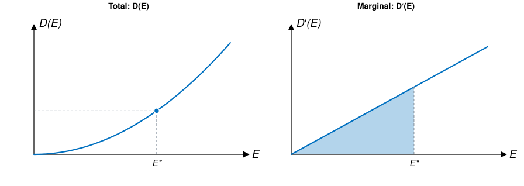
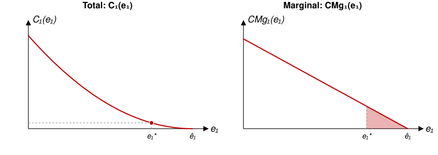
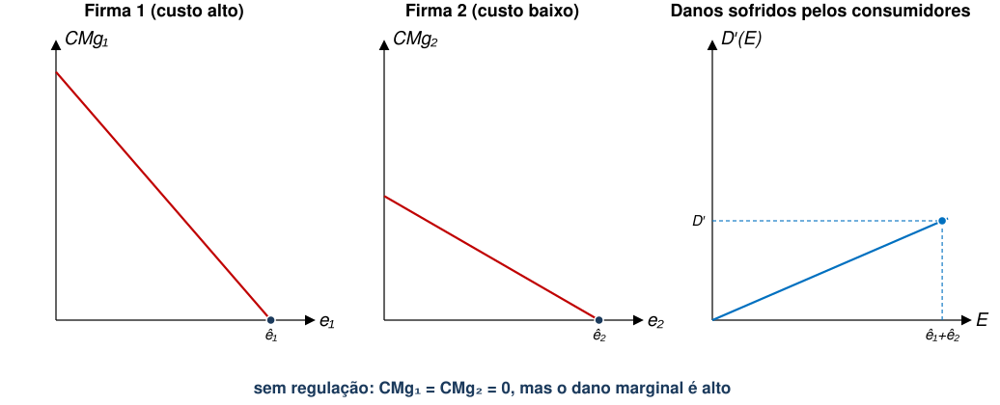
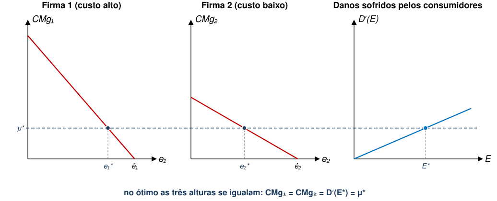
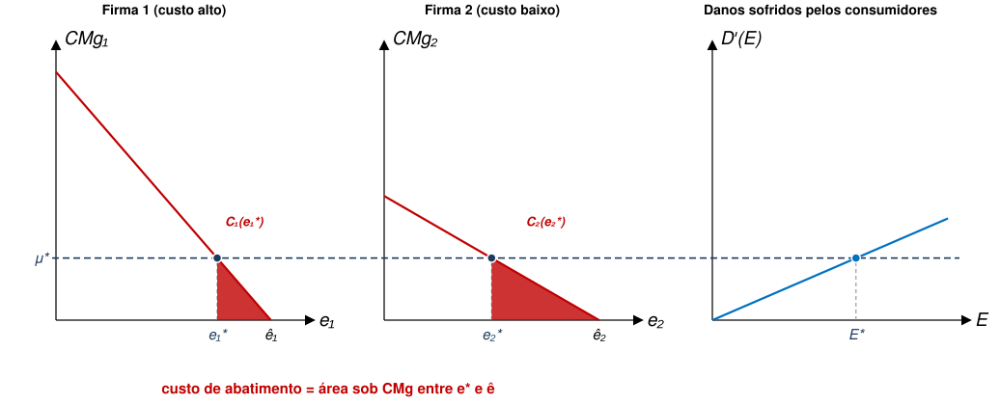
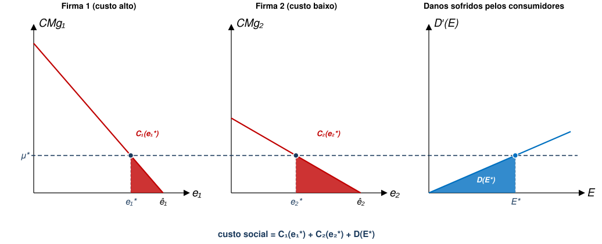

## Qual é o nível ótimo de poluição?

::: {.no-bullet}
Na primeira aula, fizemos essa pergunta sobre o litoral paulista e demos uma resposta parcial. **Hoje, derivaremos esse resultado analiticamente.**
:::

::: {.opcoes}
**(a)** Zero.

**(b)** O menor nível que a tecnologia disponível permitir.

**(c)** Depende.
:::

## Aula Passada

- Introdução
- Definições
- Modelo Formal de Externalidades
  - Alocação de Pareto
  - Equilíbrio Competitivo

## Agenda

- Modelo de Custos e Danos
  - Premissas
  - Função de Danos
  - Custos de Abatimento
  - Alocação Eficiente
  - Representação Gráfica

::: {.no-bullet}
Referência: Phaneuf e Requate, cap. 3
:::

## Modelo de Custos e Danos {.section-cover}

## Modelo de Custos e Danos

::: {.no-bullet}
**Premissas Gerais**
:::

- Informação completa
- Poluição e produto são separáveis
- Poluição não é cumulativa
- Mercados competitivos
- Sem distorções pré-existentes e não relacionadas a meio ambiente
- Espaço e tempo não importam
- Sem dimensão internacional

## Cada premissa dessas é uma aula do curso

::: {.tabela}
| Premissa de hoje | Contraponto |
|---|---|
| Informação completa | Informação Assimétrica |
| Mercados competitivos | Mercado Não-Competitivo |
| Poluição não é cumulativa | Recursos Naturais e Sustentabilidade |
| Espaço e tempo não importam | Recursos Não-Renováveis |
| Sem dimensão internacional | Transição Energética; Recursos Comuns |
:::

- São premissas irrealistas, mas que nos ajudam a estruturar um modelo simples.
- Conforme avançarmos, discutiremos o que acontece com nossas conclusões quando relaxamos essas premissas.

## Modelo de Custos e Danos

- Considere uma área em que existam firmas poluidoras e famílias.
  - Suponha que sejam usinas elétricas a carvão emitindo dióxido de enxofre ($S{O}_{2}$).
- As firmas são tomadoras de preço, pois vendem eletricidade no mercado nacional
- Famílias (consumidores) também são tomadoras de preço e compram energia no mercado nacional.
  - Não dependem das usinas vizinhas exclusivamente.
- Cada firma é indexada por $j\in \{1,2,...,J\}$.
- Cada consumidor é indexado por $i\in \{1,2,...,I\}$.

## Modelo de Custos e Danos

::: {.no-bullet}
Cada firma $j$ emite uma quantidade de poluição ${e}_{j}$.
:::

- Portanto, poluição total é igual a

::: {.eq-block}
$$E=\sum_{j=1}^{J} {e}_{j}$$
:::

## As três peças do modelo

:::: {.step-map}
::: {.step .now}
**1. Danos**
custo da poluição para quem sofre suas consequências
:::
::: {.step}
**2. Custos de abatimento**
custo das firmas para deixar de gerar poluição
:::
::: {.step}
**3. Ponto ótimo**
o nível de $E$ que minimiza a soma dos dois
:::
::::

## Função de Danos

::: {.no-bullet}
Consumidores têm função utilidade dada por
:::

::: {.eq-block}
$${U}_{i}\left({y}_{i},E\right)={y}_{i}-{D}_{i}(E)$$
:::

- ${y}_{i}$ é a renda gasta em todos os bens;
- ${D}_{i}(E)$ é a "desutilidade" causada ao indivíduo $i$ pela poluição;
- Notem que ${D}_{i}(E)$ depende do nível total de poluição, não de ${e}_{j}$;
- Notem que ${U}_{i}$ é quase-linear. Por que isso é conveniente?
  - [Taxa Marginal de Substituição informa disposição marginal a pagar por menos poluição **em termos monetários**.]{.fragment fragment-index=1}

## Função de Danos

::: {.no-bullet}
Função de Danos é crescente e convexa
:::

- ${D}_{i}^{′}\left(E\right)>0$ e ${D}_{i}^{′′}\left(E\right)\geq 0$.
- Portanto, danos são crescentes em $E$ a taxas constantes ou crescentes.

::: {.no-bullet}
[Dano agregado é dado simplesmente por]{.fragment fragment-index=1}
:::

::: {.eq-block .fragment fragment-index=1}
$$D\left(E\right)=\sum_{i=1}^{I} {D}_{i}(E)$$
:::

## Nível e inclinação nos levam à mesma informação

::: {.diagram}
{style="max-height:312px"}
:::

- O gráfico da esquerda representa o dano **total**; o da direita, o dano de **mais uma
  unidade** de $E$. Como se relacionam?
- [A área sombreada à direita **é** a altura marcada à esquerda.]{.fragment fragment-index=1}

## Custos de Abatimento

:::: {.step-map}
::: {.step}
**1. Danos**
custo da poluição para quem sofre suas consequências
:::
::: {.step .now}
**2. Custos de abatimento**
custo das firmas para deixar de gerar poluição
:::
::: {.step}
**3. Ponto ótimo**
o nível de $E$ que minimiza a soma dos dois
:::
::::

- Do lado do dano, a variável relevante é $E$ (dano **total**).
- Do lado do custo, é ${e}_{j}$: o que **cada firma** emite.

## Custos de Abatimento

- Firmas incorrem em 2 tipos de custo:
  - Custo operacional;
  - **Custo de Abatimento** = custo para reduzir poluição.
- Este é o custo pago para cada unidade de poluição **abaixo do que seria a escolha ótima individual da usina**.
  - Chamaremos esse nível ótimo individual de $\hat{e}_{j}$.

## Custos de Abatimento

- Assumiremos que custo operacional e custo de abatimento são separáveis.
- Definiremos a **função custo de abatimento** por ${C}_{j}({e}_{j})$.
- Qual é o custo de abatimento da firma em um equilíbrio competitivo?
  - [Se firma **não é obrigada a escolher poluição menor do que** $\hat{e}_{j}$, então custo de abatimento é zero.]{.fragment fragment-index=1}
  - [Ou seja, ${C}_{j}\left(\hat{e}_{j}\right)=0$]{.fragment fragment-index=1}

## Custos de Abatimento

- ${C}_{j}\left({e}_{j}\right)$ é positivo para qualquer nível de ${e}_{j}<\hat{e}_{j}$.
- Além disso, assumiremos que custo de abatimento diminui com nível de poluição.
  - Ou seja, ${C}_{j}^{′}\left({e}_{j}\right)<0$ para ${e}_{j}<\hat{e}_{j}$.

::: {.no-bullet}
$\rightarrow$ Quanto maior a redução de poluição, maior o custo
:::

## Custos de Abatimento

- Vamos definir também a função de custo marginal de abatimento:

::: {.eq-block}
$$CM{g}_{j}\left({e}_{j}\right)=-{C}_{j}^{′}\left({e}_{j}\right)>0 \quad \text{para } {e}_{j}<\hat{e}_{j}$$
:::

- Incluímos o sinal negativo apenas por conveniência.

## Custos de Abatimento

- Note que $CM{g}_{j}({e}_{j})$ cresce conforme poluição diminui.
  - Ou seja, quanto menor o nível de poluição, mais caro é reduzir outra unidade de poluição;
  - Matematicamente, temos que $CM{g}_{j}^{′}\left({e}_{j}\right)=-{C}_{j}^{′′}\left({e}_{j}\right)\leq 0$ para ${e}_{j}<\hat{e}_{j}$.
- $CM{g}_{j}^{′}\left({e}_{j}\right)\leq 0$ é uma premissa baseada em observação da realidade.
  - Quando a firma é muito poluidora, costuma ser mais barato cortar as emissões.

::: {.no-bullet}
[**Exemplo da usina a carvão**]{.fragment fragment-index=1}
:::

- [É relativamente barato substituir carvão com alto nível de enxofre por carvão com baixo nível de enxofre $\rightarrow$ redução de emissões de $S{O}_{2}$.]{.fragment fragment-index=1}
- [Para reduzir ainda mais, é preciso instalar purificadores de fumaça $\rightarrow$ custo maior.]{.fragment fragment-index=1}

## Representação gráfica do custo

::: {.diagram}
{style="max-height:312px"}
:::

- ${C}_{j}$ desce da esquerda para a direita (emitir mais custa menos); $CM{g}_{j}$
  é a inclinação do custo com o sinal trocado.
- [O custo de abatimento em ${e}_{j}$ é a **área sob** $CM{g}_{j}$ **entre**
  ${e}_{j}$ **e** $\hat{e}_{j}$: soma-se o preço (custo) de cada tonelada cortada.]{.fragment fragment-index=1}

## Alocação Eficiente

:::: {.step-map}
::: {.step}
**1. Danos**
custo da poluição para quem sofre suas consequências
:::
::: {.step}
**2. Custos de abatimento**
custo das firmas para deixar de gerar poluição
:::
::: {.step .now}
**3. Ponto ótimo**
o nível de $E$ que minimiza a soma dos dois
:::
::::

- Na aula 02, no exercício das três firmas, vocês já resolveram metade disto: o
  corte de 90 t saía mais barato comprando **todo bloco de até R\$ 90 mil**.
- [Lá, o alvo de 90 t foi proposto pela autoridade ambiental. **Aqui, estamos tratando de calcular esse alvo.**]{.fragment fragment-index=1}

## Exercício: duas usinas e um limiar

::: {.no-bullet}
Duas usinas a carvão emitem **50 t de** $S{O}_{2}$ **cada** por ano. Cortar
emissões custa, em blocos de 10 t (R\$ mil):
:::

::: {.tabela}
| Bloco cortado | 1º | 2º | 3º | 4º | 5º |
|---|---|---|---|---|---|
| **Usina A** | 10 | 20 | 30 | 40 | 50 |
| **Usina B** | 20 | 40 | 60 | 80 | 100 |
:::

::: {.no-bullet}
Cada **10 t emitidas** causam **R\$ 45 mil** de dano à população vizinha.
:::

::: {.opcoes}
**(a)** Quanto cortar no total?  **(b)** Quanto em cada usina?

**(c)** Quanto custou o **último** bloco cortado em cada uma?
:::

## Exercício: solução

- Corta-se todo bloco que custe **menos que R\$ 45 mil** de dano evitado:
  - Usina A corta 4 blocos (10+20+30+40); Usina B corta 2 (20+40).
  - [**60 t cortadas**, 40 t emitidas, R\$ 160 mil de custo de abatimento.]{.fragment fragment-index=1}

::: {.tabela .fragment fragment-index=2}
| | Abatimento | Dano | **Custo social** |
|---|---|---|---|
| Sem regulação (0 t cortadas) | 0 | 450 | **450** |
| Corte uniforme (30 t de cada) | 180 | 180 | **360** |
| Poluição zero (100 t cortadas) | 450 | 0 | **450** |
| Corte eficiente (40 + 20 t) | 160 | 180 | **340** |
:::

- [O último bloco cortado custou **R\$ 40 mil nas duas usinas**, ao passo que o próximo já
  custaria mais que os R\$ 45 mil de dano.]{.fragment fragment-index=3}

## Alocação Eficiente

::: {.no-bullet}
Como encontramos a alocação ótima de Pareto neste modelo?
:::

- [Minimizaremos custo total da externalidade para a sociedade:]{.fragment fragment-index=1}
  - [Composto pelo custo de abatimento e pelo dano aos indivíduos.]{.fragment fragment-index=1}

::: {.eq-block .fragment fragment-index=1}
$$SC\left({e}_{1},...,{e}_{J}\right)=\sum_{j=1}^{J} {C}_{j}({e}_{j})+D(E)$$
:::

- [Como resolver para $j$ qualquer? (**LOUSA**)]{.fragment fragment-index=1}

## Alocação Eficiente

::: {.no-bullet}
Condição de Primeira Ordem tem **duas implicações importantes**:
:::

1. Custo marginal de abatimento é igual a dano marginal da poluição:

::: {.eq-block}
$$CM{g}_{j}\left({e}_{j}\right)=-{C}_{j}^{′}\left({e}_{j}\right)={D}^{′}\left(E\right) \quad \forall j\in \{1,...,J\}$$
:::

2. [Custo marginal de abatimento é igual para todas as firmas (Princípio Equimarginal):]{.fragment fragment-index=1}

::: {.eq-block .fragment fragment-index=1}
$$CM{g}_{j}\left({e}_{j}\right)=-{C}_{j}^{′}\left({e}_{j}\right)=-{C}_{k}^{′}\left({e}_{k}\right)=CM{g}_{k}\left({e}_{k}\right) \quad \forall j,k$$
:::

::: {.no-bullet}
[**Estratégia para regular externalidade ambiental é ótima (eficiente) se conduzir a alocações que satisfaçam ambas essas condições**.]{.fragment fragment-index=2}
:::

## Essas duas condições apareceram no exercício

::: {.cmp}
| | No exercício | No modelo |
|---|---|---|
| **Onde parar de cortar** | último bloco custa R\$ 40 mil, o próximo custaria mais do que os R\$ 45 mil de dano | $CM{g}_{j}({e}_{j})={D}^{′}(E)$ |
| **Como repartir o corte** | o último bloco cortado custa o mesmo nas duas usinas | $CM{g}_{j}({e}_{j})=CM{g}_{k}({e}_{k})$ |
| **O que sobra de fora** | quem paga a conta do abatimento | modelo deixa em aberto |
:::

- As duas primeiras linhas são a **mesma conta** em versão discreta e contínua.
- [A terceira será tratada na próxima aula: a eficiência fixa **quanto** se corta, mas
  não, necessariamente, **quem paga** a conta.]{.fragment fragment-index=1}

## Sem regulação, não cortam o suficiente

::: {.diagram}
{style="max-height:378px"}
:::

- Cada firma corta até seu custo marginal chegar a zero, ou seja, não corta nada.
- [O dano marginal nesse ponto **não** é zero, o que justifica a necessidade de regulação.]{.fragment fragment-index=1}

## O nível comum: Princípio Equimarginal

::: {.diagram}
{style="max-height:378px"}
:::

- A linha tracejada representa um único número, pois, no ótimo,
  $CM{g}_{1}=CM{g}_{2}={D}^{′}(E^{*})$.

## Custo de abatimento total está nas áreas vermelhas

::: {.diagram}
{style="max-height:378px"}
:::

- Note que a firma 2 corta **mais** que a firma 1 porque é mais eficiente em abatimento.

## Custo social é a soma das três áreas

::: {.diagram}
{style="max-height:378px"}
:::

- Mover ${e}_{1}$ ou ${e}_{2}$ para qualquer lado **aumenta** a soma das três áreas.
- [Em particular, levar a poluição a zero elimina a área azul ao custo de duas
  áreas vermelhas enormes.]{.fragment fragment-index=1}

## Experimentem: onde vocês parariam?



## Voltando à pergunta da abertura

::: {.no-bullet}
**Qual é o nível ótimo de poluição?**
:::

::: {.opcoes}
**(a)** Não é zero: as últimas toneladas cortadas custam mais do que o dano que evitam.

**(b)** Não é o que a tecnologia permitir, pois esta informa **quanto custa** cortar,
  não **quanto vale** cortar.

[**(c)** É o nível em que **o custo de cortar mais uma tonelada iguala o dano que essa
  tonelada causa** (que será o mesmo em todas as firmas).]{.fragment fragment-index=1}
:::

::: {.no-bullet}
[Falta a pergunta que o modelo não responde abertamente: **quem deveria pagar** a conta? Falaremos mais sobre isso na próxima aula.]{.fragment fragment-index=2}
:::

## Referências

::: {#refs}
:::
