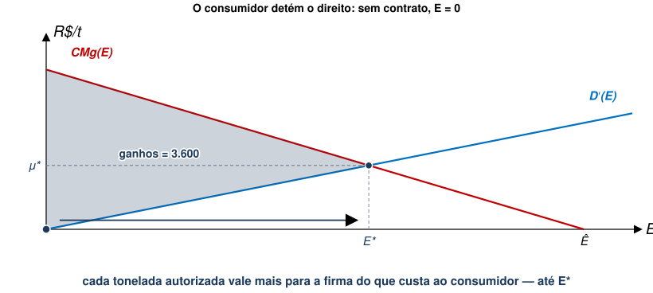
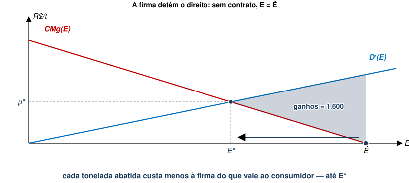

## Quem deveria pagar a conta?

::: {.no-bullet}
A aula passada terminou com uma pergunta em aberto: o modelo diz **quanto**
cortar, mas não diz quem arca com o custo do abatimento.
:::

::: {.opcoes}
**(a)** Quem polui, porque foi quem causou o dano.

**(b)** Quem sofre, se para ele o dano for menor que o custo de evitá-lo.

**(c)** Tanto faz: o nível de poluição acaba sendo o mesmo.
:::

## Aula Passada

- Modelo de Custos e Danos
  - Função de Danos
  - Custos de Abatimento
  - Alocação Eficiente
- As duas condições da alocação eficiente:
  - $CM{g}_{j}\left({e}_{j}\right)={D}^{′}\left(E\right)$
  - $CM{g}_{j}\left({e}_{j}\right)=CM{g}_{k}\left({e}_{k}\right)$

## Agenda

- Teorema de Coase
  - Direitos de propriedade e negociação
  - Consumidor detém os direitos
  - Firma detém os direitos
  - O teorema e seus limites
  - Um caso real

::: {.no-bullet}
Referência: Phaneuf e Requate, cap. 3
:::

## O que ficou em aberto

::: {.no-bullet}
A alocação eficiente fixa $E^{*}$, o nível de emissão que minimiza
:::

::: {.eq-block}
$$SC(E)=C\left(E\right)+D(E)$$
:::

- Para isso, supusemos a existência de um **planejador central** que conhece as duas funções e
  escolhe $E$ pela sociedade.
- Nada no modelo diz **quem paga** o abatimento, nem por que alguém o faria
  espontaneamente.
- [Hoje, mostraremos como dois agentes privados, negociando entre si, podem chegar ao mesmo
  $E^{*}$.]{.fragment fragment-index=1}

## Teorema de Coase {.section-cover}

## Teorema de Coase

::: {.no-bullet}
A ideia de Coase é que, atribuindo direitos de propriedade bem definidos aos
agentes, é possível alcançar o ótimo de Pareto por meio de negociação
:::

- Vamos supor dois cenários distintos:
  - Consumidor detém direito a ambiente livre de poluição.
    - Neste caso, firma só pode poluir com autorização do consumidor.
  - Firma detém direito de poluir.
    - Neste caso, consumidor precisa convencer firma a não poluir.

## Consumidor detém Direitos de Propriedade

::: {.no-bullet}
Firma pode propor um contrato para o consumidor.
:::

- Firma transfere dinheiro ao consumidor em troca de permissão para poluir
  quantidade pré-determinada.
- Este contrato segue uma estrutura de jogo sequencial:
  - Firma propõe contrato $\left(\theta ,E\right)$;
    - $\theta$ é o pagamento;
    - $E$ é o nível máximo de poluição proposto pela firma.
  - Consumidor aceita ou recusa o contrato;
- Negociação do contrato envolve custo de transação pago pela firma.
  - Custo de transação igual a $k$.

## Passo 1: quais valores de $\theta$ o consumidor aceita?

::: {.no-bullet}
Sem contrato, o direito é do consumidor: a firma não emite nada, e o consumidor sofre
$D(0)$. Aceitando, consumidor recebe $\theta$ e passa a sofrer $D(E)$.
:::

::: {.eq-block}
$$y+\theta -D\left(E\right)\geq y-D(0)$$
:::

::: {.no-bullet}
[que é o mesmo que]{.fragment fragment-index=1}
:::

::: {.eq-block .fragment fragment-index=1}
$$\theta \geq D\left(E\right)-D(0)$$
:::

- [Esta é a **restrição de participação** do consumidor: o pagamento tem que cobrir o
  dano adicional em relação à ausência de contrato.]{.fragment fragment-index=1}

## Passo 2: qual $\theta$ a firma oferece?

- A firma conhece a restrição do passo 1 e não paga um centavo a mais do que
  precisa:

::: {.eq-block}
$$\theta ={D}\left(E\right)-D(0)$$
:::

- A restrição fica **ativa**: o consumidor assina e fica exatamente tão bem
  quanto ficaria sem contrato.
- [Todo o excedente da negociação fica com quem propõe. Guardem isso — é o que
  vai mudar de mãos quando trocarmos o dono do direito.]{.fragment fragment-index=1}

## Passo 3: qual problema a firma resolve?

::: {.eq-block}
$$\min_{E}\ \left[C\left(E\right)-C\left(0\right)\right]-\theta -k
\quad \text{s.a.} \quad \theta \geq D\left(E\right)-D(0)$$
:::

::: {.no-bullet}
[Restrição vale como igualdade, logo, basta substituir $\theta$:]{.fragment fragment-index=1}
:::

::: {.eq-block .fragment fragment-index=1}
$$\min_{E}\ \left[C\left(E\right)+D(E)\right] - \left[C\left(0\right)+D(0)\right]-k$$
:::

::: {.no-bullet}
[O segundo colchete e o $k$ não dependem de $E$, então sobra]{.fragment fragment-index=2}
:::

::: {.eq-block .fragment fragment-index=2}
$$\min_{E}\ C\left(E\right)+D(E)$$
:::

## A firma resolve o problema do planejador

::: {.no-bullet}
A condição de primeira ordem é a mesma da aula passada:
:::

::: {.eq-block}
$$-{C}^{′}\left({E}^{*}\right)={D}^{′}\left({E}^{*}\right)
\quad \Longleftrightarrow \quad CMg\left({E}^{*}\right)={D}^{′}\left({E}^{*}\right)$$
:::

- Sozinha, a firma nunca olharia para $D(E)$, pois o dano é sofrido pelo consumidor.
- [A restrição de participação **transforma o dano alheio em despesa própria**:
  cada tonelada de emissão a mais custa à firma exatamente ${D}^{′}(E)$ de
  pagamento.]{.fragment fragment-index=1}
- [É o mesmo mecanismo que o imposto e o preço da licença vão reproduzir, por
  outros meios, nas próximas aulas.]{.fragment fragment-index=2}

## Passo 4: que outra restrição importa para a firma?

::: {.no-bullet}
A firma só entra na negociação se esta compensar o que custa negociar:
:::

::: {.eq-block}
$$\left[C\left(0\right)+D(0)\right]-\left[C\left({E}^{*}\right)+D({E}^{*})\right]\geq k$$
:::

- O lado esquerdo é a **redução do custo social** que o contrato gera, ou os
  ganhos de negociação.
- [Se os ganhos forem menores do que o custo de transação, não há contrato nenhum, e a
  poluição.]{.fragment fragment-index=1}

## Onde a negociação começa e onde ela para

::: {.diagram}

:::

- A área entre as curvas é o que as duas partes têm a ganhar negociando: até
  $E^{*}$, o que a firma economiza em abatimento supera o dano causado.
- [Depois de $E^{*}$ a ordem se inverte: o dano adicional ressarcido é maior do que a redução adicional no custo.]{.fragment fragment-index=1}

## Em números

::: {.no-bullet}
Com $CMg\left(E\right)=60-0{,}3E$, ${D}^{′}\left(E\right)=0{,}2E$ e
$\hat{E}=200$, temos ${E}^{*}=120$ (valores em R\$ mil):
:::

::: {.tabela}
| | Sem contrato ($E=0$) | Com contrato ($E=120$) |
|---|---|---|
| Custo de abatimento (firma) | 6.000 | 960 |
| Dano (consumidor) | 0 | 1.440 |
| Transferência $\theta$ | — | 1.440 |
| **Custo social** | **6.000** | **2.400** |
:::

- O consumidor recebe exatamente o dano que passa a sofrer: está **indiferente**.
- [A firma fica com os R\$ 3.600 mil de redução do custo social, menos
  $k$.]{.fragment fragment-index=1}

## Firma detém Direitos de Propriedade

::: {.no-bullet}
De forma similar, **consumidor propõe contrato para que firma reduza poluição em
troca de pagamento**.
:::

- Consumidor propõe contrato $\left(\theta ,E\right)$.
  - $\theta$ é o pagamento do consumidor para a firma.
  - $E$ é o nível máximo de poluição proposto pelo consumidor.
- Firma aceita ou recusa o contrato.
- Consumidor paga custo de transação igual a $k$.

## Passos 1 e 2 são análogos

::: {.no-bullet}
Agora o status quo é $\hat{E}$: a firma não gasta nada com abatimento, e
$C(\hat{E})=0$. Aceitando o contrato, passa a gastar $C(E)$.
:::

::: {.eq-block}
$$\theta \geq C\left(E\right)-C(\hat{E})$$
:::

- O consumidor, por sua vez, oferece o mínimo que a firma aceita, e a restrição
  fica ativa de novo.
- [Quem fica indiferente agora é a **firma**.]{.fragment fragment-index=1}

## Passos 3 e 4: o consumidor resolve o mesmo problema

::: {.eq-block}
$$\min_{E}\ \left[D\left(E\right)-D\left(\hat{E}\right)\right]-\theta -k
\quad \text{s.a.} \quad \theta \geq C\left(E\right)-C(\hat{E})$$
:::

::: {.no-bullet}
[Substituindo $\theta$, o problema do consumidor vira]{.fragment fragment-index=1}
:::

::: {.eq-block .fragment fragment-index=1}
$$\min_{E}\ C\left(E\right)+D(E)
\qquad \text{com} \qquad
\left[C\left(\hat{E}\right)+D(\hat{E})\right]-\left[C\left({E}^{*}\right)+D({E}^{*})\right]\geq k$$
:::

- [**Mesmo problema, mesma CPO, mesmo ${E}^{*}$.** O que mudou foi o ponto de partida.]{.fragment fragment-index=2}

## Os mesmos ganhos, começando pela direita

::: {.diagram}

:::

- A fronteira é a mesma, mas o ponto de partida vem do outro lado do gráfico.
- [A área é **menor** que a do caso anterior, ou seja, os ganhos de negociação dependem
  do status quo, ainda que o destino não dependa.]{.fragment fragment-index=1}

## Em números, do outro lado

::: {.tabela}
| | Sem contrato ($E=200$) | Com contrato ($E=120$) |
|---|---|---|
| Custo de abatimento (firma) | 0 | 960 |
| Dano (consumidor) | 4.000 | 1.440 |
| Transferência $\theta$ | — | 960 |
| **Custo social** | **4.000** | **2.400** |
:::

- A firma recebe exatamente o que passa a gastar abatendo: fica **igual**.
- [O consumidor fica com os R\$ 1.600 mil de redução do custo social, menos
  $k$.]{.fragment fragment-index=1}

## Teorema de Coase {.smaller}

::: {.no-bullet}
Suponha que o agente A imponha uma externalidade ao agente B. Se os custos de
transação forem suficientemente baixos, temos que, **independentemente da
alocação inicial de direitos de propriedade**
:::

1. Existe um contrato eficiente descrevendo o nível de poluição socialmente
   ótimo ${E}^{*}$ e uma transferência $\theta$ de um agente para o outro tal
   que ambos estejam tão bem quanto na ausência do contrato
2. O contrato eficiente pode ser interpretado como o resultado de um equilíbrio
   perfeito de sub-jogo em que o agente sem os direitos de propriedade propõe o
   contrato ao detentor dos direitos de propriedade, que pode ou não aceitá-lo
   [@schweizer1988]

::: {.no-bullet}
Uma implicação importante deste teorema é que **não importa a alocação inicial
dos direitos de propriedade**.
:::

- Contanto que custos de transação não superem os ganhos de negociação.

## Resumo dos dois cenários

::: {.cmp}
| | Consumidor tem o direito | Firma tem o direito |
|---|---|---|
| Sem contrato | $E=0$ | $E=\hat{E}$ |
| Quem propõe | a firma | o consumidor |
| Participação | $\theta \geq D(E)-D(0)$ | $\theta \geq C(E)-C(\hat{E})$ |
| Problema do proponente | $\min C(E)+D(E)$ | $\min C(E)+D(E)$ |
| Emissão contratada | ${E}^{*}$ | ${E}^{*}$ |
| **Quem fica com o excedente** | **a firma** | **o consumidor** |
:::

## Limitações do teorema

- **Nada garante que que funciona com muitos agentes.** Com uma firma e uma comunidade a
  negociação é plausível; com mil de cada lado, $k$ pode ser excessivamente alto.
- **Exige direitos bem definidos.** Sem saber de quem é o ar, não há o que
  negociar.

## Exemplo de Teorema de Coase na Prática

- Em 1988, produtores da água mineral *Vittel* na França notaram níveis
  crescentes de nitratos.
- Essa contaminação crescente poderia afetar a imagem da marca.
  - Limpa e natural, recomendável até para crianças pequenas.
- *Vittel* identificou que a contaminação era causada por fertilizantes usados
  em 37 fazendas na bacia hidrográfica.
- Tentativas (sem sucesso) de lidar com o problema incluíram
  - Filtros de água;
  - Responsabilização legal dos fazendeiros.

## Exemplo de Teorema de Coase na Prática

- Finalmente, *Vittel* entrou em contato com cada fazendeiro individualmente.
- Propôs contrato para que fazendeiros deixassem de usar diversos pesticidas e
  fertilizantes, ou mesmo deixassem de plantar nos arredores.
- Em troca, ofereceu pagamentos anuais por hectare mais um pagamento único de
  €150.000,00 por fazenda.
- Além disso, ofereceu assistência técnica gratuita para implementação de
  processos produtivos menos poluentes.

## Exemplo de Teorema de Coase na Prática

- Alto custo de transação: negociação individual com cada fazendeiro.
  - Somado aos pagamentos efetuados a cada um.
- Entretanto, conclusão é de que custos foram menores do que prejuízos que
  seriam incorridos pela *Vittel* na ausência de um contrato.
- Mais detalhes em @grolleau2008.

## Vittel, traduzida para o modelo

::: {.cmp}
| No caso | No modelo |
|---|---|
| Fazendeiros podiam adubar como quisessem | os fazendeiros detinham o direito |
| A *Vittel* procurou cada um deles | quem sofre o dano é quem propõe |
| Pagamento por hectare + €150 mil + assistência técnica | transferência $\theta$ |
| Negociar com 37 fazendas, uma a uma | custo de transação $k$ |
| **Filtros e ação judicial fracassaram antes** | **alternativas ao contrato** |
:::

- O contrato saiu caro e ainda assim compensou, pois os ganhos de negociação eram
  maiores que $k$.

## Voltando à pergunta da abertura

::: {.no-bullet}
**Quem deveria pagar a conta?**
:::

::: {.opcoes}
- Se o direito é do consumidor, é a firma quem paga.

- Se o direito é da firma, é o consumidor quem paga para ela abater.

- De qualquer forma, poluição acaba no mesmo ${E}^{*}$ nos dois casos, com implicações distributivas distintas.
:::

::: {.no-bullet}
Quando $k$ é grande demais, ou quando não se sabe de quem é o direito, resta a
aplicar instrumentos regulatórios,  dos quais trataremos na próxima aula.
:::

## Referências

::: {#refs}
:::
