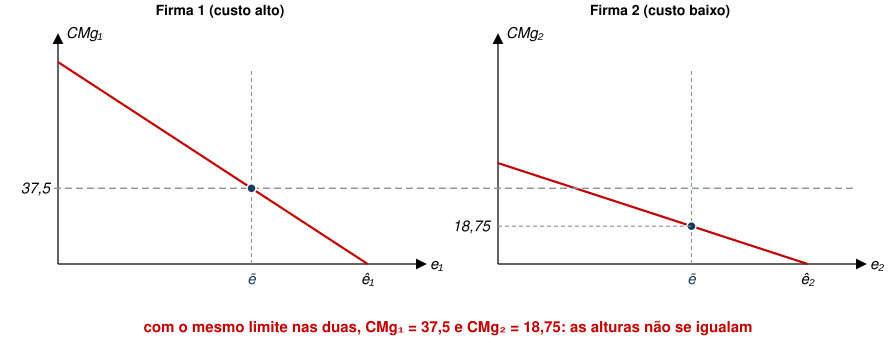
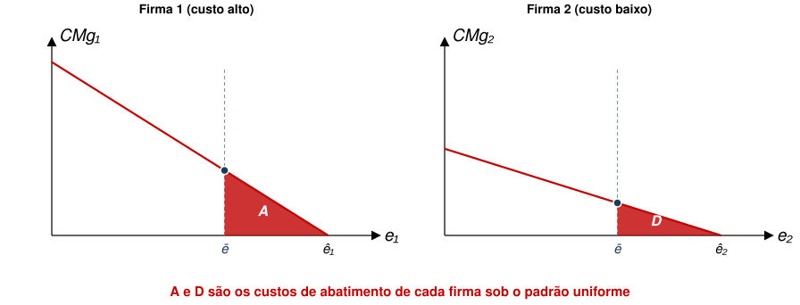
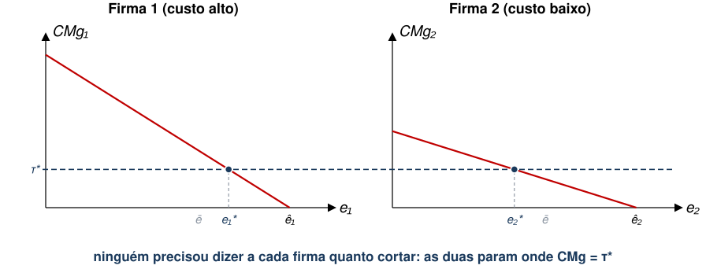
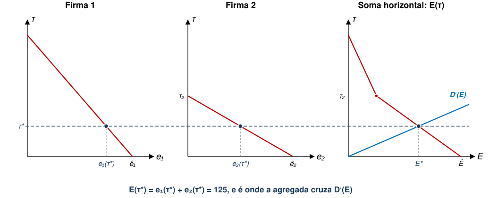

## Aula Passada

- Modelo de Custos e Danos
- Teorema de Coase
  - Alocação de Direitos de Propriedade
  - Negociação com **poucos agentes** e **direitos bem definidos**.

## Agenda

- Instrumentos de Política Ambiental
  - Leque de instrumentos
  - Comando e Controle
  - Imposto sobre Emissões
- Curva de Custo Marginal Agregado de Abatimento

::: {.no-bullet}
Referências: Phaneuf e Requate, cap. 3; Keohane e Olmstead, cap. 8
:::

## Instrumentos de Política Ambiental

::: {.no-bullet}
Teorema de Coase pode ser aplicável em diversos contextos, mas é desafiador quando há muitos agentes envolvidos.
:::
- É uma limitação importante, pois grande parte das políticas ambientais lida com problemas em que
  - Poluidores são muitos e estão espalhados;
  - Pessoas afetadas são muitas e estão espalhadas.
  
::: {.no-bullet}
Nesses contextos, custos de transação costumam ser proibitivamente altos.
:::

- Intervenção pode ser mais eficiente.

## O leque de instrumentos

::: {.no-bullet}
@keohane2016 organizam as políticas ambientais em quatro categorias. As duas
primeiras serão discutidas nesta aula.
:::

:::::: step-map
::: {.step .now}
**1. Prescrever** o regulador diz o que fazer: tecnologia obrigatória ou
limite de emissão por fonte
:::

::: {.step .now}
**2. Precificar** o regulador põe um preço na emissão: imposto ou subsídio
:::

::: step
**3. Limitar quantidade** o regulador fixa o total e deixa o mercado
repartir permissões
:::

::: step
**4. Informar** o regulador informa população com inventários de emissão, selos e certificações
:::
::::::

- As três primeiras tratam do problema da firma, ao passo que a quarta trata do consumidor.

## Exemplos

::: {.tabela}
| Categoria | Implementação | Exemplo prático |
|---|---|---|
| Prescrever | limite ou tecnologia obrigatória, qualidade mínima | CONAMA 297/2002 |
| Precificar | imposto por unidade emitida ou subsídio por unidade abatida | imposto sobre poluição na China (2018) |
| Limitar a quantidade | teto agregado com permissões negociáveis | mercado europeu de carbono |
| Informar | divulgação obrigatória; selos voluntários | *Toxics Release Inventory* (EUA); selo FSC |
:::

- Imposto e subsídio são **dois lados da mesma moeda**: cobrar R\$ 10 por tonelada
  emitida dá o mesmo incentivo que pagar R\$ 10 por tonelada abatida [@keohane2016].
- A quarta categoria trata de **outra** falha de mercado (informação assimétrica), e não
  da externalidade. Voltaremos a ela depois.

## Comando e Controle {.section-cover}

## Comando e Controle

- Governo determina uma ação de redução de poluição.
  - Depois, fiscaliza e pune quem não cumprir.
- As formas mais comuns de comando e controle são
  - **Requisito de Performance:** limite na quantidade de poluição por produto;
  - **Requisito de Tecnologia:** instalação de tecnologias de produção e/ou
    redução de poluição específicas.

## Comando e Controle

- Exemplos de **Requisito de Performance**:
  - Decreto Estadual 59.113/2013: estabelece limites máximos de poluentes do ar
    no Estado de São Paulo.
    - Partículas inaláveis ($M{P}_{10}$): $120\mu g/{m}^{3}$;
    - Partículas inaláveis finas ($M{P}_{2,5}$): $60\mu g/{m}^{3}$;
    - Ozônio: $140\mu g/{m}^{3}$ etc.
- Exemplos de **Requisito de Tecnologia**:
  - Resolução CONAMA nº 297/2002: comercialização de novos veículos e
    motocicletas com motores que emitam menos poluentes.

## Comando e Controle: Mais um Exemplo

::: {.no-bullet}
**Caso: Chuva Ácida na Alemanha em 1980**
:::

- Causada parcialmente pela emissão de $S{O}_{2}$ de geradores a carvão.
- Danos a florestas e lagos no norte da Europa.
- Intervenção: Ordinance on Large Combustion Plants (GFA-VO, 1983, 1990).
  1. 2.500 mg/m³ de emissão de $S{O}_{2}$ para firmas existentes;
  2. 400 mg/m³ de emissão de $S{O}_{2}$ para novas firmas;
  3. Meta de redução de enxofre em 85%, o que implicou em instalação de filtros.

## Comando e Controle

- Retomemos o modelo da aula passada, em que cada firma tem custo de abatimento
  ${C}_{j}({e}_{j})$.
- Suponha que o governo queira instituir um limite de poluição. Qual seria o
  limite mais intuitivo a se propor?
  - Talvez ${{e}_{j}\leq e}_{j}^{*}$ para cada firma $j$?
- Por que esse limite é pouco realista?

## Comando e Controle

- Primeiro, é preciso saber a tecnologia de produção e abatimento de cada firma.
- Segundo, pode ser legalmente impossível impor um limite diferente para cada
  empresa (princípio da isonomia?).
- Assim, qual seria a segunda melhor alternativa?
  - Restringir poluição a limite único para todas as firmas $\rightarrow {e}_{j}\leq\bar{e}$

## Comando e Controle

- Como definir esse limite único?
  - Relembrando a solução de Pareto, temos $\sum_{j=1}^{J} {e}_{j}^{*}={E}^{*}$
  - Assim, uma possibilidade seria $\bar{e}=\frac{{E}^{*}}{J}$
  - De modo que $\sum_{j=1}^{J} \bar{e}=\sum_{j=1}^{J}
    \frac{{E}^{*}}{J}={E}^{*}$
- Qual é o potencial problema desse limite?
  - [Se firmas não forem idênticas, pode haver perda de eficiência.]{.fragment fragment-index=1}

## Este limite já apareceu, sem o nome

::: {.no-bullet}
Na aula de Custos e Danos, vimos um cenário denominado **"corte igual"**.
Era exatamente $\bar{e}={E}^{*}/J$ com apenas duas firmas.
:::

::: {.tabela}
| | ${e}_{1}$ | ${e}_{2}$ | Custo social |
|---|---|---|---|
| Corte igual ($\bar{e}=62{,}5$) | 62,5 | 62,5 | 2.617 |
| Ótimo | 75 | 50 | **2.500** |
:::

- As duas linhas têm a **mesma emissão total** ($E=125$) e, portanto, o mesmo
  dano.
- A diferença de 117 se refere à má alocação nos custos de abatimento.

## Comando e Controle

::: {.no-bullet}
Suponha o seguinte caso com 2 firmas, e suponha, ainda, que
${e}_{1}={e}_{2}=\bar{e}=\frac{{E}^{*}}{2}$
:::

::: {.diagram}
{style="max-height:300px"}
:::

- A Firma 1 abate mais caro do que a Firma 2, mas as duas recebem o mesmo limite.

## Comando e Controle

- Neste caso, temos que $-{C}_{1}^{′}\left(\bar{e}\right)>-{C}_{2}^{′}\left(\bar{e}\right)$
  - Isto viola uma das condições de eficiência de Pareto que vimos anteriormente.
- Graficamente, temos que
  - $A$ é custo de abatimento para Firma 1;
  - $D$ é custo de abatimento da Firma 2.

::: {.diagram}
{style="max-height:300px"}
:::

## Comando e Controle

- Haveria ganho de eficiência se Firma 2 absorvesse esforço de abatimento da
  Firma 1.
  - Firma 2 absorve $C$ para que Firma 1 economize $B$.
- Peso morto desta intervenção, com ${e}_{j}\leq \bar{e}$, é igual a $B-C$.

::: {.diagram}
{style="max-height:300px"}
:::

## Exercício: as duas usinas, de novo

::: {.no-bullet}
Em duplas, 5 minutos. As mesmas usinas das aulas passadas: cada uma emite
50 t e cortam poluição, em blocos de 10 t, aos custos discriminados abaixo (em R\$ mil).
:::

::: {.tabela}
| | 1º bloco | 2º | 3º | 4º | 5º |
|---|---|---|---|---|---|
| Usina A | 10 | 20 | 30 | 40 | 50 |
| Usina B | 20 | 40 | 60 | 80 | 100 |
:::

- Cada 10 t emitidas causam R\$ 45 mil de dano, como antes, e já sabemos que o corte
  eficiente é **40 t em A e 20 t em B**, por R\$ 160 mil de abatimento.
- **(a)** O governo manda **cada uma cortar 30 t**. Quanto custa?
- **(b)** Quanto se perde em relação ao corte eficiente?
- **(c)** Que troca entre as duas desfaria a perda, e por qual preço?

## O padrão uniforme incorre em desperdício

::: {.cmp}
| | Corte de A | Corte de B | Abatimento | Dano | Custo social |
|---|---|---|---|---|---|
| Sem regulação | 0 | 0 | 0 | 450 | 450 |
| Padrão uniforme | 30 t | 30 t | 180 | 180 | 360 |
| Corte eficiente | 40 t | 20 t | 160 | 180 | **340** |
| **Desperdício do padrão uniforme** | | | **20** | **0** | **20** |
:::

- Nos cenários de padrão uniforme e corte eficiente, chegamos às mesmas 60 t no equilíbrio, logo o dano é o mesmo. No entanto, custos de abatimento mal alocados levam a perdas.
- [**(c)** A corta um bloco a mais (R\$ 40 mil) e B corta um a menos (economiza
  R\$ 60 mil): qualquer preço **entre 40 e 60** faz as duas ganharem.]{.fragment fragment-index=1}
- [Guardem isto, pois fundamentará o mercado de permissões das próximas aulas.]{.fragment fragment-index=2}

## Imposto sobre Emissões {.section-cover}

## Precificando poluição

:::::: step-map
::: step
**1. Prescrever** o regulador diz o que fazer: tecnologia obrigatória ou
limite de emissão por fonte
:::

::: {.step .now}
**2. Precificar** o regulador põe um preço na emissão: imposto ou subsídio
:::

::: step
**3. Limitar a quantidade** o regulador fixa o total e deixa o mercado
repartir: permissões
:::

::: step
**4. Informar** o regulador divulga: inventários de emissão, selos e
certificações
:::
::::::

- No comando-e-controle, o regulador busca escolher **a alocação** final.
- No imposto, regulador escolhe **o preço** da poluição, e a alocação é escolhida pelas
  firmas.
  - Ou seja, usa preços para internalizar a externalidade.

## Imposto sobre Emissões

::: {.no-bullet}
Como incluir imposto pago por unidade de emissão no modelo?
:::

::: {.eq-block .fragment fragment-index=1}
$$T{C}_{j}\left({e}_{j}\right)={C}_{j}\left({e}_{j}\right)+\tau {e}_{j}$$
:::

- [Em que $T{C}_{j}({e}_{j})$ é o custo total da firma associado à
  poluição.]{.fragment fragment-index=1}
- [Qual é a condição de primeira ordem deste problema?]{.fragment fragment-index=1}

::: {.eq-block .fragment fragment-index=2}
$$-{C}_{j}^{′}\left({e}_{j}\right)=\tau$$
:::

- [Firma iguala custo marginal de abatimento ao “preço” da
  emissão.]{.fragment fragment-index=2}

## Imposto sobre Emissões

::: {.no-bullet}
**Intuição:** firma reduz emissões enquanto o custo adicional de abatimento for
**menor** do que o imposto pago por unidade emitida.
:::

- Ou seja, firma prefere reduzir sua própria poluição se isto for mais barato do que
  poluir e pagar taxa.
- Note que as CPOs também implicam em

::: {.eq-block}
$$-{C}_{j}^{′}\left({e}_{j}\right)=\tau =-{C}_{k}^{′}\left({e}_{k}\right)\
\forall j\neq k$$
:::

## Preço único induz a quantidades diferentes para cada firma

::: {.diagram}
{style="max-height:300px"}
:::

- O regulador anuncia **um número só**, sem precisar conhecer ${C}_{1}$ nem
  ${C}_{2}$.
- [A condição $CM{g}_{1}=CM{g}_{2}$ é resultado de equilíbrio, não exigência.]{.fragment fragment-index=1}

## Imposto sobre Emissões

::: {.no-bullet}
Qual deveria ser o valor da alíquota $\tau$ para alcançarmos o Ótimo de Pareto?
:::

- [Sabemos que $-{C}_{j}^{′}\left({e}_{j}^{*}\right)=D′({E}^{*})$ é a condição de
  ótimo social.]{.fragment fragment-index=1}
  - [Em que $\{{e}_{1}^{*},...,{e}_{J}^{*}\}$ é a alocação ótima tal que $\sum{e}_{j}^{*}={E}^{*}$]{.fragment fragment-index=1}
- [Logo, ${\tau }^{*}={D}^{′}\left({E}^{*}\right)$ induz a alocação ótima de Pareto]{.fragment fragment-index=1}

## ${\tau }^{*}$ é o ${\mu }^{*}$ da aula de Custos e Danos

::: {.no-bullet}
Considerem as mesmas funções de antes: 
:::

::: {.eq-block}
$CM{g}_{1}=100-{e}_{1}$, $CM{g}_{2}=50-0{,}5{e}_{2}$ e ${D}^{′}\left(E\right)=0{,}2E$.
:::

::: {.no-bullet}
Temos
:::

::: {.eq-block}
$${\mu }^{*}=25 \quad \Longrightarrow \quad {\tau }^{*}=25$$
:::

- Antes, ${\mu }^{*}$ era o **multiplicador** de um problema resolvido por um
  planejador central que conhecia as duas funções de custo.
- [Aqui, é um **preço** anunciado por quem não conhece nenhuma delas, mas devolve a
  mesma alocação.]{.fragment fragment-index=1}
- [O contrato de Coase fez o mesmo por um terceiro caminho: transformar dano
  alheio em despesa própria.]{.fragment fragment-index=2}

## Imposto sobre Emissões

- De outra forma, também podemos interpretar $\tau$ como o preço da emissão
- Com isso, podemos definir a **Demanda Agregada por Poluição** das firmas em função da
  alíquota $\tau$.

::: {.eq-block}
$$E\left(\tau \right)=\sum_{j=1}^{J} {e}_{j}(\tau )$$
:::

- Graficamente, para as firmas 1 e 2, é a soma **horizontal** das duas curvas de
  custo marginal de abatimento.

## Imposto sobre Emissões

::: {.no-bullet}
Para cada nível de $\tau$, temos um nível de $E\left(\tau\right)={e}_{1}\left(\tau \right)+{e}_{2}(\tau )$
:::

::: {.diagram}
{style="max-height:378px"}
:::

- Acima de ${\tau }_{2}$ a Firma 2 já zerou emissões, e só a Firma 1 responde: curva agregada muda de inclinação.

## Imposto sobre Emissões

::: {.no-bullet}
Como a poluição varia com o imposto (taxa)?
:::

- Vamos diferenciar $-{C}_{j}^{′}\left({e}_{j}\right)=\tau$

::: {.eq-block}
$$-{C}_{j}^{′′}\left({e}_{j}\right)\frac{d{e}_{j}\left(\tau \right)}{d\tau }=1
\to \frac{d{e}_{j}\left(\tau \right)}{d\tau }=\frac{1}{-{C}_{j}^{′′}\left({e}_{j}\right)}<0$$
:::

- Sabendo que $E\left(\tau \right)={e}_{1}\left(\tau \right)+{e}_{2}(\tau )$,
  temos que $\frac{dE}{d\tau }<0$
- Isto implica que, se regulador souber estrutura de custo das firmas, pode-se
  alcançar qualquer nível de $E$ desejado.
  - O problema é que dificilmente há informação perfeita, como discutiremos depois.

## As três políticas lado a lado

::: {.cmp}
| | Sem regulação | Padrão uniforme $\bar{e}$ | Imposto ${\tau }^{*}$ |
|---|---|---|---|
| Emissão total | 200 | 125 | 125 |
| $CM{g}_{1}$ e $CM{g}_{2}$ | $0=0$ | $37{,}5 \neq 18{,}75$ | $25=25$ |
| Custo de abatimento | 0 | 1.055 | 938 |
| Dano | 4.000 | 1.563 | 1.563 |
| Custo social | 4.000 | 2.617 | **2.500** |
| **Quem paga, e a quem** | **ninguém** | **as firmas, sem contrapartida** | **as firmas, ao governo** |
:::

- Notem que a arrecadação de ${\tau }^{*}{E}^{*}=3.125$ **não** entra no custo social:
  é apenas transferência entre agentes.
- [Mas pode tornar o imposto politicamente mais difícil que o padrão
  uniforme.]{.fragment fragment-index=1}

## Exercício de Fixação

::: {.no-bullet}
Suponha uma economia com 2 firmas e 2 consumidores. Assuma que os custos de
abatimento são
:::

::: {.eq-block}
$${C}_{1}\left({e}_{1}\right)=\frac{{\left(5-{e}_{1}\right)}^{2}}{2}\ ;\
{C}_{2}\left({e}_{2}\right)=\frac{{\left(8-2{e}_{2}\right)}^{2}}{2}$$
:::

::: {.no-bullet}
Assuma que o dano causado a **cada** consumidor é dado por
${D}_{i}\left(E\right)=\frac{{E}^{2}}{2}$
:::

- **(a)** Qual é o nível ótimo individual de cada firma?
- **(b)** Qual é o nível ótimo de poluição?
- **(c)** Qual é o imposto de Pigou apropriado?
- **(d)** Qual é o custo total de cada firma?

## Exercício de Fixação: resolução

::: {.no-bullet}
São **2** consumidores, logo $D\left(E\right)={E}^{2}$ e ${D}^{′}\left(E\right)=2E$, com
$-{C}_{1}^{′}=5-{e}_{1}$ e $-{C}_{2}^{′}=16-4{e}_{2}$.
:::

- **(a)** Sem regulação, cada firma abate até $-{C}_{j}^{′}=0$: $\hat{e}_{1}=5$ e
  $\hat{e}_{2}=4$.
- [**(b)** A solução interior exigiria $-{C}_{1}^{′}=-{C}_{2}^{′}={D}^{′}$, o que daria
  $\tau =36/7$ e ${e}_{1}=-1/7$. Inviável, então ${e}_{1}^{*}=0$, e minimizar
  ${C}_{2}+D$ em ${e}_{2}$ devolve ${e}_{2}^{*}={E}^{*}=8/3$.]{.fragment fragment-index=1}
- [**(c)** ${\tau }^{*}={D}^{′}\left({E}^{*}\right)=16/3\approx 5{,}33$, e
  $-{C}_{1}^{′}\left(0\right)=5<{\tau }^{*}$ confirma que a firma 1 zera a
  emissão.]{.fragment fragment-index=2}
- [**(d)** $T{C}_{1}=12{,}5$, só abatimento; $T{C}_{2}=32/9+128/9=160/9\approx
  17{,}8$.]{.fragment fragment-index=3}
- [Ou seja, $-{C}_{j}^{′}\left({e}_{j}\right)=\tau$ vale só no interior: no canto ela se torna
  $-{C}_{j}^{′}\left(0\right)\leq \tau$.]{.fragment fragment-index=4}

## Exemplo Prático

::: {.no-bullet}
Em 2018, a China implementou um imposto sobre poluição no país inteiro.
:::

- Como já existia uma tarifa de poluição antes, algumas províncias
  experimentaram aumento de imposto e outras não;
- Diff-in-Diff comparando províncias com aumento de imposto versus as outras.

## Exemplo Prático

- Introdução do imposto causa redução nas emissões em províncias tratadas.
- Aumento de 1 yuan (+50%) no imposto por unidade gera queda de
  - 3,8% na média de $P{M}_{2.5}$;
  - 18,6% na média de $S{O}_{2}$;
  - 5,6% na média de $N{O}_{2}$.

::: {.no-bullet}
Fontes: @li2021 e @li2023.
:::

## A categoria que ficou de fora

::: {.no-bullet}
@keohane2016 elencam uma quarta categoria de instrumentos focada em **informar** agentes.
:::

- **Divulgação obrigatória.** Nos EUA, o *Toxics Release Inventory* obriga
  fábricas, desde 1988, a declarar quanto emitem de mais de 300 substâncias
  tóxicas. Isto é publicado pela agência ambiental (EPA).
- **Selos e certificação.** FSC para madeira, Marine Stewardship Council para
  pesca: voluntários e, em geral, operados por organizações não governamentais.
- [Como o imposto, agem de forma **descentralizada**: mudam o incentivo e deixam
  cada um decidir.]{.fragment fragment-index=1}
- [Diferente do imposto, o incentivo é **indireto**, pois da reação de consumidores e
  cidadãos à informação.]{.fragment fragment-index=2}

## Informar resolve outra falha

- Rótulo e inventário buscam resolver **informação assimétrica**: revelam ao cidadão o que
  a fábrica ao lado emite; ou, ao consumidor, como foi feito o produto.
- [A externalidade e o bem público continuam de pé: apenas a informação não internaliza o dano.]{.fragment fragment-index=1}
- [Por isso o alcance dessas políticas é mais limitado que o de um imposto ou de
  uma cota.]{.fragment fragment-index=2}
  

## E os empurrõezinhos?

::: {.no-bullet}
Políticas que mudam comportamento sem mudar preço ou regra [@keohane2016].
:::

- **Opower.** Relatórios de consumo de energia que comparam a casa com as
  vizinhas, usados por mais de 85 distribuidoras nos EUA. A queda é pequena, mas
  **persiste**. No longo prazo, leva à troca de lâmpadas e eletrodomésticos.
- **Atlanta.** Cartas a clientes sobre consumo de água: informação técnica, apelo à seca, ou
  comparação com a vizinhança. Três grupos tratados com cartas economizaram; **o da comparação
  economizou mais**.
- [O efeito é pequeno, mas o custo também.]{.fragment fragment-index=1}

## Referências

::: {#refs}
:::
