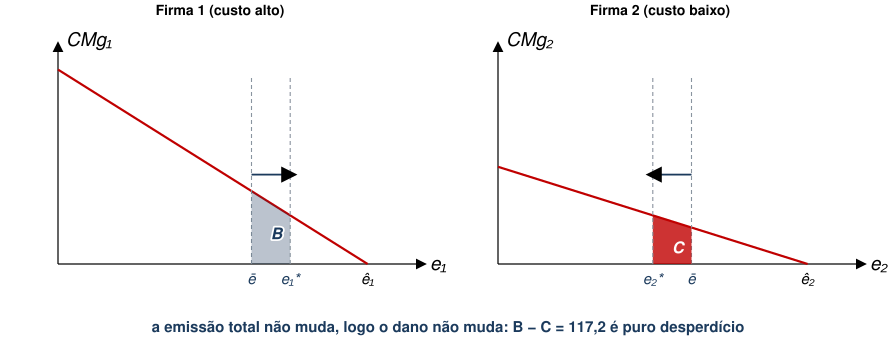
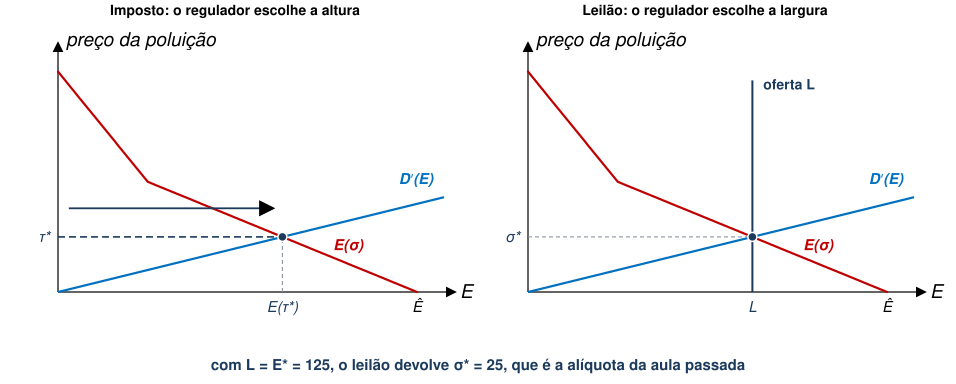
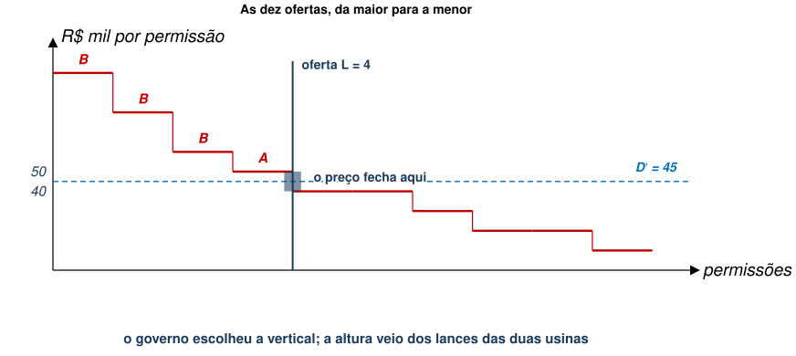
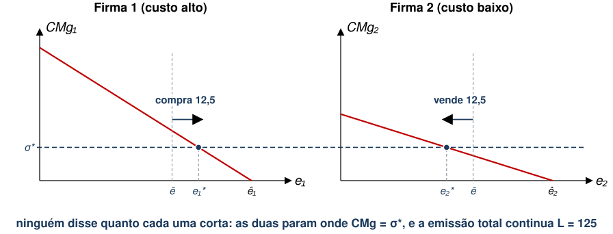
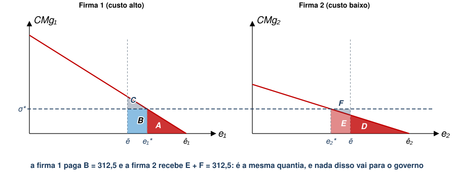
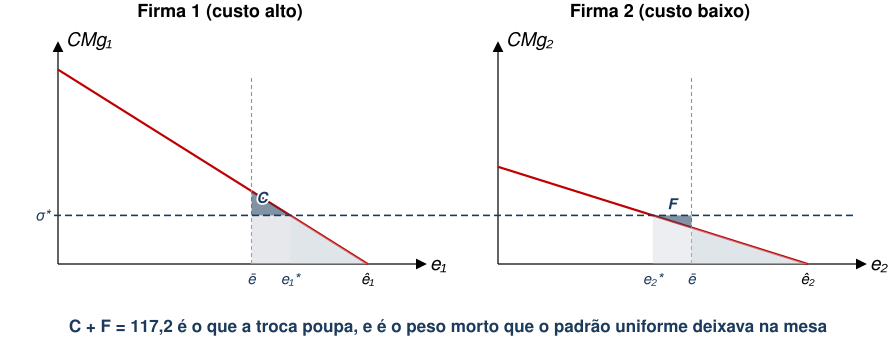
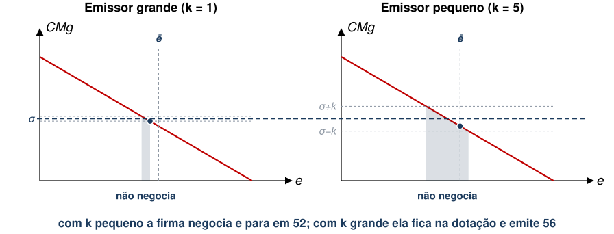
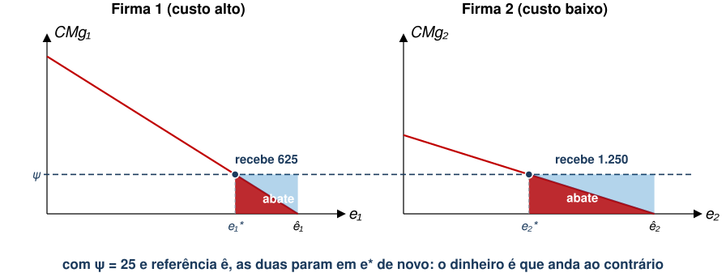
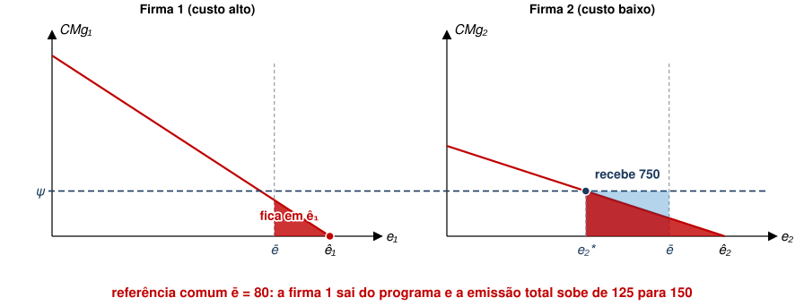

## Aula Passada

- O leque de instrumentos de @keohane2016
- Comando e Controle
  - Requisito de performance e requisito de tecnologia
  - Limite único $\bar{e}={E}^{*}/J$ gera peso morto quando as firmas diferem
- Imposto sobre Emissões
  - ${\tau }^{*}={D}^{′}\left({E}^{*}\right)$ induz a alocação de Pareto
  - Firmas escolhem sozinhas quanto abater: $-{C}_{j}^{′}\left({e}_{j}\right)=\tau$

## Agenda

- Permissões Negociáveis
  - Cotas negociáveis
  - Leilão de permissões
  - Distribuição de permissões transferíveis
- Subsídios ao Abatimento

::: {.no-bullet}
Referências: Phaneuf e Requate, cap. 3; Keohane e Olmstead, cap. 8
:::

## As duas categorias de hoje

:::::: step-map
::: step
**1. Prescrever** o regulador diz o que fazer: tecnologia obrigatória ou
limite de emissão por fonte
:::

::: {.step .now}
**2. Precificar** o regulador põe um preço na emissão: imposto ou subsídio
:::

::: {.step .now}
**3. Limitar quantidade** o regulador fixa o total e deixa o mercado
repartir permissões
:::

::: step
**4. Informar** o regulador informa população com inventários de emissão, selos e certificações
:::
::::::

- Não tratamos ainda da caixa 3.
- Falaremos da caixa 2 novamente, porque o **subsídio** é o outro lado da moeda do imposto.

## Permissões Negociáveis {.section-cover}

## Comando e Controle com Cotas Negociáveis

- Suponha, alternativamente, que o limite seja global $\rightarrow E={E}^{*}$.
- Suponha, ainda, que cada firma tenha **cotas de poluição idênticas e
  negociáveis** fixadas em $\bar{e}=\frac{{E}^{*}}{2}$.
- Qual firma estaria disposta a comprar cotas? E vender?

::: {.no-bullet}
A figura é a mesma da aula passada. Só a leitura muda.
:::

## A mesma figura, outra leitura

::: {.diagram}
{style="max-height:300px"}
:::

- Na aula passada, $B$ e $C$ eram uma realocação que o regulador **não**
  conseguia fazer, e o saldo $B-C$ era peso morto.
- [Com direito de venda, essa realocação vira uma **troca voluntária**, e as
  duas firmas ganham.]{.fragment fragment-index=1}

## Comando e Controle com Cotas Negociáveis

- Quanto a Firma 1 estaria disposta a pagar para comprar cotas da Firma 2?
  - [Firma 1 pagaria no máximo $B$ por mais cotas.]{.fragment fragment-index=1}
  - [Firma 1 poderia aumentar emissões em ${e}_{1}^{*}-\bar{e}$.]{.fragment fragment-index=1}
- [Quanto a Firma 2 aceitaria receber pelas cotas?]{.fragment fragment-index=1}
  - [Firma 2 aceitaria pelo menos $C$.]{.fragment fragment-index=2}
  - [E teria que reduzir poluição em $\bar{e}-{e}_{2}^{*}$.]{.fragment fragment-index=2}
- [Quando essa troca seria mutuamente benéfica?]{.fragment fragment-index=2}
  - [Isto seria mutuamente benéfico se $B>C$.]{.fragment fragment-index=3}

## Comando e Controle com Cotas Negociáveis

- Este exemplo ilustra o conceito de “ganhos de especialização”.
  - Análogo a questões de Economia Internacional (vantagens comparativas).
- Firmas mais eficientes em abatimento podem absorver emissões de firmas menos
  eficientes.
  - Se houver mecanismo de troca.

::: {.no-bullet}
Falta dizer como se forma o preço dessa troca. Trataremos disso a seguir.
:::

## Leilão de Permissões {.section-cover}

## Leilão de Permissões

::: {.no-bullet}
Suponha que, ao invés de cobrar um imposto ex-post da firma poluidora, o
governo leiloe permissões ex-ante.
:::

- Neste caso, o governo oferta $L$ permissões.
- O preço de equilíbrio do leilão é dado por $\sigma$.

::: {.no-bullet}
Qual função de custo total a firma minimiza neste caso?
:::

## Leilão de Permissões

- Novamente, teremos $T{C}_{j}\left({e}_{j}\right)={C}_{j}\left({e}_{j}\right)+\sigma {e}_{j}$
- A C.P.O. será análoga ao caso do imposto: $-{C}_{j}^{′}\left({e}_{j}\right)=\sigma$
- Qual será o preço que maximiza o bem-estar social?

::: {.eq-block}
$${\sigma }^{*}={D}^{′}\left({E}^{*}\right)$$
:::

- [Para a firma, permissão leiloada e imposto são a mesma despesa por unidade
  emitida.]{.fragment fragment-index=1}

## Leilão de Permissões

- Também podemos pensar na demanda por emissões em função do preço das
  permissões.
- Assim, teremos uma função de demanda agregada por emissões igual a

::: {.eq-block}
$$E\left(\sigma \right)=\sum_{j=1}^{J} {e}_{j}(\sigma )$$
:::

::: {.no-bullet}
É a mesma soma horizontal que já vimos, porém com $\sigma$ no lugar de $\tau$.
:::

## Leilão de Permissões

- No caso do imposto, o preço unitário da poluição estava sob controle do
  planejador central.
- No caso das permissões, qual variável o planejador controla?
  - **A oferta total de permissões** $L$.
- [A oferta regula o preço das permissões por meio da condição de Market
  Clearing:]{.fragment fragment-index=1}

::: {.eq-block .fragment fragment-index=1}
$$L=E(\sigma )=\sum_{j=1}^{J} {e}_{j}(\sigma )$$
:::

## Preço e quantidade são o mesmo botão

::: {.no-bullet}
Se o governo conhece a demanda agregada por permissões ou a curva de custo de
abatimento agregada, pode definir $L$ de modo a induzir ${E}^{*}$.
:::

::: {.diagram}
{style="max-height:322px"}
:::

- [Com informação perfeita, escolher a altura ou escolher a largura dá na
  mesma. Nas próximas aulas, entretanto, veremos que isso não é verdade sob Informação Assimétrica.]{.fragment fragment-index=1}

## Exercício: quanto vale uma permissão

::: {.no-bullet}
Em duplas, 5 minutos. As mesmas usinas: cada uma emite 50 t e corta em blocos
de 10 t, aos custos abaixo (em R\$ mil), e cada 10 t emitidas causam R\$ 45 mil
de dano.
:::

::: {.tabela}
| | 1º bloco | 2º | 3º | 4º | 5º |
|---|---|---|---|---|---|
| Usina A | 10 | 20 | 30 | 40 | 50 |
| Usina B | 20 | 40 | 60 | 80 | 100 |
:::

- O governo quer as 40 t eficientes, então emite $L=4$ permissões de 10 t.
  **Não define preço nenhum.**
- **(a)** Quanto vale para cada usina a 1ª permissão? E a 2ª?
- **(b)** O governo **leiloa** as 4. Quem leva quantas, e onde o preço para?
- **(c)** Se, em vez de leiloar, ele **entregar 2 para cada uma**, o que muda?

## As ofertas, e o preço que sai delas

::: {.no-bullet}
**(a)** Uma permissão dispensa o bloco mais caro que a usina teria de cortar.
Com $k$ permissões ela emite $10k$ e corta os $5-k$ blocos mais baratos.
:::

::: {.tabela}
| | 1ª permissão | 2ª | 3ª | 4ª | 5ª |
|---|---|---|---|---|---|
| Usina A | 50 | 40 | 30 | 20 | 10 |
| Usina B | 100 | 80 | 60 | 40 | 20 |
:::

- [**(b)** As quatro maiores ofertas são 100, 80 e 60, de B, e 50, de A. **B leva 3 e A leva 1**.]{.fragment fragment-index=1}
- [O preço é definido pelo leilão: fica entre maior oferta perdedora (40) e menor oferta vencedora (50).]{.fragment fragment-index=1}

## O regulador escolhe quantidade e induz preço

::: {.diagram}
{style="max-height:326px"}
:::

- O dano marginal de 45 informa ao governo **quantas** permissões emitir (não o preço, como no caso do imposto).
- Com blocos discretos há um degrau em $L=4$: vários preços de equilíbrio ao invés de um único ponto.

## Mesmas permissões, contas diferentes

::: {.no-bullet}
**(c)** Com 2 permissões cada, A vende uma a B: ela vale 40 para A e 60 para B.
As duas terminam com 1 e 3, como no leilão.
:::

::: {.cmp}
| | Permissões de A | de B | Abatimento | Conta de A | Conta de B | Ao governo |
|---|---|---|---|---|---|---|
| Leilão das 4 | 1 | 3 | 160 | 145 | 195 | 180 |
| Entrega de 2 e 2, com troca | 1 | 3 | 160 | 55 | 105 | 0 |
| **Diferença** | 0 | 0 | **0** | **90** | **90** | **180** |
:::

- A conta toma $\sigma =45$. As 2 permissões grátis valem $2\sigma$ para cada
  usina, e é essa a diferença.
- [O abatimento é 160 nas duas rotas, contra 180 do padrão uniforme: a troca
  recupera os 20 da aula passada.]{.fragment fragment-index=1}
- [**Repartir as permissões muda quem paga, e não quanto se polui.**]{.fragment fragment-index=2}

## Distribuição de Permissões Transferíveis {.section-cover}

## Distribuição de Permissões Transferíveis

::: {.no-bullet}
Ao invés de leiloar permissões diretamente, o governo pode distribuir uma
dotação inicial de permissões para cada firma.
:::

- Isto significa que firma pode poluir sem custo até determinado nível, que é
  definido pela dotação inicial de permissões.
- Note que a forma como o governo escolhe essa dotação tem implicações
  distributivas.

## Distribuição de Permissões Transferíveis

::: {.no-bullet}
Firmas podem comprar e vender permissões
:::

- Uma firma pode aumentar seu limite de poluição comprando permissões
  de outra firma.
- Temos, portanto, uma estrutura de **mercado competitivo de permissões**.

::: {.no-bullet}
Isto é similar ao que vimos na seção de Comando e Controle com Cotas Negociáveis.
:::

## Distribuição de Permissões Transferíveis

::: {.no-bullet}
Suponha que a firma $j$ receba permissões equivalentes a $\bar{e}_{j}$.
:::

- É como se fosse transferência lump sum do governo para a firma.

::: {.no-bullet}
Denote $\sigma$ como o preço de cada permissão no mercado. O custo total da
firma é dado por
:::

::: {.eq-block}
$$T{C}_{j}\left({e}_{j}\right)={C}_{j}\left({e}_{j}\right)+\sigma \left({e}_{j}-\bar{e}_{j}\right)$$
:::

::: {.no-bullet}
Note que
:::

- ${e}_{j}-\bar{e}_{j}>0$ **significa que a firma compra** permissões adicionais.
- ${e}_{j}-\bar{e}_{j}<0$ **significa que a firma vende** permissões que estão sobrando.

## Distribuição de Permissões Transferíveis

::: {.no-bullet}
Minimização de custos implica novamente em $-{C}_{j}^{′}\left({e}_{j}\right)=\sigma$
:::

- Firmas reduzem poluição até que o custo marginal de abatimento seja igual ao
  preço da permissão.
- Note que a dotação $\bar{e}_{j}$ **não aparece** na condição de primeira
  ordem, pois é exógena.

::: {.no-bullet}
Qual é a condição de equilíbrio de mercado neste caso?
:::

::: {.eq-block}
$$\sum_{j=1}^{J} {e}_{j}\left(\sigma \right)=\sum_{j=1}^{J} \bar{e}_{j}=L$$
:::

::: {.no-bullet}
[O preço $\sigma$ é determinado implicitamente por essa condição.]{.fragment fragment-index=1}
:::

## Quem compra e quem vende

::: {.no-bullet}
Voltemos ao caso de apenas duas firmas, com a dotação $\bar{e}$ repartida
igualmente.
:::

::: {.diagram}
{style="max-height:300px"}
:::

- A Firma 1 abate caro, então prefere comprar. A Firma 2 abate barato, então
  prefere vender e abater mais.

## As áreas

- Firma 1 gasta $A$ em custo de abatimento e paga $B$ para comprar
  ${e}_{1}\left(\sigma \right)-\bar{e}$ permissões.
- Firma 2 gasta $D+E$ em abatimento, mas ganha $E+F$ vendendo
  $\bar{e}-{e}_{2}\left(\sigma \right)$ permissões.

::: {.diagram}
{style="max-height:290px"}
:::

## As áreas

::: {.no-bullet}
Gasto da indústria com abatimento é $\left(A+D+E\right)$ ao invés de
$\left(A+B+C+D\right)$.
:::

- Sabendo que $B=E+F$, temos poupança de
  $\left(A+E+F+C+D\right)-\left(A+D+E\right)=C+F$.

::: {.diagram}
{style="max-height:290px"}
:::

## Independência dos instrumentos

::: {.no-bullet}
Vimos que a mesma alocação surge no casos em que leilão ou mercado de permissões induzem preço $\sigma$.
:::

- A dotação $\bar{e}_{j}$ entra no custo total como parcela **fixa**, então sai
  na derivada.
- [O que a firma decide depende de $\sigma$, e $\sigma$ depende de $L$, não de
  como $L$ foi repartido.]{.fragment fragment-index=1}
- [Remete ao Teorema de Coase: direitos de propriedade bem definidos e
  negociáveis levam ao mesmo lugar, independentemente de quem os recebe
  [@montgomery1972].]{.fragment fragment-index=2}
- [A ressalva também é a mesma: se houver custo de transação, a dotação inicial passa
  a importar.]{.fragment fragment-index=3}

## Exemplo Prático

::: {.no-bullet}
O mercado europeu de carbono (EU ETS) permite testar isso com dados
[@zaklan2023].
:::

- Em 2013, geradores de energia da maior parte dos países perderam a alocação
  gratuita e passaram a comprar permissões em leilão.
- Oito países mantiveram alocação gratuita por uma regra de exceção.
- Diff-in-Diff comparando quem perdeu a alocação gratuita versus quem manteve,
  com dados de 2009 a 2017.

## Exemplo Prático

- Para o setor como um todo, e para os grandes emissores, **a independência não
  é rejeitada**: perder a alocação gratuita não muda a emissão.
  - Quem perdeu a dotação respondeu **comprando mais permissões**, e não
    poluindo menos.
- [Para os pequenos emissores, a emissão cai cerca de 20%, o que sugere custo de
  transação ou limitação organizacional.]{.fragment fragment-index=1}
- [Como eles respondem por parcela pequena da emissão, a independência
  sobrevive no agregado.]{.fragment fragment-index=2}

## Por que o tamanho da firma importaria?

::: {.no-bullet}
Nosso modelo diz que a dotação sai na derivada. Para os grandes emissores foi
isso que os dados mostraram. Para os pequenos, não: tirar a dotação fez a
emissão cair.
:::

- Comprar e vender permissão custa alguma coisa **além do preço**? O quê,
  exatamente?
- Por que esse custo pesaria mais sobre uma firma pequena?
- E, no nosso modelo, **em que ponto** ele entraria?

::: {.no-bullet}
Discutam em duplas, 3 minutos.
:::

## O preço deixa de ser um só

::: {.no-bullet}
Suponha que negociar uma permissão custe $k$ por unidade, além do preço
$\sigma$. O custo total da firma passa a ser
:::

::: {.eq-block}
$$T{C}_{j}={C}_{j}\left({e}_{j}\right)+\sigma \left({e}_{j}-\bar{e}_{j}\right)+k\left|{e}_{j}-\bar{e}_{j}\right|$$
:::

- [Se **compra**, paga $\sigma +k$ por unidade, e para em
  $-{C}_{j}^{′}\left({e}_{j}\right)=\sigma +k$.]{.fragment fragment-index=1}
- [Se **vende**, recebe $\sigma -k$, e para em
  $-{C}_{j}^{′}\left({e}_{j}\right)=\sigma -k$.]{.fragment fragment-index=1}
- [E se $\sigma -k\leq -{C}_{j}^{′}\left(\bar{e}_{j}\right)\leq \sigma +k$, não
  faz nem uma coisa nem outra: ${e}_{j}=\bar{e}_{j}$.]{.fragment fragment-index=2}
- [Ou seja, a dotação **voltou** para dentro da escolha da firma.]{.fragment fragment-index=3}

## A mesma curva, dois custos de transação

::: {.diagram}
{style="max-height:268px"}
:::

- Com $k$ pequeno, o intervalo $[\sigma -k \; , \; \sigma +k]$ é estreito $\rightarrow$ mais provável que dotação de permissões esteja fora, o que leva a firma a negociar.
- [Com $k$ grande, o intervalo é largo $\rightarrow$ mais provável que dotação caia dentro $\rightarrow$ emissão **é** a própria
  dotação.]{.fragment fragment-index=1}
- [O teto continua valendo, portanto a emissão total não muda. Muda **quem
  abate**, e aí volta o peso morto do padrão uniforme.]{.fragment fragment-index=2}

## Subsídios {.section-cover}

## Voltando aos instrumentos de preço

:::::: step-map
::: step
**1. Prescrever** o regulador diz o que fazer: tecnologia obrigatória ou
limite de emissão por fonte
:::

::: {.step .now}
**2. Precificar** o regulador põe um preço na emissão: imposto ou subsídio
:::

::: step
**3. Limitar quantidade** o regulador fixa o total e deixa o mercado
repartir permissões
:::

::: step
**4. Informar** o regulador informa população com inventários de emissão, selos e certificações
:::
::::::

- Na aula passada, tratamos de imposto.
- Entretanto, cobrar R\$ 10 por tonelada emitida ou pagar R\$ 10 por tonelada abatida dão o
  mesmo incentivo **na margem** [@keohane2016]. Vejamos.

## Subsídios

::: {.no-bullet}
Às vezes, é mais factível subsidiar firmas para que adotem tecnologias limpas
ao invés de tributar a poluição.
:::

- Neste caso, a alocação de direitos de propriedade é diferente.
- **A sociedade paga às firmas** para que reduzam poluição.

::: {.no-bullet}
É a pergunta distributiva do Teorema de Coase, de novo: o direito de poluir é
da firma e consumidores precisam incentivá-la a reduzir poluição.
:::

## Subsídios

::: {.no-bullet}
Suponha que uma firma receba subsídio para reduzir poluição abaixo de algum
nível de referência.
:::

- Usaremos a escolha ótima individual da firma como esse *nível de referência*.
  ($\hat{e}_{j}$)
- Vamos definir o subsídio por unidade reduzida de poluição como $\psi$.

::: {.no-bullet}
Assim, a função de custo total da poluição fica
:::

::: {.eq-block}
$$T{C}_{j}\left({e}_{j}\right)={C}_{j}\left({e}_{j}\right)+\psi \left({e}_{j}-\hat{e}_{j}\right)$$
:::

## Subsídios

::: {.no-bullet}
Chegamos a uma C.P.O. similar: $-{C}_{j}^{′}\left({e}_{j}\right)=\psi$
:::

- Firma 1 recebe o retângulo da esquerda e Firma 2, o da direita.

::: {.diagram}
{style="max-height:290px"}
:::

- Com $\psi ={\tau }^{*}$, as duas param exatamente onde o imposto as faria parar.

## Subsídios

::: {.no-bullet}
Subsídios têm uma nuance importante.
:::

- A definição do **nível de referência** pode afetar a decisão das firmas em
  participar ou não do programa de subsídio.
- No exemplo anterior, tomamos $\hat{e}_{j}$ como nível de referência. Qual é o
  problema aqui?
  - Muitas vezes, não saberemos $\hat{e}_{j}$ e precisaremos definir um nível
    comum para todas as firmas.

## Subsídios

::: {.no-bullet}
Suponha que a referência seja $\bar{e}$, igual para todas as firmas.
:::

- O que a Firma 1 faz?
- E a Firma 2?

::: {.diagram}
{style="max-height:290px"}
:::

## Subsídios

- Firma 1 sai do programa de subsídio.
  - Para receber alguma coisa, teria que abater até $\bar{e}$, e isso lhe custa
    mais do que o subsídio paga.
- Firma 2 fica, e recebe $\psi \left(\bar{e}-{e}_{2}^{*}\right)$.
- [Resultado: a emissão total sobe de 125 para 150, e a alocação deixa de ser
  eficiente.]{.fragment fragment-index=1}
- [O imposto não tem esse problema, porque o ponto de partida é sempre zero.]{.fragment fragment-index=2}

## Mesmo nível ótimo, porém caixa da firma muda

::: {.no-bullet}
Com a referência individual, imposto e subsídio produzem a **mesma** emissão.
Mas o caixa da firma vai para lados opostos.
:::

::: {.cmp}
| | Imposto ${\tau }^{*}=25$ | Subsídio $\psi =25$ |
|---|---|---|
| Emissão da Firma 1 | 75 | 75 |
| Custo de abatimento | 312,5 | 312,5 |
| Fluxo de dinheiro | paga 1.875 | recebe 625 |
| **Resultado para a firma** | **2.187,5 de despesa** | **312,5 de ganho** |
:::

- São 2.500 de diferença para a Firma 1, e o mesmo vale para a Firma 2.
- [No longo prazo, o imposto empurra firmas para fora do setor e o subsídio
  atrai firmas para dentro.]{.fragment fragment-index=1}
- [Mais firmas no setor significa mais emissão total, mesmo com cada uma
  emitindo o mesmo.]{.fragment fragment-index=2}

## As quatro políticas lado a lado

::: {.cmp}
| | Imposto ${\tau }^{*}$ | Leilão de $L$ | Permissões grátis | Subsídio $\psi$ |
|---|---|---|---|---|
| Emissão total | 125 | 125 | 125 | 125 |
| $CM{g}_{1}$ e $CM{g}_{2}$ | $25=25$ | $25=25$ | $25=25$ | $25=25$ |
| Custo de abatimento | 938 | 938 | 938 | 938 |
| Custo social | 2.500 | 2.500 | 2.500 | 2.500 |
| **Quem paga a quem?** | **firmas ao governo, 3.125** | **firmas ao governo, 3.125** | **firma 1 à firma 2, 312,5** | **governo às firmas, 1.875** |
:::

- As quatro linhas de cima são idênticas. A de baixo separa uma política da outra em termos **distributivos**.

## Concluindo

- Distribuir permissões de graça chega ao mesmo ${E}^{*}$ do imposto, sem
  transferência ao governo.
- A alocação final **não** depende de quem recebeu as permissões, e sim de
  quantas foram emitidas.
- [Isso vale enquanto o mercado funcionar. Com custo de transação, a dotação
  volta a importar, como nos pequenos emissores do EU ETS.]{.fragment fragment-index=1}
- [Fica uma pergunta para a próxima aula: tudo isso supôs que o regulador
  conhece $D′$ e as curvas de custo. E quando ele não conhece?]{.fragment fragment-index=2}

## Referências

::: {#refs}
:::
