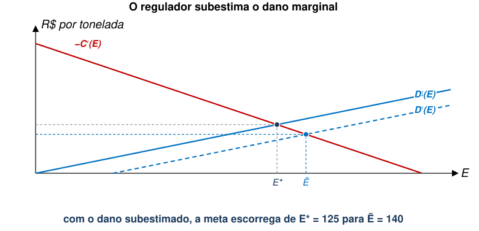
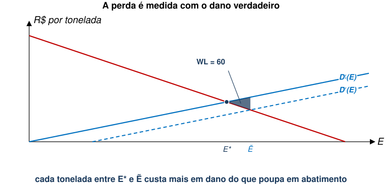
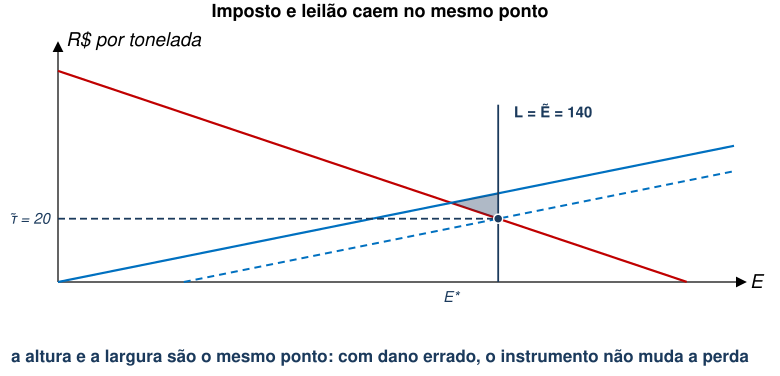
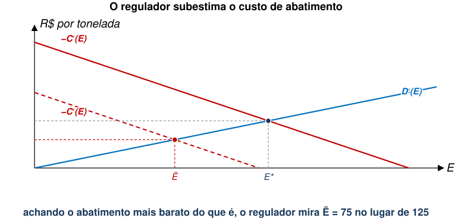
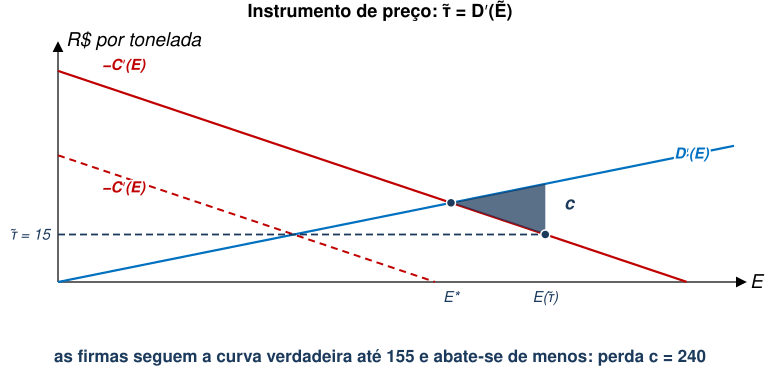
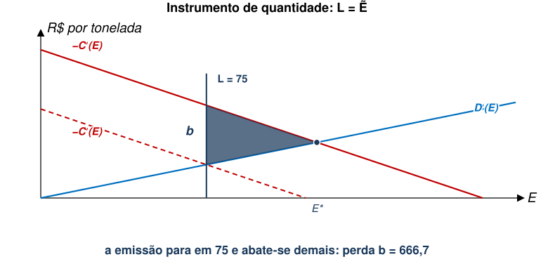
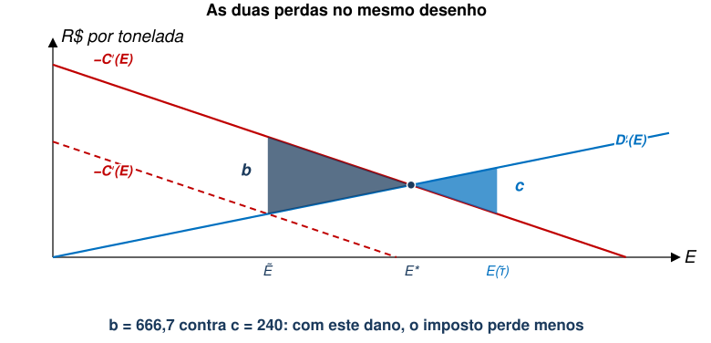
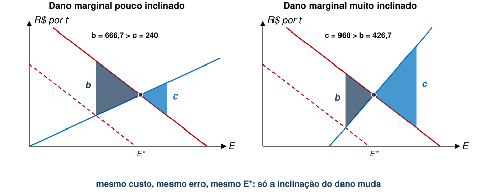
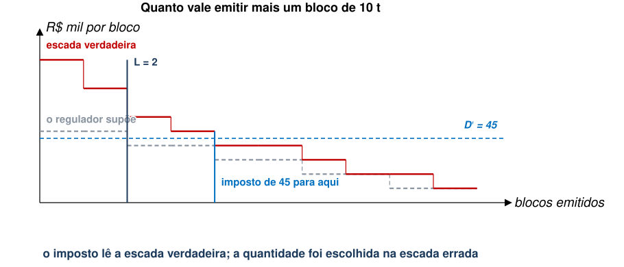
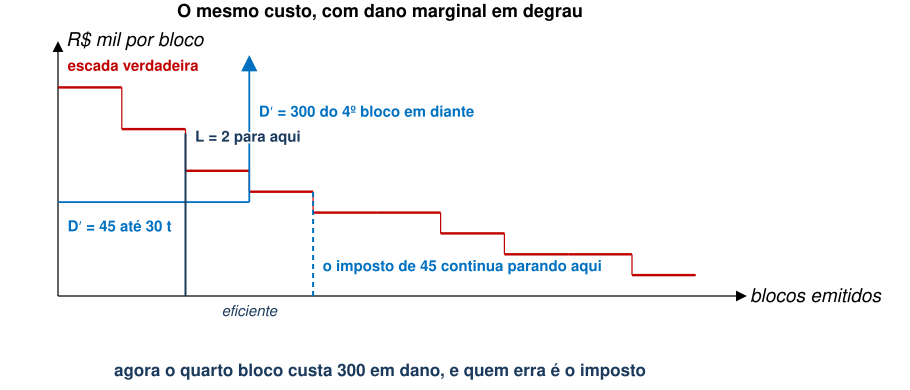

## Aula Passada

- Permissões Negociáveis
  - Leilão de $L$ permissões: o governo escolhe a quantidade e o preço
    $\sigma$ sai do lance das firmas.
  - Distribuição gratuita chega ao mesmo ${E}^{*}$, e muda só quem paga a quem.
- Subsídios ao Abatimento
  - $-{C}_{j}^{′}\left({e}_{j}\right)=\psi$ é a mesma margem do imposto, com o
    caixa da firma indo para o outro lado.

::: {.no-bullet}
Tudo isso sob informação perfeita.
:::

## Agenda

- Informação Assimétrica
  - Função de Danos
  - Custo de Abatimento
- Perdas e Inclinação da Função de Dano Marginal
- Teorema de Weitzman

::: {.no-bullet}
Referência: Phaneuf e Requate, cap. 4
:::

## Preço e Quantidade sob Informação Imperfeita

:::::: step-map
::: step
**1. Prescrever** o regulador diz o que fazer: tecnologia obrigatória ou
limite de emissão por fonte.
:::

::: {.step .now}
**2. Precificar** o regulador põe um preço na emissão: imposto ou subsídio.
:::

::: {.step .now}
**3. Limitar quantidade** o regulador fixa o total e deixa o mercado
repartir permissões.
:::

::: step
**4. Informar** o regulador informa população com inventários de emissão, selos e certificações.
:::
::::::

## Relevância de Informação Assimétrica

::: {.no-bullet}
Nas aulas anteriores, assumimos que as funções de danos e custo de abatimento
eram conhecidas por todos.
:::

- Este é um caso de informação perfeita.

::: {.no-bullet}
Entretanto, é razoável supor que os agentes não observem perfeitamente essas
funções.
:::

- Os danos podem ser medidos com erro.
- As firmas podem não divulgar sua estrutura de custos.

::: {.no-bullet}
Nesta aula, focaremos no caso em que **o regulador não tem informação
perfeita**.
:::

## Dano Observado com Imprecisão {.section-cover}

## Danos observados com imprecisão

::: {.no-bullet}
Comecemos com o caso em que o regulador tem informação assimétrica sobre a
função de danos.
:::

- Considere que ${E}^{*}$ é o nível ótimo obtido quando ${D}^{′}\left(E\right)=-C′(E)$.
- Defina $\tilde{D}(E)$ e ${\tilde{D}}^{′}(E)$ como as estimativas do regulador
  sobre as verdadeiras funções $D(E)$ e ${D}^{′}(E)$.
- Assuma que o regulador conhece $C′(E)$.

## Danos observados com imprecisão

::: {.no-bullet}
Suponha que o regulador **subestime** o dano marginal da poluição agregada.
:::

- Ou seja, ${\tilde{D}}^{′}\left(E\right)<{D}^{′}\left(E\right) \forall E$.

::: {.no-bullet}
Qual será a condição de ótimo observada pelo regulador neste caso?
:::

- [Regulador escolhe $\tilde{E}$ tal que ${\tilde{D}}^{′}\left(E\right)=-C′(E)$.]{.fragment fragment-index=1}
- [Ou seja, regulador se baseia no dano que observa.]{.fragment fragment-index=1}

::: {.no-bullet}
[Sabendo que ${\tilde{D}}^{′}\left(E\right)<{D}^{′}\left(E\right)$, teremos $\tilde{E}>{E}^{*}$ ou $\tilde{E}<{E}^{*}$. Por quê?]{.fragment fragment-index=1}
:::

- [Intuitivamente, se regulador subestima os danos, vai permitir mais poluição.]{.fragment fragment-index=2}

## A meta escorrega para a direita

::: {.diagram}
{style="max-height:390px"}
:::

- O regulador acha que as primeiras 40 t não fazem mal a ninguém (intercepto X), então a
  curva que ele enxerga passa por baixo da verdadeira.
- [Ele iguala $-C′$ à curva que observa, e define que o ótimo está em $\tilde{E}=140$ ao invés de
  ${E}^{*}=125$.]{.fragment fragment-index=1}

## Danos observados com imprecisão

1. Qual é a perda de eficiência ao se escolher $\tilde{E}$?
1. Essa perda varia com o instrumento de política ambiental escolhido para
   reduzir poluição?

::: {.no-bullet}
Matematicamente, a perda de eficiência (*welfare loss*) é dada por:
:::

::: {.eq-block}
$$WL=\left[D\left(\tilde{E}\right)+C\left(\tilde{E}\right)\right]-\left[D\left({E}^{*}\right)+C\left({E}^{*}\right)\right]$$
:::

::: {.eq-block}
$$=\int_{{E}^{*}}^{\tilde{E}} {D}^{′}\left(E\right)dE-\int_{{E}^{*}}^{\tilde{E}} {C}^{′}\left(E\right)dE$$
:::

::: {.no-bullet}
[Note que a perda é calculada com base na verdadeira função $D(E)$.]{.fragment fragment-index=1}
:::

## Graficamente

::: {.diagram}
{style="max-height:392px"}
:::

- Cada tonelada entre 125 e 140 causa mais dano do que poupa em abatimento, e
  a diferença é a altura do triângulo.
- [Quem calcula a perda usa $D′$, não a estimativa $\tilde{D}′$ que produziu
  o erro.]{.fragment fragment-index=1}

## Danos observados com imprecisão

::: {.no-bullet}
Considere o caso de um imposto sobre emissões.
:::

::: {.eq-block}
$$\tilde{\tau} = D'(\tilde{E}) = -{C}^{′}\left(\tilde{E}\right)\to \tilde{E}>{E}^{*}$$
:::

::: {.no-bullet}
Da mesma forma, se o governo leiloa $L=\tilde{E} > E^*$ permissões, também teremos:
:::

::: {.eq-block}
$$\sigma(\tilde{E}) = D'(\tilde{E}) = -{C}^{′}\left(\tilde{E}\right)$$
:::

::: {.no-bullet}
Ou seja, ambos os instrumentos levam à mesma alocação ineficiente.
:::

## Preço e quantidade levam ao mesmo ponto

::: {.diagram}
{style="max-height:355px"}
:::

- A alíquota que o regulador calcula e o preço que um leilão com $L=140$ produz
  são o **mesmo número**, 20.
- Errar o dano gera perda de ineficiência, mas esta é **a mesma** sob ambos os instrumentos.

## Custo de Abatimento Impreciso {.section-cover}

## Custo de Abatimento impreciso

::: {.no-bullet}
Agora, suponha que o regulador não observe o verdadeiro custo de abatimento agregado.
:::

- Defina $\tilde{C}(E)$ e ${\tilde{C}}^{′}(E)$ como as estimativas do regulador.
- Assuma que o regulador conhece $D′(E)$.

::: {.no-bullet}
Neste caso, o regulador escolhe a meta de poluição baseando-se:
:::

  - Na informação correta sobre os danos.
  - Em uma estimativa imprecisa sobre o custo de abatimento agregado.

## Custo de Abatimento impreciso

::: {.no-bullet}
Suponha que o regulador **subestime** o custo de abatimento marginal agregado.
:::

- Ou seja, $-{\tilde{C}}^{′}\left(E\right)<-{C}^{′}\left(E\right) \forall E$.

::: {.no-bullet}
Qual será a condição de ótimo neste caso?
:::

- Regulador busca $-{\tilde{C}}^{′}\left(E\right)=D′(E)$ e encontra $\tilde{E}$.

::: {.no-bullet}
Sabendo que $-{\tilde{C}}^{′}\left(E\right)<-{C}^{′}\left(E\right)$, teremos $\tilde{E}<{E}^{*}$ ou $\tilde{E}>{E}^{*}$. Por quê?
:::

- [Intuitivamente, se regulador subestima os custos, vai requerer redução de
  poluição mais intensa do que o ótimo.]{.fragment fragment-index=1}

## A meta fica apertada demais

::: {.diagram}
{style="max-height:390px"}
:::

- Supondo que o abatimento é mais barato do que a realidade, o regulador mira em $\tilde{E}=75$
  porém o ótimo de Pareto é ${E}^{*}=125$.
- [Repare que, agora, o erro está na curva **vermelha**, sobre a qual as firmas operam.]{.fragment fragment-index=1}

## Custo de Abatimento impreciso

::: {.no-bullet}
Neste caso, a perda de bem-estar **dependerá da política implementada?**
:::

::: {.no-bullet}
Primeiro, analisemos o caso de um imposto $\tau$ por unidade de $E$.
:::

- [Regulador define $\tilde{\tau}$ para induzir $E(\tilde{\tau})=\tilde{E}$.]{.fragment fragment-index=1}
- [Firmas reagem igualando $\tilde{\tau} =-C′(E)$.]{.fragment fragment-index=2}
- [Graficamente $\to$ perda igual a $c$.]{.fragment fragment-index=3}

## Com instrumento de preço, emissão fica acima do ótimo

::: {.diagram}
{style="max-height:392px"}
:::

- Com $\tilde{\tau}=15$ as firmas respondem na curva **verdadeira** e param em
  155.
- [Agora, abate-se menos do que o ótimo, gerando a perda $c$.]{.fragment fragment-index=1}

## Custo de Abatimento impreciso

::: {.no-bullet}
Agora, analisemos o caso de leilão de permissões (limite de quantidade).
:::

- [Regulador disponibiliza $L=\tilde{E}$ permissões.]{.fragment fragment-index=1}
- [Preço de equilíbrio é dado por $\sigma (\tilde{E})$.]{.fragment fragment-index=2}
- [Graficamente $\to$ perda igual a $b$.]{.fragment fragment-index=3}

## Com instrumento de quantidade, emissão fica abaixo do ótimo

::: {.diagram}
{style="max-height:393px"}
:::

- Com $L=75$ a emissão **é** 75, qualquer que seja o custo verdadeiro. As firmas ficam presas ali.
- [Abate-se demais, e a perda $b$ é a área entre as duas curvas verdadeiras.]{.fragment fragment-index=1}

## Custo de Abatimento impreciso

::: {.no-bullet}
Analiticamente, temos que:
:::

::: {.eq-block}
$$b=\int_{\tilde{E}}^{{E}^{*}} -{C}^{′}(E)dE-\int_{\tilde{E}}^{{E}^{*}} {D}^{′}\left(E\right)dE$$
:::

::: {.eq-block}
$$c=\int_{{E}^{*}}^{E\left(\tau \right)} {D}^{′}(E)dE-\int_{{E}^{*}}^{E\left(\tau \right)} -{C}^{′}(E)dE$$
:::

::: {.no-bullet}
Entretanto, não sabemos dizer se $b>c$ ou $b<c$.
:::

- [Ou seja, **quando custo de abatimento é desconhecido pelo regulador, tipo de política importa**.]{.fragment fragment-index=1}

## Qual das duas é maior?

::: {.diagram}
{style="max-height:393px"}
:::

- Neste desenho $b=666{,}7$ e $c=240$, então o imposto gera perda menor.
- [Mas nada garante isso: as duas áreas dependem de quanto o dano marginal
  sobe. Vamos girar essa reta e ver.]{.fragment fragment-index=1}

## Teorema de Weitzman {.section-cover}

## Relação entre Perdas e Inclinação de $D′(E)$

::: {.no-bullet}
Reescreva a função dano: $D(E,\eta )$.
:::

- $\eta$ é a inclinação do dano marginal (quanto maior $\eta$, mais inclinada).

::: {.no-bullet}
**Proposição**
:::

::: {.no-bullet}
Suponha $-{\tilde{C}}^{′}\left(E\right)\neq -C′(E)$, e seja $\tilde{E}$ a meta
definida por $-{\tilde{C}}^{′}\left(\tilde{E}\right)={D}_{E}(\tilde{E},\eta )$.
Quanto maior $\eta$, temos:
:::

1. $\left|{E}^{*}\left(\eta \right)-\tilde{E}\right|$ diminui, e a perda sob
   permissões limitadas (leilão) diminui também.
1. $\left|{E}^{*}\left(\eta \right)-E(\tau )\right|$ aumenta, e a perda sob
   imposto aumenta também.

## Graficamente

::: {.diagram}
{style="max-height:400px"}
:::

- Mesma curva de custo, mesmo erro do regulador, mesmo ${E}^{*}$. Só a
  inclinação do dano muda.
- [Com dano plano, o imposto perde menos. Com dano íngreme, as permissões
  perdem menos.]{.fragment fragment-index=1}

## Teorema de Weitzman

::: {.no-bullet}
É possível mostrar que, sob informação assimétrica, **diferença na perda de
eficiência** entre instrumentos de preço (imposto) e de quantidade (permissões)
**depende da inclinação relativa das curvas de custo de abatimento marginal e
dano marginal** [@weitzman1974].
:::

- Isto ocorre quando há incerteza sobre a curva de custo de abatimento.

::: {.no-bullet}
Quando há incerteza sobre o dano, a perda é a mesma para dois instrumentos
diferentes.
:::

- O que muda com a inclinação relativa é apenas o tamanho da perda.

## Exercício: o regulador erra o custo

::: {.no-bullet}
As mesmas usinas: cada uma emite 50 t e corta em blocos de 10 t, aos custos abaixo (em R\$ mil).
:::

::: {.tabela}
| | 1º bloco | 2º | 3º | 4º | 5º |
|---|---|---|---|---|---|
| Usina A | 10 | 20 | 30 | 40 | 50 |
| Usina B | 20 | 40 | 60 | 80 | 100 |
:::

- Cada 10 t emitidas causam R\$ 45 mil de dano, e o regulador sabe disso.
- **O que não sabe é o custo da B: ele acha que ela é igual à A.**
- **(a)** Com essa crença, quantos blocos ele acha que devem ser emitidos?
- **(b)** Ele emite $L$ permissões nessa quantidade. Onde a indústria para?
- **(c)** E se ele cobrar um imposto de 45 por bloco emitido?

## As duas escadas

::: {.diagram}
{style="max-height:305px"}
:::

- **(a)** Emitir um bloco poupa o corte mais caro. Na crença do regulador, só
  dois blocos valem mais que 45, então ele mira 2 e emite $L=2$.
- [**(b)** Com $L=2$ a indústria emite 2 blocos e corta 8 (os mais baratos):
  R\$ 270 mil.]{.fragment fragment-index=1}
- [**(c)** Com $\tau =45$, cada usina corta o que custa menos que 45: A corta
  4 e B corta 2. Emitem-se 4 blocos ao custo de R\$ 160 mil.]{.fragment fragment-index=2}

## O imposto induz o ótimo de Pareto

::: {.cmp}
| | Blocos emitidos | Abatimento | Dano | Custo social |
|---|---|---|---|---|
| Eficiente | 4 | 160 | 180 | **340** |
| Imposto $\tau =45$ | 4 | 160 | 180 | **340** |
| Permissões $L=2$ | 2 | 270 | 90 | **360** |
:::

- Corte eficiente é o mesmo das aulas anteriores: 40 t emitidas.
- [O imposto acerta porque o regulador usa o dano (conhecido e perfeitamente plano) para calcular alíquota.]{.fragment fragment-index=1}
- [As permissões erram por 20, porque a quantidade é calculada com base na curva errada.]{.fragment fragment-index=2}

## E se o dano fosse íngreme?

::: {.no-bullet}
Mesmas usinas, mesma crença do regulador, mudando apenas a curva de danos: acima de 30 t
emitidas o rio fica sem oxigênio, e cada bloco a mais causa dano de R\$ 300 mil.
:::

::: {.diagram}
{style="max-height:370px"}
:::

- O eficiente cai para 3 blocos, mas imposto de 45 continua parando levando a 4.

## Agora, imposto gera ineficiência

::: {.cmp}
| | Blocos | Custo social com dano 45 | Custo social com o degrau |
|---|---|---|---|
| Eficiente | 4 e 3 | **340** | **345** |
| Permissões $L=2$ | 2 | 360 (perda 20) | 360 (perda 15) |
| Imposto $\tau =45$ | 4 | 340 (perda 0) | 595 (**perda 250**) |
:::

- Dano constante é o caso $\eta =0$: o imposto gera ótimo de Pareto, enquanto quantidade gera ineficiência.
- O degrau no dano é o caso de $\eta$ enorme: passar um bloco do limite custa 300, e
  quem não controla a quantidade paga caro por isso.{.fragment fragment-index=1}

## Concluindo

- Quando o regulador erra o **dano**, imposto e permissões produzem a mesma
  alocação e a mesma perda.
- Quando erra o **custo de abatimento**, cada instrumento gera perda em lados opostos,
  e o tamanho de cada erro depende da inclinação de $D′$.
- Com dano marginal constante, preço é mais indicado; com dano marginal muito íngreme, quantidade é melhor.

## Referências

::: {#refs}
:::
