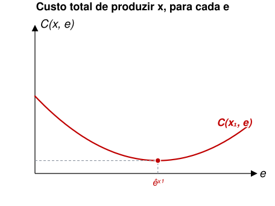
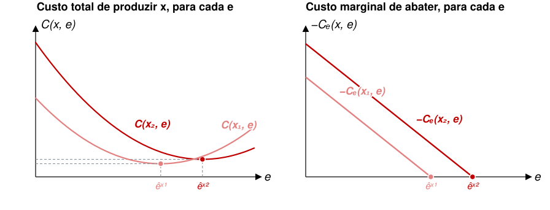
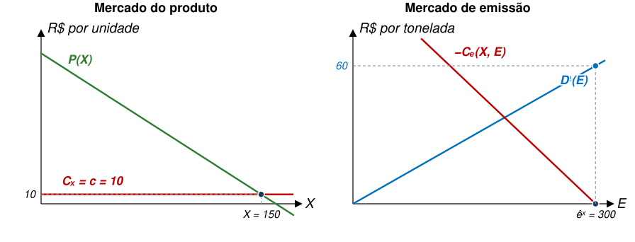
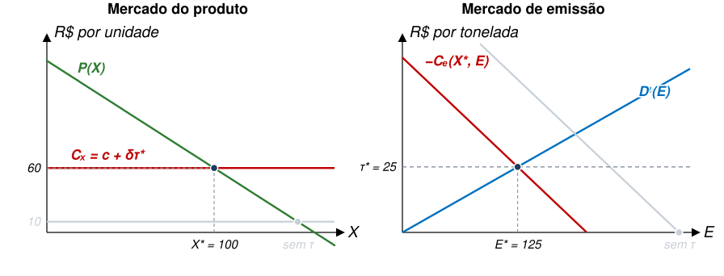
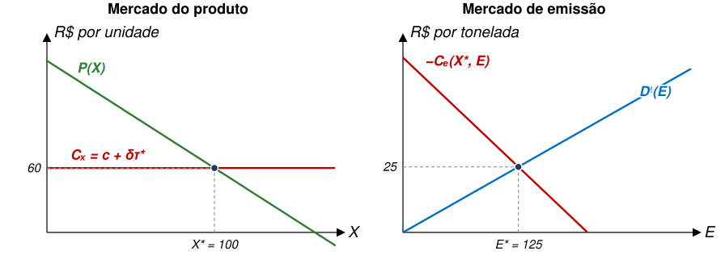
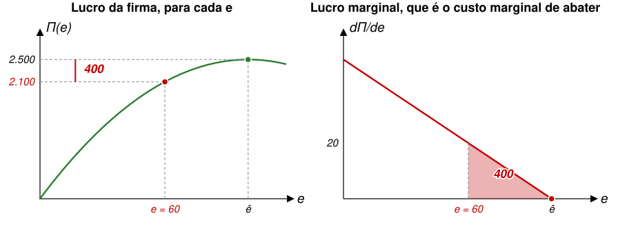
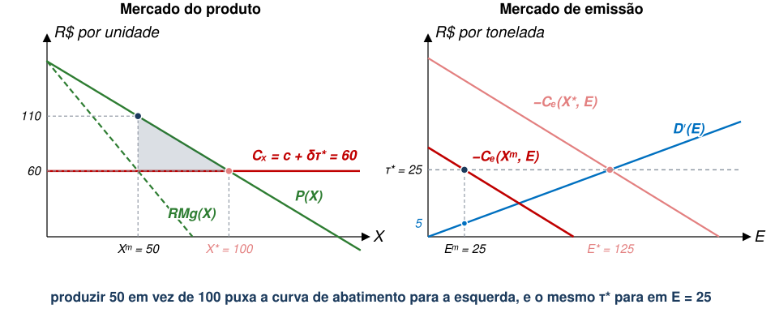
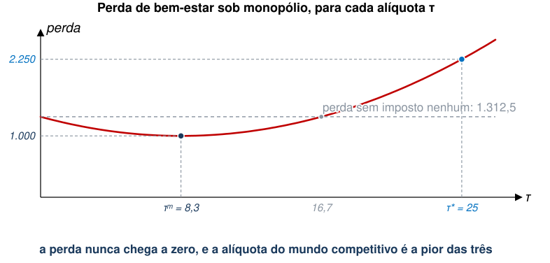
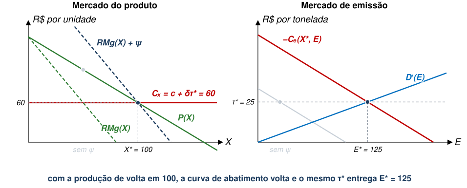
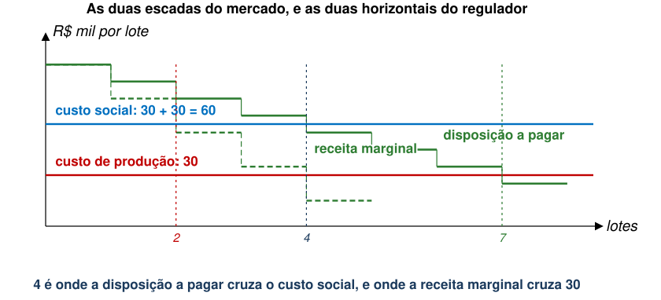

## Imposto de poluição em mercado com apenas um produtor

::: {.no-bullet}
Uma indústria poluidora tem um único produtor. O regulador cobra dele um
imposto igual ao dano marginal, que é a alíquota eficiente quando o mercado é
competitivo.
:::

::: {.opcoes}
**(a)** O bem-estar sobe: o imposto corrige a externalidade, e isso vale em
qualquer mercado.

**(b)** O bem-estar sobe, mas menos do que sob concorrência, porque o
monopolista repassa parte da conta ao preço.

**(c)** O bem-estar pode cair: o monopolista já produzia de menos, e o imposto
o faz produzir menos ainda.
:::

## Agenda

- Mercado Competitivo pelo Produto Final
  - Função Custo
  - Demanda de Mercado
- Instrumentos de Política
  - Impostos
  - Permissões
- Monopólio no Mercado do Produto Final
  - Modelo Básico
  - Imposto sobre Poluição
  - Subsídio à Produção do Bem Final

::: {.no-bullet}
Referência: Phaneuf e Requate, caps. 5 e 6
:::

## Onde estamos no modelo

:::::: step-map
::: step
**1. Uma escolha** a firma decide quanto emitir, e a produção fica fora do
modelo.
:::

::: {.step .now}
**2. Duas escolhas** a firma decide quanto produzir e quanto emitir, e o custo
liga as duas.
:::

::: {.step .now}
**3. Mercado competitivo** o preço é dado, e um instrumento basta.
:::

::: step
**4. Mercado monopolista** o vendedor escolhe o preço, e um instrumento não
basta.
:::
::::::

## Produto e Poluição {.section-cover}

## Custo Produtivo e Demanda de Consumidores

- Para simplificar nossas análises, nós ignoramos os custos produtivos das
  firmas.
- Também não discutimos a demanda pelos produtos finais.
- Vamos retomar o que vimos nas primeiras aulas.
  - Expandiremos as funções-custo.
  - Adicionaremos produtos ao mercado consumidor.

## Função-Custo

- Considere uma tecnologia que produz o bem $x$:

::: {.eq-block}
$$x=f({\ell }_{1},...,{\ell }_{K})$$
:::

  - Em que $({\ell }_{1},...,{\ell }_{K})$ é um vetor de insumos.
- [Defina também a tecnologia que gera poluição a partir do uso dos
  insumos:]{.fragment fragment-index=1}

::: {.eq-block .fragment fragment-index=1}
$$e=g({\ell }_{1},...,{\ell }_{K})$$
:::

  - [Ou seja, poluição é subproduto dos insumos usados na produção de
    $x$.]{.fragment fragment-index=1}
- [A ausência de subscrito $j$ em $f\left(\cdot \right)$ é apenas por
  conveniência. Continue assumindo firmas heterogêneas com ${f}_{j}(\cdot
  )$.]{.fragment fragment-index=2}

## Função-Custo

- Note que o produto marginal de $f(\cdot )$ e $g(\cdot )$ em relação a um
  insumo ${\ell }_{k}$ pode ser positivo, negativo ou zero.
- Isto significa que pode haver insumos que aumentam a produção de $x$ ao mesmo
  tempo em que reduzem emissões.

## Função-Custo

- A função-custo é resultado do problema de minimização de custos de cada
  firma.
- Definiremos a função-custo como:

::: {.eq-block}
$$C\left(x,e\right)=\min_{({\ell }_{1},...,{\ell }_{K})} \left\{\sum_{k=1}^{K} {w}_{k}{\ell }_{k}+\lambda [x-f({\ell }_{1},...,{\ell }_{K})+\mu [e-g({\ell }_{1},...,{\ell }_{K})\right\}$$
:::

::: {.no-bullet}
Em que $({w}_{1},...,{w}_{K})$ é o vetor de preços dos insumos (fatores de
produção).
:::

  - Como exemplo, insumos podem ser capital, trabalho, petróleo, carvão etc.

## Premissas Adicionais

- A função-custo $C(x,e)$ é duplamente diferenciável.
- ${C}_{x}\left(x,e\right)=\frac{\partial C\left(x,e\right)}{\partial x}>0$
  $\to$ Custo aumenta com produto.
- [Para cada nível de produção de $x$, há nível de emissão ${ê}^{x}$ tal
  que:]{.fragment fragment-index=1}

::: {.eq-block .fragment fragment-index=1}
$${C}_{e}\left(x,{ê}^{x}\right)=\frac{\partial C\left(x,{ê}^{x}\right)}{\partial e}=0$$
:::

  - [Isto é análogo ao caso de $ê$ nas aulas anteriores, que era o nível de
    poluição em um ambiente sem nenhuma regulação.]{.fragment fragment-index=2}

## Premissas Adicionais

::: {.no-bullet}
Sobre o custo marginal de abatimento, $-{C}_{e}(x,e)$, temos que:
:::

  - ${C}_{e}\left(x,e\right)<0 \quad \forall e<{ê}^{x}$.
  - ${C}_{e}\left(x,e\right)\geq 0 \quad \forall e\geq {ê}^{x}$.
  - Estas duas premissas dizem que o custo da firma aumenta conforme ela
    escolhe poluição acima ou abaixo do nível ótimo ${ê}^{x}$.

::: {.no-bullet}
[Além disso, temos:]{.fragment fragment-index=1}
:::

- [${C}_{xe}\left(x,e\right)={C}_{ex}\left(x,e\right)<0 ↔ -{C}_{ex}\left(x,e\right)>0 \forall e<{ê}^{x}$.]{.fragment fragment-index=1}
- [Isto significa que o custo marginal de abatimento aumenta com a
  produção.]{.fragment fragment-index=2}
  - [Ou seja, é mais caro (na margem) reduzir poluição se a produção é
    maior.]{.fragment fragment-index=2}

## O custo tem um mínimo em $e$

::: {.diagram}
{style="max-height:390px"}
:::

- Note que o custo de produzir $x={x}_{1}$ é mínimo com $e={ê}^{{x}_{1}}$.
- [Custo aumenta se $e>{ê}^{{x}_{1}}$ ou se $e<{ê}^{{x}_{1}}$. Poluir de menos
  também custa caro.]{.fragment fragment-index=1}

## E o mínimo anda com a produção

::: {.diagram}
{style="max-height:350px"}
:::

- Com ${x}_{2}>{x}_{1}$, a curva inteira sobe e o mínimo se desloca para
  ${ê}^{{x}_{2}}$.
- [No segundo gráfico, note que os custos marginais de abatimento
  $-{C}_{e}({x}_{1},e)$ e $-{C}_{e}({x}_{2},e)$ são iguais a zero quando
  $e={ê}^{{x}_{1}}$ ou $e={ê}^{{x}_{2}}$.]{.fragment fragment-index=1}
- [Para cada $e$, a curva de ${x}_{2}$ está por cima. É isto que
  $-{C}_{ex}>0$ quer dizer.]{.fragment fragment-index=2}

## Demanda dos Consumidores

::: {.no-bullet}
Assuma a seguinte função-utilidade quase-linear:
:::

::: {.eq-block}
$${U}^{i}={u}_{i}\left({x}_{i}\right)+{z}_{i}-{D}_{i}\left(E\right)$$
:::

- ${x}_{i}$ é o consumo do bem cuja produção é poluente.
- ${z}_{i}$ é o gasto em todos os outros bens.

::: {.no-bullet}
A restrição orçamentária do consumidor é dada por:
:::

::: {.eq-block}
$${y}_{i}=p{x}_{i}+{z}_{i}$$
:::

  - Em que $p$ é o preço do bem $x$.

## Função de Demanda Inversa

::: {.no-bullet}
O consumidor maximiza utilidade sujeito à restrição orçamentária.
:::

- Condição de primeira ordem é ${u}_{i}^{′}\left({x}_{i}\right)=p$.

::: {.no-bullet}
Podemos definir a função de demanda inversa individual (disposição marginal a
pagar) usando a CPO:
:::

::: {.eq-block}
$${p}_{i}\left({x}_{i}\right)={u}_{i}^{′}({x}_{i})$$
:::

::: {.no-bullet}
O benefício de se consumir ${x}_{i}$ unidades é dado por:
:::

::: {.eq-block}
$$\int_{0}^{{x}_{i}} {p}_{i}\left(t\right)dt={u}_{i}({x}_{i})$$
:::

## Benefício Agregado do Consumo de $x$

::: {.no-bullet}
Para agregar o benefício de se consumir $x$ entre os consumidores, defina:
:::

::: {.eq-block}
$$X=\sum_{i=1}^{I} {x}_{i}$$
:::

::: {.no-bullet}
A demanda inversa agregada é dada pela soma horizontal das demandas
individuais.
:::

- Vamos chamá-la de $P(X)$.

::: {.no-bullet}
Com isso, temos danos e benefícios associados à poluição:
:::

- Dano causado pela produção de $x$ é $D(E)$.
- Benefício por consumir $x$ é a área sob $P(X)$.

## Maximização de Bem-Estar Social

::: {.no-bullet}
O bem-estar social gerado por $x$, neste caso, é dado por:
:::

::: {.eq-block .fragment fragment-index=1}
$$W\left({x}_{1},...,{x}_{J},{e}_{1},...,{e}_{J}\right) = \int_{0}^{\sum {x}_{j}} P\left(t\right)dt - \sum_{j=1}^{J} {C}^{j}\left({x}_{j},{e}_{j}\right) - D(E)$$
:::

::: {.no-bullet}
[Os três termos são benefício total aos consumidores, custo total das firmas e
dano causado pela poluição. O problema do regulador é:]{.fragment fragment-index=1}
:::

::: {.eq-block .fragment fragment-index=1}
$$\underset{\begin{array}{l}{x}_{1},...,{x}_{J} \\ {e}_{1},...,{e}_{J}\end{array}}{\max_{}} W({x}_{1},...,{x}_{J},{e}_{1},...,{e}_{J})$$
:::

## Maximização de Bem-Estar Social

::: {.no-bullet}
O bem-estar social gerado por $x$, neste caso, é dado por:
:::

::: {.eq-block}
$$W\left({x}_{1},...,{x}_{J},{e}_{1},...,{e}_{J}\right) = \int_{0}^{\sum {x}_{j}} P\left(t\right)dt - \sum_{j=1}^{J} {C}^{j}\left({x}_{j},{e}_{j}\right) - D(E)$$
:::

::: {.no-bullet}
Quais são as condições de primeira ordem?
:::

::: {.eq-block .fragment fragment-index=1}
$$P\left(X\right)={C}_{{x}_{j}}^{j}\left({x}_{j},{e}_{j}\right) \forall j$$
:::

::: {.eq-block .fragment fragment-index=1}
$${D}^{′}\left(E\right)=-{C}_{{e}_{j}}^{j}\left({x}_{j},{e}_{j}\right) \forall j$$
:::

## Maximização de Bem-Estar Social

- A condição $P\left(X\right)={C}_{{x}_{j}}^{j}\left({x}_{j},{e}_{j}\right)$
  representa o resultado básico de microeconomia que **iguala custo marginal a
  benefício marginal do consumo**.
- A condição
  ${D}^{′}\left(E\right)=-{C}_{{e}_{j}}^{j}\left({x}_{j},{e}_{j}\right)$
  representa o que vimos anteriormente, em que **dano marginal da poluição se
  iguala ao custo marginal de abatimento**.

::: {.no-bullet}
São duas condições, e nenhuma delas é nova. A novidade é considerá-las ao mesmo tempo.
:::

## O equilíbrio sem imposto

::: {.diagram}
{style="max-height:310px"}
:::

- Sem imposto, a firma para onde abater deixa de custar, em $e={ê}^{x}$, e o
  custo marginal de produzir é o "limpo", ${C}_{x}=c=10$.
- [A demanda faz o resto: $X=150$, e a emissão que vem junto é
  ${ê}^{X}=300$.]{.fragment fragment-index=1}
- [Ali, abater a última tonelada custa zero e evitaria 60 de
  dano.]{.fragment fragment-index=2}

## O imposto sobe o custo marginal

::: {.diagram}
{style="max-height:310px"}
:::

- Com um imposto $\tau$ por tonelada, a firma abate até $\tau =-{C}_{e}$, e o
  custo marginal de produzir vira ${C}_{x}=c+\delta \tau$.
- [Com ${\tau }^{*}=25$, ela vai de 10 a 60, e a produção cai para
  100.]{.fragment fragment-index=1}
- [A curva de abatimento anda junto, porque depende de $X$, e o mesmo
  ${\tau }^{*}$ para em ${E}^{*}=125$.]{.fragment fragment-index=2}

## As duas condições lado a lado

::: {.diagram}
{style="max-height:310px"}
:::

- O painel da direita é a figura das aulas 04 a 09: $-C′(E)=(200-E)/3$ cruzando
  $D′(E)=0{,}2E$ em ${E}^{*}=125$, com preço 25.
- Esta aula acrescenta o painel da esquerda, ao passo que a curva vermelha da
  direita é a curva de abatimento **no nível de produção ${X}^{*}$**. Note que esta é diferente para cada ${X}^{*}$.

## Instrumentos de Política

- Para avaliar como impostos e permissões afetam o equilíbrio, precisamos
  avaliar o caso competitivo.
- Começaremos com impostos e, depois, veremos permissões.

::: {.no-bullet}
A pergunta a guardar é quantos instrumentos o regulador precisa para atender às
**duas** condições do ótimo.
:::

## Impostos

No equilíbrio competitivo, temos firmas maximizando lucro, dado pela função abaixo:

::: {.eq-block}
$${Π}_{j}\left({x}_{j},{e}_{j}\right)=p{x}_{j}-{C}^{j}\left({x}_{j},{e}_{j}\right)-\tau {e}_{j}$$
:::

::: {.no-bullet}
Como de costume, a escolha ótima é revelada pelas CPOs:
:::

::: {.eq-block}
$$p={C}_{{x}_{j}}^{j}\left({x}_{j}, {e}_{j}\right) \qquad \tau =-{C}_{{e}_{j}}^{j}({x}_{j},{e}_{j})$$
:::

::: {.no-bullet}
Se o regulador tem informação plena, pode tentar implementar um imposto $\tau
={D}^{′}({E}^{*})$ e alcançar o ótimo de Pareto.
:::

## Leilão de Permissões

O governo emite $L$ permissões, de modo que temos:

::: {.eq-block}
$${Π}_{j}\left({x}_{j},{e}_{j}\right)=p{x}_{j}-{C}^{j}\left({x}_{j},{e}_{j}\right)-\sigma (L){e}_{j}$$
:::

::: {.no-bullet}
E CPOs:
:::

::: {.eq-block}
$$p={C}_{{x}_{j}}^{j}\left({x}_{j}, {e}_{j}\right) \qquad \sigma (L)=-{C}_{{e}_{j}}^{j}({x}_{j},{e}_{j})$$
:::

::: {.no-bullet}
Se $L={E}^{*}$, teremos o ótimo de Pareto.
:::

- **Um instrumento, e as duas condições atendidas.**

## Custo de Abatimento Não-Separável

::: {.no-bullet}
Em alguns contextos, firmas não conseguem abater poluição com tecnologia
específica para isso.
:::

- Nestes casos, redução de poluição acontece somente por meio de **redução de
  produção**.

::: {.no-bullet}
Formalmente, teríamos uma função $C(x)$ com ${C}^{′}\left(x\right)>0$ e
${C}^{′′}\left(x\right)\geq 0$.
:::

::: {.no-bullet}
Além disso, emissões seriam função direta da produção.
:::

- Ou seja, $e=\phi (x)$.
- Como exemplo, considere uma função linear $e=\phi \left(x\right)=\delta x$.

## Custo de Abatimento Não-Separável

::: {.no-bullet}
Se a redução de poluição afeta diretamente a produção, o custo de abatimento é
a perda de lucro da firma.
:::

- Ou seja, trata-se de um custo de oportunidade.

::: {.no-bullet}
Com $e=\delta x \to x=\frac{e}{\delta }$, o lucro da firma é dado por:
:::

::: {.eq-block}
$$Π=px-C\left(x\right)=\frac{p.e}{\delta }-C\left(\frac{e}{\delta }\right)$$
:::

## Custo de Abatimento Não-Separável

::: {.no-bullet}
Sabemos que $\hat{e}$ resolve a seguinte expressão:
:::

::: {.eq-block}
$$\frac{dΠ}{de}=\left[p-{C}^{′}\left(\frac{\hat{e}}{\delta }\right)\right]\frac{1}{\delta }=0$$
:::

::: {.no-bullet}
[O que acontece quando $e<\hat{e}$?]{.fragment fragment-index=1}
:::

- [Lucro diminui em $\frac{dΠ}{de}=\left[p-{C}^{′}\left(\frac{e}{\delta }\right)\right]\frac{1}{\delta }$, e por isso $\frac{dΠ}{de}$ pode ser interpretada como o custo marginal de abatimento.]{.fragment fragment-index=2}

## Abater é lucro perdido

::: {.diagram}
{style="max-height:350px"}
:::

- O lucro tem um pico em $\hat{e}$, que é onde a firma pararia sem regulação
  nenhuma.
- Descer de $\hat{e}=100$ para $e=60$ custa 400 de lucro, que é exatamente a
  área sob a curva da direita.
- Aqui, **abater é produzir menos**.

## Monopólio {.section-cover}

## Onde estamos no modelo

:::::: step-map
::: step
**1. Uma escolha** a firma decide quanto emitir, e a produção fica fora do
modelo.
:::

::: step
**2. Duas escolhas** a firma decide quanto produzir e quanto emitir, e o custo
liga as duas.
:::

::: step
**3. Mercado competitivo** o preço é dado, e um instrumento basta.
:::

::: {.step .now}
**4. Mercado monopolista** o vendedor escolhe o preço, e um instrumento não
basta.
:::
::::::

## Introduzindo Falhas de Concorrência

- Vamos discutir como nossas conclusões se alteram quando as firmas poluidoras
  não atuam em mercado competitivo.
- Muitos mercados regulados de fato não são competitivos.
  - Energia.
  - Montadoras de automóveis.
  - Refinarias de petróleo.
- Para simplificar, trataremos do caso de monopólio.
  - Mas também seria possível analisar oligopólio ou concorrência
    monopolística.

## Monopólio

- Vamos denotar $P(X)$ como a demanda inversa pelo produto final.
- Como só há uma firma, emissão individual é $E$.
- Qual é o problema do monopolista (com imposto)?

::: {.eq-block .fragment fragment-index=1}
$$\max_{X,E} Π\left(X,E\right)=P\left(X\right)X-C\left(X,E\right)-\tau E$$
:::

- [Qual é a decisão ótima do monopolista?]{.fragment fragment-index=1}

::: {.eq-block .fragment fragment-index=2}
$${P}^{′}\left({X}^{m}\right){X}^{m}+P\left({X}^{m}\right)={C}_{X}\left({X}^{m},{E}^{m}\right)$$
:::

::: {.eq-block .fragment fragment-index=2}
$$-{C}_{E}({X}^{m},{E}^{m})=\tau$$
:::

::: {.no-bullet}
[A segunda CPO é **idêntica** à da firma competitiva.]{.fragment fragment-index=3}
:::

## Solução de Pareto para Monopólio

- Vejamos como seria a solução eficiente para o caso de monopólio.
  - Note que há duas falhas de mercado aqui: **concorrência imperfeita e
    externalidades**.
- Novamente, maximizaremos bem-estar total:

::: {.eq-block .fragment fragment-index=1}
$$\max_{X,E} W\left(X,E\right) = \int_{0}^{X} P\left(t\right)dt-C\left(X,E\right)-D\left(E\right)$$
:::

::: {.no-bullet}
[CPOs:]{.fragment fragment-index=1}
:::

::: {.eq-block .fragment fragment-index=1}
$$P\left({X}^{*}\right)={C}_{X}\left({X}^{*},{E}^{*}\right) \qquad {D}^{′}\left(E\right)=-{C}_{E}\left({X}^{*},{E}^{*}\right)$$
:::

::: {.no-bullet}
[São as mesmas duas condições do caso competitivo. O regulador quer $P(X)$, e o
monopolista entrega ${P}^{′}(X)X+P(X)$.]{.fragment fragment-index=2}
:::

## O mesmo imposto, e metade da produção

::: {.diagram}
{style="max-height:306px"}
:::

- O custo marginal de produzir fica constante em $c+\delta \tau =60$.
- Produzir 50 em vez de 100 desloca curva de abatimento para baixo. Aqui, está atuando a premissa $-{C}_{ex}>0$ em funcionamento.
- Monopólio **polui menos** do que o ótimo sob ${\tau }^{*}$. Poluição fica em ${E}^{m}=25$, onde abater custa 25 e evita só 5 de dano.

## Eficiência apenas com imposto?

É possível alcançar a solução ótima $({X}^{*},{E}^{*})$ apenas com um imposto $\tau$?

- Para isso, denote ${X}^{m}(\tau )$ e ${E}^{m}(\tau )$ como as escolhas do
    monopolista em função do nível de $\tau$.
    
Regulador define $\tau$ para maximizar

::: {.eq-block}
$$\max_{\tau} W\left[{X}^{m}\left(\tau \right),{E}^{m}\left(\tau \right)\right]$$
:::

::: {.eq-block}
$$= \int_{0}^{{X}^{m}(\tau )} P\left(t\right)dt-C\left[{X}^{m}\left(\tau \right),{E}^{m}\left(\tau \right)\right]-D\left({E}^{m}\left(\tau \right)\right)$$
:::

::: {.no-bullet}
Note que o regulador tem **um** instrumento e **duas** margens a corrigir.
:::

## Eficiência apenas com imposto?

- Neste caso, o imposto vai ser diferente do dano marginal, que seria o imposto
  eficiente:

::: {.eq-block}
$${\tau }^{m}={D}^{′}\left({E}^{m}\right)+{P}^{′}\left({X}^{m}\right){X}^{m}\frac{\frac{\partial {X}^{m}}{\partial \tau }}{\frac{\partial {E}^{m}}{\partial \tau }} \neq {D}^{′}\left({E}^{*}\right)={\tau }^{*}$$
:::

- Na verdade, é possível mostrar algebricamente que
  $\frac{\frac{\partial {X}^{m}}{\partial \tau }}{\frac{\partial {E}^{m}}{\partial \tau }}>0$.
- Ou seja, imposto vai ser menor do que o eficiente: ${\tau }^{m}<{\tau }^{*}$.

## Eficiência apenas com imposto?

::: {.no-bullet}
Lembrando que ${P}^{′}\left(X\right)<0$, note que:
:::

- **Se** $|{P}^{′}\left({X}^{m})\right|$ **é pequeno** (demanda mais elástica),
  imposto se aproxima do ótimo.
- **Se** $|{P}^{′}\left({X}^{m})\right|$ **é grande** (demanda inelástica),
  distorção do poder de mercado é maior e imposto fica mais longe do ótimo.

::: {.eq-block}
$${\tau }^{m}={D}^{′}\left({E}^{m}\right)+{P}^{′}\left({X}^{m}\right){X}^{m}\frac{\frac{\partial {X}^{m}}{\partial \tau }}{\frac{\partial {E}^{m}}{\partial \tau }}$$
:::

## Qual alíquota então?

::: {.diagram}
{style="max-height:266px"}
:::

- Com os números desta aula, o melhor imposto sozinho é ${\tau }^{m}=8{,}3$, e
  ainda assim sobra perda de 1.000.
- Se usarmos a alíquota do mundo competitivo, ${\tau }^{*}=25$, a perda é de 2.250: **pior do que não cobrar imposto nenhum**, que perderia 1.312,5.
- Na verdade, acima da alíquota de 16,7, a perda sob monopólio desregulado é menor do que a perda com imposto.

## Subsídio à Produção do Bem Final

- Conclusão é que apenas um imposto sobre emissões **não é suficiente** para
  atingir Ótimo de Pareto.
- Para atingir níveis eficientes de $X$ e $E$, precisamos de um instrumento
  adicional.
  - Subsídio à produção de $X$.
- [Do curso de Microeconomia, sabemos que monopólios tendem a produzir menos do
  que o ótimo para aumentar preço.]{.fragment fragment-index=1}
  - [Ao subsidiar produção de $X$, é possível incentivar nível socialmente
    ótimo.]{.fragment fragment-index=1}

## Subsídio à Produção do Bem Final

- Defina $\psi$ como o subsídio à produção de $X$.
- Novo problema do monopolista será:

::: {.eq-block}
$$\max_{X,E} Π\left(X,E\right)=\left[P\left(X\right)+\psi \right]X-C\left(X,E\right)-\tau E$$
:::

::: {.no-bullet}
Cujas CPOs são:
:::

::: {.eq-block}
$${P}^{′}\left({X}^{m}\right){X}^{m}+P\left({X}^{m}\right)+\psi ={C}_{X}\left({X}^{m},{E}^{m}\right)$$
:::

::: {.eq-block}
$$-{C}_{E}({X}^{m},{E}^{m})=\tau$$
:::

## Subsídio à Produção do Bem Final

- Se definirmos $\psi =-{P}^{′}\left({X}^{*}\right){X}^{*}$ e
  $\tau ={D}^{′}\left({E}^{*}\right)$, teremos:

::: {.eq-block}
$$P\left(X\right)+{P}^{′}\left(X\right)X-{P}^{′}\left({X}^{*}\right){X}^{*}={C}_{X}\left(X,E\right)$$
:::

::: {.eq-block}
$$-{C}_{E}\left(X,E\right)={D}^{′}({E}^{*})$$
:::

::: {.no-bullet}
Duas falhas de mercado, dois instrumentos: $\tau$ cuida da externalidade e
$\psi$ cuida do poder de mercado.
:::

## Duas falhas, dois instrumentos

::: {.diagram}
{style="max-height:300px"}
:::

- Com $\psi =-P′({X}^{*}){X}^{*}=100$, a receita marginal sobe exatamente o
  tanto que o poder de mercado tinha derrubado.
- Com a produção de volta em 100, a curva de abatimento volta ao lugar, e o
  mesmo ${\tau }^{*}=25$ agora entrega ${E}^{*}=125$.
- Entretanto, defender um subsídio a monopólios tende a ser politicamente
  difícil.

## Exercício: fábrica monopolista

::: {.no-bullet}
Uma única fábrica vende lotes de um produto. Cada lote emite 2 t, e cada
tonelada causa R\$ 15 mil de dano. Produzir um lote custa R\$ 30 mil.
:::

::: {.tabela}
| lote | 1º | 2º | 3º | 4º | 5º | 6º | 7º |
|---|---|---|---|---|---|---|---|
| Disposição a pagar | 95 | 85 | 75 | 65 | 55 | 45 | 35 |
| Receita marginal | 95 | 75 | 55 | 35 | 15 | | |
:::

- **(a)** Quantos lotes o regulador quer que sejam produzidos?
- **(b)** Quantos lotes a fábrica produz sem política nenhuma?
- **(c)** E se ela pagar um imposto igual ao dano marginal, R\$ 30 mil por lote?
- **(d)** E se, junto com o imposto, ela receber R\$ 40 mil de subsídio por lote?

## Solução

::: {.diagram}
{style="max-height:305px"}
:::

- **(a)** Vale produzir enquanto a disposição a pagar cobre o custo social de
  60: são **4 lotes**.
- [**(b)** A fábrica produz enquanto a receita marginal cobre os 30 de custo:
  são **4 lotes** também.]{.fragment fragment-index=1}
- [**(c)** Com o imposto, ela compara a receita marginal com 60 e para em
  **2 lotes**.]{.fragment fragment-index=2}
- [**(d)** Com o subsídio de 40, a receita marginal sobe e ela volta aos
  **4 lotes**.]{.fragment fragment-index=3}

## Imposto correto no mercado errado

::: {.tabela}
| | Lotes | Emissão | Bem-estar |
|---|---|---|---|
| Eficiente | 4 | 8 t | **80** |
| Concorrência sem política | 7 | 14 t | 35 |
| Monopólio sem política | 4 | 8 t | **80** |
| Monopólio com $\tau =30$ | 2 | 4 t | 60 |
| Monopólio com $\tau =30$ e $\psi =40$ | 4 | 8 t | **80** |
:::

- Sob concorrência, falta de regulação custa 45 de bem-estar. Sob monopólio, falta de regulação custa zero.
- O imposto que conserta a linha 2 é prejudicial na linha 3. É o mesmo imposto, mas o
  mercado é outro.
- Com o subsídio junto, o imposto volta a ser inofensivo.

## Voltando à pergunta da abertura

::: {.no-bullet}
**Imposto de poluição em mercado com apenas um produtor.**
:::

::: {.opcoes}
- A resposta é **(c)**: o bem-estar pode cair, como vimos.

- O monopolista já restringe a produção, e restringir produção é abater. O
  imposto induz produção ainda menor.

- Quanto menos elástica a demanda, maior a distorção que o imposto agrava.
:::

::: {.no-bullet}
Isso não quer dizer que se deva deixar o monopolista em paz, mas, sim, que a
alíquota correta é menor do que no mercado competitivo.
:::

## Concluindo

- A função-custo $C(x,e)$ liga produção e poluição: para cada $x$ há um
  ${ê}^{x}$, e abater fica mais caro quando se produz mais.
- Sob concorrência, um instrumento só (imposto ou permissões) atende às duas
  condições do ótimo de Pareto.
- Sob monopólio há **duas** falhas de mercado, e um imposto sozinho não dá
  conta e pode ser bem menor: ${\tau }^{m}<{\tau }^{*}$.
- O par $\tau ={D}^{′}({E}^{*})$ e $\psi =-{P}^{′}({X}^{*}){X}^{*}$ alcança o
  ótimo, mas subsidiar monopolista é politicamente difícil.
- Portanto, second-best usando apenas imposto $\tau$ pode ser a **melhor
  solução dentre as alternativas factíveis**.

## Referências

::: {#refs}
:::
