## De onde vem o dano marginal?

::: {.no-bullet}
Desde as primeiras aulas, assumimos que $D′(E)$ é dado, mas como poderíamos medir o dano? Por exemplo, considere um programa que deixa uma praia mais limpa: medir o benefício (queda no dano) dessa intervenção?
:::

::: {.opcoes}
**(a)** Pelo custo do programa. O que foi gasto para limpar é o valor da
limpeza.

**(b)** Perguntando às pessoas quanto elas pagariam por uma praia mais limpa.

**(c)** Olhando o que as pessoas já gastam para ir à praia, e quanto esse gasto
muda.
:::

## Agenda

- Revisão: Medidas de Bem-Estar
  - Demandas Marshalliana e Hicksiana
  - Variação Compensada e Variação Equivalente
- Como Medir Valor de Bens Ambientais
  - Peculiaridade de Bens Ambientais
- Medidas Indiretas
  - Preferência Revelada
  - Bens Complementares
  - Bens Substitutos
  - Qualidade

::: {.no-bullet}
Referência: Phaneuf e Requate, caps. 14 e 15
:::

## Onde estamos no curso

:::::: step-map
::: step
**1. O dano era dado.** $D′(E)$ entra no modelo como informação conhecida.
:::

::: {.step .now}
**2. O dano precisa ser medido.** Não há preço observável.
:::

::: {.step .now}
**3. Preferência revelada.** O que as pessoas fazem com o dinheiro delas
entrega o que elas não dizem.
:::

::: step
**4. Bens diferenciados.** O valor do ar limpo embutido no preço do apartamento.
:::
::::::

## Bem-Estar e Dinheiro {.section-cover}

## Demanda por Bens Ambientais

- Ao longo das últimas aulas, focamos no comportamento das firmas poluidoras.
  - Ou seja, tratamos da oferta de bens e da geração de poluição.
- A outra dimensão relevante de questões ambientais diz respeito à **demanda
  por bens ambientais**.
  - Como inferir o valor que consumidores atribuem a bens ambientais?
    - Exemplos: água limpa, ar limpo, floresta preservada etc.
- Como veremos, não é trivial atribuir valor a esses bens.
  - É difícil observar variação na quantidade de bens ambientais.
  - Geralmente, não há mercado para esses bens.

## WTP e WTA

::: {.no-bullet}
Willingness to Pay (WTP) é a **disposição a pagar** por uma mudança.
:::

- Quanto o indivíduo está disposto a pagar por uma praia mais limpa?

::: {.no-bullet}
Willingness to Accept (WTA) é a **disposição a aceitar** alguma compensação por
uma mudança.
:::

- Quanto o indivíduo está disposto a receber como compensação por uma praia
  mais suja?

::: {.no-bullet}
Exemplo: estojo, WTA e WTP.
:::

## WTP e WTA

::: {.no-bullet}
Na teoria, WTP e WTA são, frequentemente, tratadas como a mesma coisa.
:::

::: {.no-bullet}
No caso de um bem ambiental, a diferença estaria na alocação dos direitos de
propriedade:
:::

- Se uma firma poluidora é dona da praia, o consumidor estaria disposto a pagar
  por uma redução de poluição.
- Se indivíduos são donos da praia, estariam dispostos a aceitar pagamento da
  firma poluidora para tolerar um aumento de poluição.

::: {.no-bullet}
[Reconhecem o arranjo? É o Teorema de Coase da aula 05: a dotação inicial de
direitos muda quem paga, não a alocação.]{.fragment fragment-index=1}
:::

## WTP e WTA

::: {.no-bullet}
Na prática, há uma diferença quantitativa entre WTP e WTA.
:::

- Alguns experimentos mostram que WTA é substancialmente maior do que WTP.

::: {.no-bullet}
**Exemplo:** experimento com xícaras [@kahneman1990]
:::

- Alguns alunos receberam xícaras (US$ 6,00) e outros não;
- Depois, o mercado foi aberto para compra e venda de xícaras entre alunos;
- Alunos que receberam xícaras estavam muito mais relutantes em vender (alta
  WTA) do que os outros estavam dispostos a comprar (baixa WTP).

## O que o mercado das xícaras deveria ter feito

::: {.no-bullet}
As xícaras foram sorteadas. Se a disposição a pagar é a mesma coisa que a
disposição a aceitar, metade das xícaras deveria acabar trocando de mãos.
:::

::: {.tabela}
| | mediana |
|---|---|
| Preço mínimo de quem recebeu a xícara (WTA) | US$ 5,25 |
| Preço máximo de quem não recebeu (WTP) | US$ 2,25 |
| Xícaras negociadas | cerca de **um quarto** do previsto |
:::

- [Meia hora de posse dobrou o valor da xícara.]{.fragment fragment-index=1}
- [E o volume negociado ficou bem abaixo do que o Teorema de Coase
  previa.]{.fragment fragment-index=1}
- [Note que a xícara é um bem privado, com preço de mercado, que qualquer um
  pode comprar na esquina.]{.fragment fragment-index=2}

## WTP e WTA

::: {.no-bullet}
No caso de bens ambientais, a razão entre WTA e WTP pode ser ainda maior.
:::

- **Muitos bens ambientais são únicos:** Lençóis Maranhenses, Chapada dos
  Veadeiros ou a Floresta Amazônica.
- Abrir mão de algo único é difícil, porque não há substitutos.

::: {.no-bullet}
Quanto **aceitaríamos receber** para deixarmos a Floresta Amazônica ser
transformada em um estacionamento gigante?
:::

- Provavelmente, um valor próximo de infinito.

## WTP e WTA

::: {.no-bullet}
**Quanto pagaríamos** para evitar que a Floresta Amazônica vire um
estacionamento?
:::

- Certamente, bem menos do que infinito.
- Afinal, todos temos restrições orçamentárias.

::: {.no-bullet}
Essa diferença entre WTA e WTP é um desafio, por exemplo, na elaboração de
questionários sobre o valor atribuído a um bem ambiental:
:::

- Dependendo da pergunta, resposta pode ser em termos de WTA ou WTP.

## A razão está nos substitutos, e não na renda

::: {.no-bullet}
Por muito tempo se atribuiu a diferença entre WTA e WTP ao efeito renda, que é
pequeno para bens baratos. Aí a diferença observada parecia irracionalidade.
:::

- [@hanemann1991] mostra que a razão WTA/WTP depende de **duas** coisas: a
  elasticidade-renda da demanda **dividida pela** elasticidade de substituição
  entre o bem e o resto do consumo.
- Quando não há substituto próximo, a elasticidade de substituição vai a zero e
  a razão pode crescer sem limite.
- [Ou seja, a intuição do slide anterior (a floresta é única) não é um desvio da
  teoria: é o que a teoria prevê.]{.fragment fragment-index=1}
- [Para uma xícara, há substitutos por toda parte, e aí a diferença de 2,3 vezes
  é comportamental mesmo.]{.fragment fragment-index=2}

## Medidas de Bem-Estar

- Antes de entrarmos nos problemas de mensurar o valor de bens ambientais,
  retomaremos brevemente a **valoração de bens privados.**
- Como devem se lembrar, há dois métodos para se medir bem-estar:
  - Variação Compensada;
  - Variação Equivalente.
- Ambos esses métodos dependem de outros conceitos conhecidos:
  - Demanda Compensada (Hicksiana);
  - Função Utilidade Indireta;
  - Função Dispêndio.

## Demanda Marshalliana

- Para relembrarmos esses conceitos, consideremos um modelo básico.
- Há dois tipos de bens privados: $x$ e $z$.
  - $x$ é um vetor de bens privados ${x}_{j}$ com preços ${p}_{j}$;
  - $z$ é um bem numerário com preço normalizado para ${p}_{z}=1$.
- A qualidade ambiental é um bem denotado por $q$.
- O consumidor maximiza utilidade sujeito à restrição orçamentária:

::: {.eq-block}
$$\max_{x,z} \left\{U\left(x,z,q\right)+\lambda \left(y-z-\sum {p}_{j}{x}_{j}\right)\right\}$$
:::

- Como sabemos, a solução desse problema nos dará as **demandas por cada bem em
  função de preço, renda e qualidade ambiental**: ${x}_{j}(p,y,q)$.

## Demanda Hicksiana

- A demanda Hicksiana (ou compensada) é resultado da minimização de dispêndio
  (gasto) do consumidor sujeita a uma utilidade $\overline{u}$.

::: {.eq-block}
$$\min_{x,z} \left\{z+\sum {p}_{j}{x}_{j}+\mu \left[\overline{u}-U\left(x,z,q\right)\right]\right\}$$
:::

- A solução nos dará as **demandas compensadas em função de preços, nível de
  utilidade e qualidade ambiental**: ${h}_{j}(p,\overline{u},q)$.
- Demanda compensada não é facilmente observável, pois depende de
  $\overline{u}$.

## Dualidade

- Denote a função dispêndio como $E(p,u,q)$.
  - É o gasto mínimo, a preços dados, para alcançar determinada utilidade.
  - Sabemos que $y=E(p,u,q)$ no equilíbrio.
- Sabemos que, para dado nível de $u={u}^{0}$, ambas as demandas são iguais:

::: {.eq-block}
$${x}_{j}\left[p,E\left(p,{u}^{0},q\right),q\right]={h}_{j}\left(p,{u}^{0},q\right) \forall j$$
:::

::: {.no-bullet}
À esquerda, a Demanda Marshalliana. À direita, a Demanda Compensada.
:::

## Um consumidor com números

::: {.no-bullet}
Vamos parametrizar o problema de forma mais concreta, como exemplo. Considere um consumidor com preferências Cobb-Douglas, em que $x$ é uma ida (viagem) à praia:
:::

::: {.eq-block}
$$U\left(x,z\right)=\sqrt{xz} \qquad y=100 \qquad {p}^{0}=4 \to {p}^{1}=1$$
:::

- [Daí saem as quatro funções da revisão:]{.fragment fragment-index=1}

::: {.eq-block .fragment fragment-index=1}
$$x\left(p,y\right)=\frac{y}{2p} \qquad V\left(p,y\right)=\frac{y}{2\sqrt{p}} \qquad E\left(p,u\right)=2u\sqrt{p} \qquad h\left(p,u\right)=\frac{u}{\sqrt{p}}$$
:::

- [Com isso, ${u}^{0}=V(4,100)=25$ e ${u}^{1}=V(1,100)=50$.]{.fragment fragment-index=2}
- [Antes, consumidor fazia 12,5 viagens por ano. Depois da queda de preço, são 50
  viagens.]{.fragment fragment-index=2}

## Variação Compensada

- Suponha um aumento de preço → A variação compensada é a quantidade de dinheiro
  que o **consumidor precisa receber para alcançar a utilidade anterior ao
  aumento de preço.**
- Suponha uma queda de preço → A variação compensada é a quantidade de dinheiro
  que o **consumidor precisa perder para alcançar a utilidade anterior ao
  aumento de preço.**
- [Ou seja, a variação compensada ($VC$) garante que:]{.fragment fragment-index=2}

::: {.eq-block .fragment fragment-index=2}
$$V\left({p}^{0},y,q\right)=V({p}^{1},y-VC,q)$$
:::

  - [Em que $0$ e $1$ representam antes e depois da mudança de
    preço.]{.fragment fragment-index=2}

## Variação Compensada

::: {.no-bullet}
Para calcular o valor da variação compensada, fazemos:
:::

::: {.eq-block}
$$VC=E\left({p}^{0},{u}^{0},q\right)-E\left({p}^{1},{u}^{0},q\right)=y-E\left({p}^{1},{u}^{0},q\right)$$
:::

- Ou seja, mantém-se a utilidade fixa em ${u}^{0}$ (antes da mudança).
- Então, calculam-se os gastos do consumidor sob preços antigos (${p}^{0}$) e
  novos preços (${p}^{1}$).
- Se ${p}^{1}>{p}^{0}$, então $VC<0$: o consumidor gastaria mais para manter a
  mesma utilidade.
- [No nosso exemplo, o preço caiu, portanto $VC=100-2\times 25\times 1=\mathbf{50}$.]{.fragment fragment-index=1}

## Tirar renda até voltar à curva de antes

::: {.diagram}
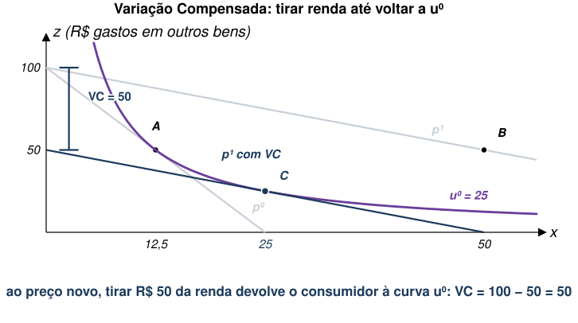{style="height:420px;max-height:420px"}
:::

- Em **A** o consumidor está no preço inicial, e, em **B**, no preço novo.
- Com novo preço, reta cai para baixo até que tangencie a curva
  ${u}^{0}$ novamente: é o ponto **C**.
- Esse deslocamento corresponde a uma queda na renda igual a $VC = 50$ **sob o preço inicial**.

## Variação Equivalente

- Suponha um aumento de preço $\rightarrow$ A variação equivalente é a quantidade de
  dinheiro que o **consumidor precisaria perder para alcançar a nova utilidade (mais baixa), sem mexer nos preços.**
- Suponha uma queda de preço $\rightarrow$ A variação equivalente é a quantidade de dinheiro
  que o **consumidor precisaria ganhar para alcançar a nova utilidade (mais alta), sem mexer nos preços.**
- [Ou seja, a variação equivalente ($VE$) garante que:]{.fragment fragment-index=2}

::: {.eq-block .fragment fragment-index=2}
$$V\left({p}^{1},y,q\right)=V({p}^{0},y+VE,q)$$
:::

  - [Em que $0$ e $1$ representam antes e depois da mudança de
    preço.]{.fragment fragment-index=2}

## Variação Equivalente

- Para calcular o valor da variação equivalente, fazemos:

::: {.eq-block}
$$VE=E\left({p}^{0},{u}^{1},q\right)-E\left({p}^{1},{u}^{1},q\right)=E\left({p}^{0},{u}^{1},q\right)-y$$
:::

- Ou seja, mantém-se a utilidade fixa em ${u}^{1}$ (após a mudança).
- Então, calculam-se os gastos do consumidor sob preços antigos (${p}^{0}$) e
  novos preços (${p}^{1}$).
- Se ${p}^{1}>{p}^{0}$, então $VE<0$: o consumidor gastaria mais para obter a
  nova utilidade.
- [No nosso exemplo, $VE=2\times 50\times 2-100=\mathbf{100}$.]{.fragment fragment-index=1}

## Dar renda até chegar à curva de depois

::: {.diagram}
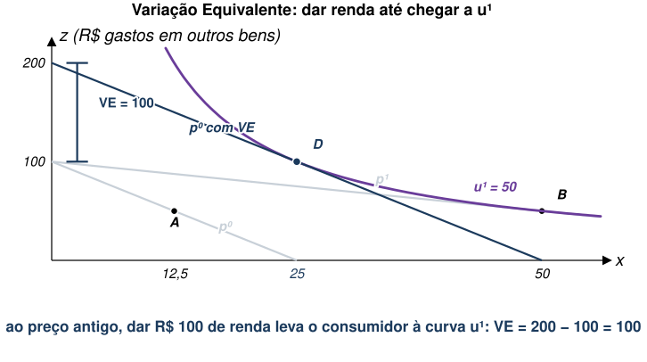{style="height:420px;max-height:420px"}
:::

- O enquadramento é o mesmo do slide anterior, com mesmos pontos **A** e **B**.
- Fixando o preço inicial, deslocamos a reta para **cima** até que encoste na curva ${u}^{1}$: é o ponto **D**.
- Esse deslocamento corresponde a um adicional de renda igual a $VE = 100$ **sob o preço inicial**.

## A mesma mudança medida por duas quantidades

::: {.cmp}
| | régua | se a mudança **melhora** | se a mudança **piora** |
|---|---|---|---|
| **$VC$**: quanto ajusto na renda **depois** da mudança? | ${u}^{0}$, antes | é a WTP pela mudança (aqui, 50) | é a WTA para tolerar |
| **$VE$**: quanto ajusto na renda **sem** a mudança? | ${u}^{1}$, depois | é a WTA para abrir mão (aqui, 100) | é a WTP para evitar |
:::

- As duas medem a mesma queda de preço, mas dão números que diferem consideravelmente.
- **A diferença não é erro de conta.** São perguntas diferentes, e a resposta de
  cada uma depende de qual curva de indiferença serve de régua.
- [O que decide se a resposta é WTP ou WTA não é a medida: é a **direção** da
  mudança. Na abertura da aula a praia ficava mais suja, que é a coluna da
  direita.]{.fragment fragment-index=1}

## Áreas sob Curvas de Demanda

- Usando as curvas de Demanda Hicksiana, temos:

::: {.eq-block}
$$VC=E\left({p}^{0},{u}^{0},q\right)-E\left({p}^{1},{u}^{0},q\right)=\int_{{p}_{j}^{1}}^{{p}_{j}^{0}} h({p}_{j},{p}_{-j},{u}^{0},q){dp}_{j}$$
:::

::: {.eq-block}
$$VE=E\left({p}^{0},{u}^{1},q\right)-E\left({p}^{1},{u}^{1},q\right)=\int_{{p}_{j}^{1}}^{{p}_{j}^{0}} h({p}_{j},{p}_{-j},{u}^{1},q){dp}_{j}$$
:::

::: {.no-bullet}
Repare que a integral é em **preço**, não em quantidade. É a faixa horizontal
entre os dois preços, à esquerda da curva.
:::

## A mesma VC, agora como área

::: {.diagram}
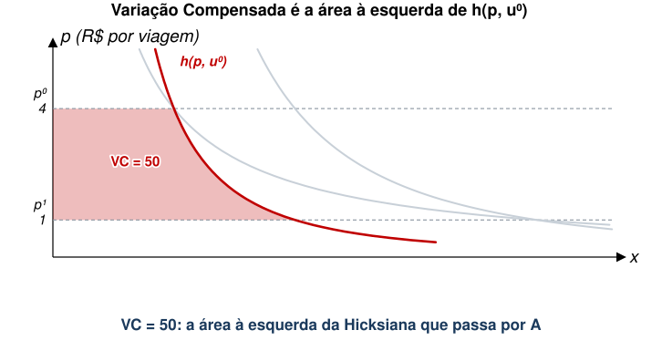{style="height:440px;max-height:440px"}
:::

- A Hicksiana de referência é $h(p,{u}^{0})=25/\sqrt{p}$, que passa pelo ponto
  **A** do slide anterior.
- A faixa entre $p=1$ e $p=4$, à esquerda dela, vale exatamente **50**.

## E a mesma VE

::: {.diagram}
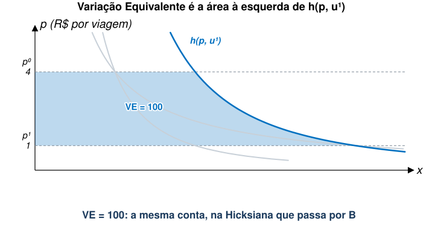{style="height:440px;max-height:440px"}
:::

- Agora a régua é $h(p,{u}^{1})=50/\sqrt{p}$, que passa pelo ponto **B**.
- Mesma conta, outra curva: **100**.

## Áreas sob Curvas de Demanda

::: {.no-bullet}
Uma aproximação sujeita a imprecisões: Excedente do Consumidor.
:::

::: {.diagram}
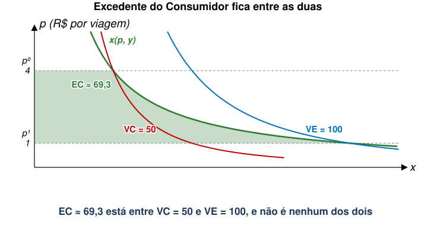{style="height:420px;max-height:420px"}
:::

- A Marshalliana é a única das três que se observa, porque não depende de $\overline{u}$.
- Ela passa por **A** e por **B**, então fica **entre** as duas Hicksianas.

## Quando o excedente basta

::: {.no-bullet}
No nosso exemplo Cobb-Douglas, as três medidas têm fórmula fechada, e o
expoente $\alpha$ é a fatia do orçamento gasta com o bem.
:::

::: {.eq-block}
$$VC=y\left(1-{p}^{-\alpha }\right) \qquad EC=\alpha y\ln p \qquad VE=y({p}^{\alpha }-1)$$
:::

::: {.tabela}
| | viagem é 50% do orçamento | viagem é 5% do orçamento |
|---|---|---|
| $VC$ | 50,00 | 6,70 |
| Excedente do Consumidor | 69,31 | 6,93 |
| $VE$ | 100,00 | 7,18 |
| erro do excedente sobre $VC$ | **38,6%** | **3,5%** |
:::

- Com a mesma queda de preço, o erro é pequeno quando o bem pesa pouco no
  orçamento.
- **Como muitos bens ambientais são fatia pequena do orçamento**, a aproximação
  Marshalliana serve, mas só onde há substituto. Sem ele, quem manda é Hanemann.

## Bens Ambientais {.section-cover}

## Como Medir Valor de Bens Ambientais

- No caso de bens ambientais, entretanto, tipicamente tratamos de mudanças na **quantidade (ou qualidade)** ao invés do preço.
  - Ou seja, olharemos para $q$.
- Neste caso, teríamos:

::: {.eq-block}
$$V\left(p,y,{q}^{0}\right)=V(p,y-VC,{q}^{1}) \qquad V\left(p,y,{q}^{1}\right)=V(p,y+VE,{q}^{0})$$
:::

::: {.eq-block}
$$VC=y-E\left(p,{u}^{0},{q}^{1}\right) \qquad VE=E\left(p,{u}^{1},{q}^{0}\right)-y$$
:::

::: {.no-bullet}
É a mesma conta de antes, com $q$ no lugar de $p$.
:::

## Peculiaridade de Bens Ambientais

::: {.no-bullet}
Como não há mercado para o bem ambiental, preços não variam: como observar mudanças no dispêndio?
:::

::: {.no-bullet}
Além disso, não é possível usar o excedente do consumidor, pois não conseguimos traçar uma curva de demanda.
:::

- **Não há preço para o bem ambiental.**
- Precisaríamos estimar qual é a **disposição marginal a pagar** por mais (menos) quantidade do bem ambiental (demanda inversa).

## Medidas Indiretas

::: {.no-bullet}
Se não temos medidas diretas, como a disposição marginal a pagar, precisamos de
alternativas.
:::

::: {.no-bullet}
Veremos medidas indiretas baseadas no conceito de **preferência revelada**.
:::

- A partir das escolhas que as pessoas efetivamente fazem, podemos inferir qual
  valor elas atribuem a bens ambientais.

::: {.no-bullet}
Usaremos variação de preço de outros bens para inferir o valor do bem ambiental.
:::

## Preferência Revelada

::: {.no-bullet}
**Exemplo 1:** Viagem a Manaus.
:::

- Parque Nacional de Anavilhanas é patrimônio ambiental.
- Saindo de São Paulo, chegar até lá envolve vários custos.
  - Passagem aérea;
  - Estadia;
  - Transporte de voadeira pelo Rio Negro.
- Várias pessoas viajam anualmente até lá e pagam esses custos.
  - Essas pessoas preferem estar lá ao invés de usarem o dinheiro para outra
    coisa.
- É possível **inferir valor do parque a partir do gasto que as pessoas
  incorrem.**

## Preferência Revelada

::: {.no-bullet}
**Exemplo 2:** Filtro de Água ou Garrafas de Água.
:::

- Em algumas cidades do Brasil, a água da torneira possui contaminantes
  prejudiciais à saúde.
- Para se protegerem, indivíduos instalam filtros nas torneiras.
- Podemos inferir valor da água limpa a partir do custo do filtro.
  - Ou a partir do gasto com garrafas d'água.

::: {.no-bullet}
**Exemplo 3:** Gasto de Turistas no Litoral.
:::

- Suponha que algumas praias paulistas se tornaram mais sujas ao longo dos anos.
- A queda no número de turistas (e seus gastos) nessas praias ao longo do tempo pode nos
  informar sobre o valor atribuído à sua qualidade ambiental.

## Medidas Indiretas, 3 Categorias

- Nós vamos dividir essas abordagens indiretas em três categorias:

1. Bens Complementares;
2. Bens Substitutos;
3. Bens Diferenciados (Qualidade).

## Bens Complementares {.section-cover}

## Bens Complementares

::: {.no-bullet}
Este é o caso relacionado a atividades recreativas.
:::

- A demanda por viagens a um local é condicional à sua qualidade ambiental.
- Mudanças na qualidade ambiental afetam demanda por viagens.

::: {.no-bullet}
É como se $q$ fosse uma qualidade do bem privado.
:::

- Da mesma forma que a limpeza da praia é uma qualidade da viagem.

## Bens Complementares

::: {.no-bullet}
Vamos medir a disposição a pagar por um aumento de qualidade ambiental
${q}^{0}\to {q}^{1}$.
:::

- Queremos uma medida indireta para
  $VC=E\left(p,{u}^{0},{q}^{0}\right)-E\left(p,{u}^{0},{q}^{1}\right)$.

::: {.no-bullet}
Uma possibilidade é:
:::

::: {.eq-block}
$$A=\int_{{p}^{0}}^{\overline{p}\left({q}^{1}\right)} h\left(p,{u}^{0},{q}^{1}\right)dp-\int_{{p}^{0}}^{\overline{p}\left({q}^{0}\right)} h\left(p,{u}^{0},{q}^{0}\right)dp$$
:::

::: {.no-bullet}
Em que $\overline{p}\left({q}^{1}\right)$ é o preço do bem privado que levaria a
demanda por esse bem a zero quando $q={q}^{1}$. O mesmo para
$\overline{p}\left({q}^{0}\right)$.
:::

## Bens Complementares

::: {.no-bullet}
$\overline{p}\left({q}^{1}\right)$ e $\overline{p}\left({q}^{0}\right)$ são os
**preços de esgotamento** (ou afogamento).
:::

- **Preço mais alto que alguém está disposto a pagar pelo bem privado** para
  dado nível de qualidade ambiental (${q}^{0}$ ou ${q}^{1}$).

::: {.no-bullet}
**Exemplo:** considere uma praia e dois cenários.
:::

- Em um cenário de praia limpa, ninguém paga passagem aérea com preço acima de
  $\overline{p}\left({q}^{1}\right)$;
- Em um cenário de praia suja, ninguém paga passagem aérea com preço acima de
  $\overline{p}\left({q}^{0}\right)$;
- Provavelmente, $\overline{p}\left({q}^{1}\right)>\overline{p}\left({q}^{0}\right)$.

::: {.no-bullet}
Aqui, assumimos que esses preços de esgotamento são finitos.
:::

## Com a praia suja

::: {.diagram}
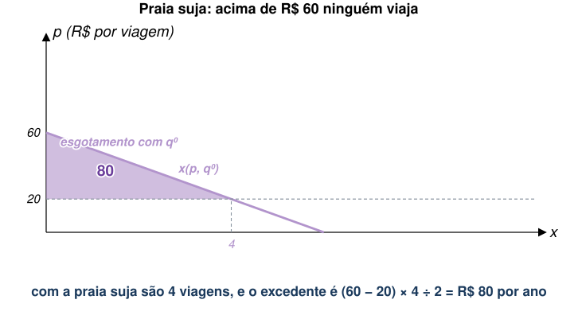{style="height:430px;max-height:430px"}
:::

- A viagem custa R\$ 20, e a essa altura da curva ele faz 4 viagens por ano.
- Acima de R\$ 60 ele não vai mais: este é o preço de esgotamento
  $\overline{p}({q}^{0})$.

## Com a praia limpa

::: {.diagram}
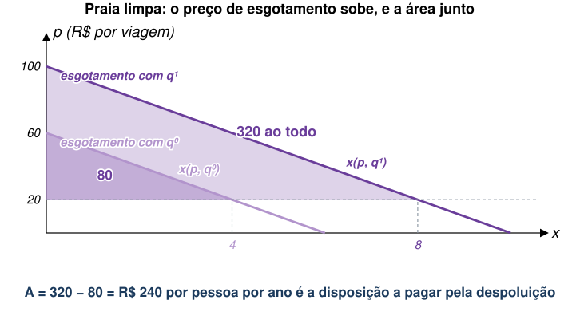{style="height:420px;max-height:420px"}
:::

- A limpeza gira a curva para fora: agora ele faz 8 viagens, e só desiste acima
  de R\$ 100.
- $A$ é a diferença entre as duas áreas: **R\$ 240 por pessoa por ano**.
- Note que nenhuma das duas curvas tem preço de qualidade ambiental nelas. A
  conta inteira é feita com o preço da **viagem**.

## Bens Complementares

::: {.no-bullet}
A questão é se $A=VC$.
:::

- Se sim, temos uma boa medida indireta.

::: {.no-bullet}
Verifiquemos (**LOUSA**).
:::

- [Temos que:]{.fragment fragment-index=1}

::: {.eq-block .fragment fragment-index=1}
$$A=VC+E\left[\overline{p}\left({q}^{1}\right),{u}^{0},{q}^{1}\right]-E\left[\overline{p}\left({q}^{0}\right),{u}^{0},{q}^{0}\right]$$
:::

- [Se $E\left[\overline{p}\left({q}^{1}\right),{u}^{0},{q}^{1}\right]-E\left[\overline{p}\left({q}^{0}\right),{u}^{0},{q}^{0}\right]=0 \to A=VC$.]{.fragment fragment-index=1}

## Bens Complementares

::: {.no-bullet}
O que significa assumir
$E\left[\overline{p}\left({q}^{1}\right),{u}^{0},{q}^{1}\right]-E\left[\overline{p}\left({q}^{0}\right),{u}^{0},{q}^{0}\right]=0$ ?
:::

- Dispêndio para obter ${u}^{0}$ não varia com $q$ quando o bem privado não é
  consumido.
- De outra forma, **o bem ambiental só tem valor quando o bem privado é
  consumido.**
  - É como se o bem ambiental só tivesse "valor de uso".
- Essa hipótese tem nome, e é o conceito a levar desta aula:
  **complementaridade fraca** [@maler1974].

::: {.no-bullet}
**Exemplo:** é como valorizar os Lençóis Maranhenses só porque é possível viajar
até lá.
:::

- Ou seja, o bem que importa é a viagem, não o local intrinsecamente.

## O que a viagem não mede

::: {.diagram}
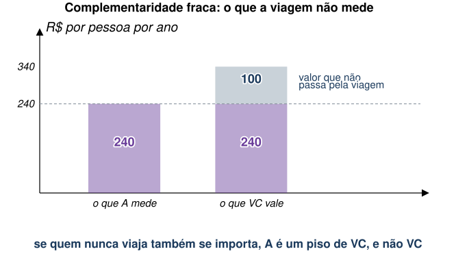{style="height:410px;max-height:410px"}
:::

- Suponha que a pessoa pagaria R\$ 100 por ano pela praia limpa **mesmo que
  nunca fosse lá**.
- Os dois triângulos continuam dando 240, porque nada disso passa pelo custo da
  viagem.
- Nesse caso $A$ é um **piso** para $VC$, e não $VC$. A hipótese de
  complementaridade fraca é justamente a de que essa barra cinza não existe.

## Bens Complementares

::: {.no-bullet}
Quando poderia fazer sentido pensar que o bem ambiental só tem "valor de uso"?
:::

- Tipicamente, quando os indivíduos consideram aquele bem como **não
  essencial**.

::: {.no-bullet}
**Exemplo:** cachoeiras no interior de São Paulo.
:::

- Uma cachoeira específica só tem valor se estiver aberta à visitação.
- Isto porque há uma infinidade de cachoeiras similares disponíveis.
- Nenhuma delas é, a princípio, única.

::: {.no-bullet}
Obviamente, sabemos que a definição do que é "único" não é trivial.
:::

## Bens Complementares

::: {.no-bullet}
Mesmo que o bem ambiental em questão seja não-essencial, ainda não conseguimos
observar a Demanda Compensada.
:::

::: {.no-bullet}
Seria necessário aproximar $VC$ usando a Demanda Marshalliana:
:::

::: {.eq-block}
$$\int_{{p}^{0}}^{\overline{p}\left({q}^{1}\right)} x\left(p,y,{q}^{1}\right)dp-\int_{{p}^{0}}^{\overline{p}\left({q}^{0}\right)} x\left(p,y,{q}^{0}\right)dp$$
:::

::: {.no-bullet}
Sob algumas condições, essa aproximação é razoável.
:::

- Em particular, se as elasticidades-renda de $x$ e $q$ forem similares.
- [É o mesmo argumento da tabela de alguns slides atrás: se a viagem é uma fatia
  pequena do orçamento, a diferença some.]{.fragment fragment-index=1}

## Isso já foi usado para cobrar uma conta

::: {.no-bullet}
O vazamento da plataforma Deepwater Horizon, em 2010, sujou a costa do Golfo do
México. Para calcular a indenização, a agência ambiental americana precisava de
um número [@english2018].
:::

- Foram cinco anos de trabalho, oito pesquisas amostrais e um modelo de demanda
  por viagens de recreação para toda a população dos EUA.
- Custo da viagem calculado com modo de transporte, inclusive passagem aérea.

::: {.tabela}
| | |
|---|---|
| Dias de recreação perdidos | mais de 16 milhões |
| Excedente médio por dia perdido | cerca de US\$ 42 |
| **Dano recreacional total** | **US\$ 661 milhões** |
:::

## Isso já foi usado para cobrar uma conta

- A conta é exatamente a dos dois triângulos: quanto de área sob a demanda por
  viagens desapareceu quando $q$ caiu.
- Note o que **não** está nesses 661 milhões: o valor que alguém em Chicago
  atribui a um Golfo do México limpo sem nunca pensar em ir lá.
- Pela complementaridade fraca, esse valor é zero por hipótese.
- [Ou seja, o número que foi a juízo é, pela própria construção, um
  piso.]{.fragment fragment-index=1}
- [No mesmo processo, uma pesquisa de preferência **declarada** perguntou a
  domicílios de todo o país quanto pagariam para evitar um dano igual
  [@bishop2017]. Deu ao menos **US\$ 17,2 bilhões**.]{.fragment fragment-index=2}
- [As duas contas não medem a mesma coisa, e é esse o ponto: a segunda mede o
  que a complementaridade fraca zerou na primeira.]{.fragment fragment-index=3}

## Bens Substitutos {.section-cover}

## Bens Substitutos

::: {.no-bullet}
Este é o caso em que bens privados e o bem ambiental são **intermediários** na
obtenção de um bem final.
:::

::: {.no-bullet}
**Exemplo 1:** Saúde de uma pessoa com asma.
:::

- Remédios e bombinha são bens privados.
- Qualidade do ar é o bem ambiental.
- São substitutos que ajudam a obter mais saúde (bem final).

::: {.no-bullet}
**Exemplo 2:** Saúde e qualidade da água.
:::

- Filtro e garrafas de água são bens privados.
- Qualidade da água é bem ambiental.

## Bens Substitutos

::: {.no-bullet}
O valor do bem ambiental pode, portanto, ser inferido a partir dos bens privados
substitutos.
:::

::: {.no-bullet}
Para estudar este caso, vamos considerar um modelo de produção:
:::

- Bem ambiental e bens privados são insumos.
- Existe uma tecnologia que transforma esses insumos no bem final (ex.: saúde).

::: {.no-bullet}
Função de produção $H=f(x,q)$.
:::

- $x$ é o bem privado; $q$ é o bem ambiental;
- ${f}_{x}>0$; ${f}_{q}>0$ → os bens intermediários ajudam na produção de $H$.

## Bens Substitutos

::: {.no-bullet}
O sinal de ${f}_{xq}(x,q)$ vai depender do contexto.
:::

::: {.no-bullet}
**Exemplo 1:** qualidade da água e saúde.
:::

- Quanto melhor a qualidade da água ($q$), menor é a contribuição do filtro à
  saúde.
- Logo, esperaríamos ${f}_{xq}<0$.
- Ou seja, benefício marginal do filtro é decrescente conforme qualidade da água
  aumenta.

::: {.no-bullet}
**Exemplo 2:** peixes pescados, idas ao pesqueiro e estoque de peixes no lago.
:::

- Peixes pescados geram utilidade, e quanto mais peixes no lago, mais produtiva
  é a ida ao pesqueiro.
- ${f}_{xq}>0$: benefício marginal da ida ao pesqueiro aumenta conforme o bem
  ambiental melhora.

## Duas tecnologias, os mesmos dois pontos

::: {.diagram}
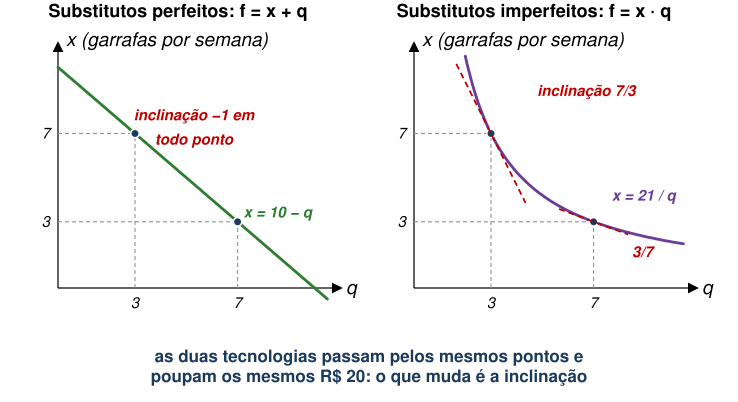{style="height:405px;max-height:405px"}
:::

- Uma família precisa de $H$ de água segura por semana. A torneira entrega $q$
  de graça, e o resto vem de garrafas a R\$ 5 cada.
- Nos dois painéis, passar de $q=3$ para $q=7$ derruba as garrafas de 7 para 3,
  e poupa os mesmos R\$ 20.
- O que muda é a **inclinação da isoquanta**, que é o
  ${f}_{q}/{f}_{x}$ que vamos usar em seguida.

## Bens Substitutos

::: {.no-bullet}
A função-custo pode ser escrita como um problema de minimização tradicional:
:::

::: {.eq-block}
$$C\left(p,q,H\right)=\min_{x} \left\{px+\mu \left[H-f\left(x,q\right)\right]\right\}$$
:::

- Esse é o menor custo para a obtenção de $H$, escolhendo $x$.

## Bens Substitutos

::: {.no-bullet}
O consumidor maximiza sua utilidade sujeita ao custo e ao formato de
$f(\cdot )$:
:::

::: {.eq-block}
$$\max_{x,z} U(H,z) \text{ s.a. } y=C\left(p,q,H\right)+z, \quad H=f(x,q)$$
:::

- Note que $x$ e $q$ afetam a utilidade apenas através de $H$.
- Isto significa que $x$ e $q$ **não têm benefícios diretos ao consumidor.**
- A solução desse problema nos dá uma demanda $x(p,y,q)$, e o nível de produção
  é tal que:

::: {.eq-block}
$$H\left(p,y,q\right)=f\left[x\left(p,y,q\right), q\right]$$
:::

## Bens Substitutos

::: {.no-bullet}
Para medir bem-estar, precisamos da função dispêndio:
:::

::: {.eq-block}
$$E\left(p,u,q\right)=\min_{H,z} \left\{C\left(p,q,H\right)+z \text{ s.a. } U\left(H,z\right)=u\right\}$$
:::

- E obtemos demandas compensadas por $H$ e $z$.

::: {.no-bullet}
Novamente, $VC=E\left(p,{u}^{0},{q}^{0}\right)-E\left(p,{u}^{0},{q}^{1}\right)$.
:::

## Bens Substitutos

::: {.no-bullet}
Primeiro, vamos analisar uma mudança marginal em $q$, mantendo $H$ constante.
:::

::: {.no-bullet}
A disposição marginal a pagar por uma mudança em $q$ é:
:::

::: {.eq-block}
$$MWTP=-\frac{\partial E\left(p,u,q\right)}{\partial q}=-\frac{\partial C\left(p,q,H\right)}{\partial q}$$
:::

::: {.no-bullet}
Vamos combinar essa expressão com os resultados anteriores da escolha do
consumidor (**LOUSA**).
:::

## Bens Substitutos

::: {.no-bullet}
Ou seja, para uma mudança marginal em $q$ mantendo $H$ constante, conseguimos
calcular a MWTP de três formas:
:::

- Usando a função-custo → $MWTP=-\frac{\partial C(p,q,H)}{\partial q}$
- Usando a tecnologia de "produção" → $MWTP=p \frac{\partial f/\partial q}{\partial f/\partial x}$
- Usando a demanda por $x$ → $MWTP=-p\frac{\partial x}{\partial q}$

::: {.no-bullet}
A terceira é a única que se observa: é o gasto com garrafas que se vê no caixa
do supermercado.
:::

## Total e margem não são a mesma coisa

::: {.diagram}
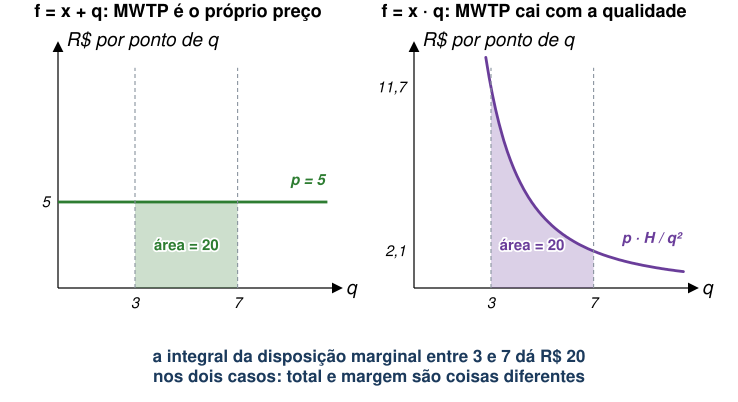{style="height:405px;max-height:405px"}
:::

- Com substitutos perfeitos, cada ponto de qualidade vale R\$ 5, sempre.
- Com a tecnologia multiplicativa, o primeiro ponto vale R\$ 11,70 e o último
  vale R\$ 2,10.
- **As duas áreas valem 20**, que é a economia total do slide anterior. Só a
  curva é diferente.

## Bens Substitutos

::: {.no-bullet}
E se mudança não for marginal, saindo de ${q}^{0}$ para ${q}^{1}$?
:::

::: {.no-bullet}
Podemos usar algo similar à medida usada para bens complementares.
:::

::: {.eq-block}
$$A=\int_{{p}^{0}}^{\overline{p}\left({q}^{1}\right)} h\left(p,{u}^{0},{q}^{1}\right)dp-\int_{{p}^{0}}^{\overline{p}\left({q}^{0}\right)} h\left(p,{u}^{0},{q}^{0}\right)dp$$
:::

::: {.no-bullet}
No caso de bens substitutos, $A=VC$ ocorre quando $x$ é **essencial** para $H$
(contrário do caso de complementares).
:::

## Bens Substitutos

::: {.no-bullet}
Quando $x$ é essencial para $H$, temos:
:::

::: {.eq-block}
$$f\left(0,q\right)=0\to H=0\to U(0,z)$$
:::

- $U(0,z)$ não varia com mudanças em $q$, porque o bem ambiental só faz
  diferença quando o bem privado é consumido.

::: {.no-bullet}
Se $x$ é essencial, podemos usar mesma estratégia de antes com "preços de
afogamento":
:::

- Quando os preços são iguais a $\overline{p}\left({q}^{1}\right)$ e
  $\overline{p}\left({q}^{0}\right)$, o bem $x$ não é consumido;
- Isso implica em $H=0$;
- Quando $H=0$, o dispêndio para alcançar ${u}^{0}$ não depende de $q$;
- Isto nos dá $E\left[\overline{p}\left({q}^{1}\right),{u}^{0},{q}^{1}\right]-E\left[\overline{p}\left({q}^{0}\right),{u}^{0},{q}^{0}\right]=0 \to A=VC$.

## Bens Substitutos

::: {.no-bullet}
**Caso Especial:** $f(x,q)$ **é separável.**
:::

::: {.no-bullet}
Suponha que $f\left(x,q\right)=x+q$.
:::

- É o caso de substitutos perfeitos (água da torneira limpa ou água filtrada).

::: {.no-bullet}
Com isso, o problema de minimização de custo do consumidor será:
:::

::: {.eq-block}
$$C\left(p,q,H\right)=\min_{x} \left\{px+\mu \left[H-x-q\right]\right\}$$
:::

::: {.no-bullet}
Assumindo solução interior, temos $p=\mu$ e $x=H-q$.
:::

## Bens Substitutos

::: {.no-bullet}
A função-custo é dada por $C\left(p,q,H\right)=p(H-q)$.
:::

::: {.no-bullet}
Retomemos o problema de maximização de utilidade:
:::

::: {.eq-block}
$$\max_{x,z} U[H,z] \text{ s.a. } y=C\left(p,q,H\right)+z, \quad H=f(x,q)$$
:::

- No caso separável, temos:

::: {.eq-block}
$$y=p\left(H-q\right)+z \to y+p\cdot q=p\cdot H+z \to y+p\cdot q=p\cdot f(x,q)+z$$
:::

## Bens Substitutos

::: {.no-bullet}
$p\cdot q$ funciona como um modificador da renda $y$: $\tilde{y}=y+p\cdot q$.
:::

::: {.no-bullet}
Suponha ${q}^{1}-{q}^{0}>0$ → renda aumentaria em $p({q}^{1}-{q}^{0})$.
:::

::: {.no-bullet}
Qual é a disposição a pagar por esse aumento de renda?
:::

- É o mesmo que perguntar a disposição a pagar por mais dinheiro.
- Será exatamente $p({q}^{1}-{q}^{0})$.

::: {.no-bullet}
Logo, no caso separável em que bens são substitutos, a disposição a pagar por um
aumento na qualidade do bem ambiental é simplesmente o **preço do bem privado
vezes a diferença de qualidade**.
:::

## Comprar ar limpo em prateleira

::: {.no-bullet}
Na China, a norma de aquecimento ao norte do Rio Huai criou décadas de
poluição a mais de um lado da linha. [@ito2020] usam dados de caixa de
purificadores de ar para ler a disposição a pagar direto no consumo.
:::

- O purificador é o $x$ do modelo, e a qualidade do ar é o $q$.
- Quem mora do lado poluído compra mais purificador, e paga mais caro por
  modelos que filtram melhor.

::: {.tabela}
| | por domicílio, por ano |
|---|---|
| Reduzir PM₁₀ em 1 µg/m³ | US\$ 1,34 |
| Eliminar toda a poluição causada pela norma do Huai | US\$ 32,70 |
:::

## Comprar ar limpo em prateleira

- Repare que o número sai de $-p\,\partial x/\partial q$, que é a **terceira**
  das três formas de calcular a MWTP.
- Nenhum chinês foi perguntado quanto vale o ar limpo. O que se observou foi o
  que ele levou para casa.
- [A disposição a pagar cresce com a renda e com a exposição a informação sobre
  a qualidade do ar.]{.fragment fragment-index=1}
- [Isso é um alerta: a medida capta a disposição a pagar de quem **pode** pagar,
  e a de quem sabe que o problema existe.]{.fragment fragment-index=2}

## Quem ignora o gasto defensivo subestima o benefício

::: {.no-bullet}
O NOx Budget Program é o cap-and-trade americano de óxidos de nitrogênio, primo
do EU ETS da aula 07. [@deschenes2017] medem o que ele fez com a saúde.
:::

- O programa derrubou emissão de NOx, ozônio, **gasto com remédios** e
  mortalidade.
- Redução anual de compra de medicamentos: cerca de US\$ 800 milhões.
- Redução anual de mortalidade: cerca de US\$ 1,3 bilhão.
- [Ou seja, o gasto defensivo é **mais de um terço** da disposição a pagar
  total.]{.fragment fragment-index=1}
- [Uma avaliação que olhasse só para mortalidade perderia essa parte inteira, e
  a política pareceria menos vantajosa do que é.]{.fragment fragment-index=2}

## Exercício: quanto vale despoluir a praia

::: {.no-bullet}
Uma pessoa mora em São Paulo e vai ao litoral. Cada viagem custa R\$ 20. A
tabela traz o quanto ela valoriza cada viagem adicional, nos dois cenários de
qualidade da praia.
:::

::: {.tabela}
| viagem | 1ª | 2ª | 3ª | 4ª | 5ª | 6ª | 7ª | 8ª |
|---|---|---|---|---|---|---|---|---|
| Praia suja | 40 | 30 | 20 | 10 | | | | |
| Praia limpa | 80 | 70 | 60 | 50 | 40 | 30 | 20 | 10 |
:::

- **(a)** Quantas viagens ela faz em cada cenário?
- **(b)** Quais são os preços de esgotamento nos dois cenários?
- **(c)** Quanto vale a despoluição para ela, por ano?
- **(d)** A praia recebe 50 mil visitantes com esse mesmo perfil, e despoluir
  custa R\$ 6 milhões por ano. Vale a pena?

## Solução

::: {.diagram}
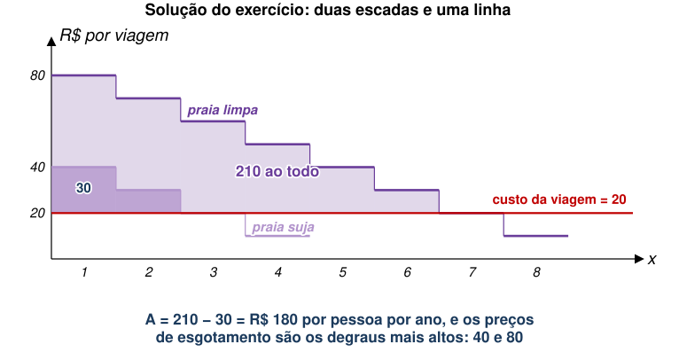{style="max-height:300px"}
:::

- **(a)** Ela viaja enquanto o valor cobre os 20: são **3 viagens** com a praia
  suja e **7** com a praia limpa.
- [**(b)** Os preços de esgotamento são o degrau mais alto de cada escada:
  **40** e **80**.]{.fragment fragment-index=1}
- [**(c)** Excedente de 30 na praia suja e de 210 na limpa, então
  $A = \mathbf{180}$ por ano.]{.fragment fragment-index=2}
- [**(d)** $180 \times 50.000 = \textbf{R\$ 9 milhões}$ contra R\$ 6 milhões de
  custo. **Vale.**]{.fragment fragment-index=3}

## E o que essa conta não viu

::: {.tabela}
| | benefício anual |
|---|---|
| Quem vai à praia (50 mil pessoas × 180) | R\$ 9 milhões |
| Quem mora em Manaus e nunca vai | **R\$ 0, por hipótese** |
| Custo da despoluição | R\$ 6 milhões |
:::

- A resposta do item (d) sobrevive: 9 é maior que 6, e o valor de não-uso só
  aumentaria o lado do benefício.
- **Mas o sinal da conclusão nem sempre é robusto assim.** Se despoluir custasse
  R\$ 12 milhões, a decisão dependeria inteiramente da linha do meio.
- [E a complementaridade fraca não é uma hipótese sobre o mundo: é uma hipótese
  sobre o que o método consegue enxergar.]{.fragment fragment-index=1}
- [E repare na primeira linha: 50 mil pessoas pagando pela **mesma** praia é a
  agregação **vertical** de um bem público, que é de onde sai o
  ${D}^{′}(E)$ da aula 04.]{.fragment fragment-index=2}

## Voltando à pergunta da abertura

::: {.no-bullet}
**Um programa deixa uma praia mais limpa. Como o economista mede o benefício?**
:::

::: {.opcoes}
- A resposta é **(c)**: pelo que as pessoas já gastam com bens ligados à praia,
  e por quanto esse gasto muda.

- A alternativa **(a)** confunde custo com benefício, que é exatamente o erro
  que o modelo de custos e danos da aula 04 existe para evitar.

- A alternativa **(b)** é o outro ramo da literatura, o de preferência
  declarada. Ela alcança o que (c) não alcança, como nos US\$ 17,2 bilhões do
  Golfo, ao custo de depender do que as pessoas dizem, e não do que fazem.
:::

::: {.no-bullet}
E a resposta de (c) é sempre um **piso**, porque só enxerga o que passa por
algum mercado.
:::

## Concluindo

- $VC$ e $VE$ respondem perguntas diferentes sobre a mesma mudança, e só
  coincidem quando o efeito renda é desprezível.
- O excedente do consumidor fica entre as duas, e é uma aproximação boa para
  bens que são fatia pequena do orçamento **e têm substituto**.
- Sem mercado para $q$, a saída é a **preferência revelada**: o valor do bem
  ambiental aparece no gasto com um bem privado ligado a ele.
- Com **complementares**, a medida é a diferença de áreas entre os preços de
  esgotamento, e ela vale se o bem ambiental só tiver valor de uso.
- Com **substitutos**, a medida é o gasto defensivo que deixa de ser feito, e
  ela vale se o bem privado for essencial.
- [Fica a pergunta da próxima aula: e quando o bem ambiental não é complemento
  nem substituto de nada, mas vem **embutido** no preço de um bem que já tem
  mercado?]{.fragment fragment-index=1}

## Referências

::: {#refs}
:::
