## Um apartamento perto do parque custa 15% mais

::: {.no-bullet}
Dois apartamentos, mesma metragem, mesmo número de quartos, mesmo andar. Um
fica a 500 metros de um parque e custa 15% mais caro que o outro. O que esses
15% medem?
:::

::: {.opcoes}
**(a)** A disposição a pagar pelo parque de quem comprou o apartamento perto
dele.

**(b)** A disposição a pagar média da cidade pelo parque.

**(c)** Nada em particular: bairros com parque costumam ser melhores em tudo, e
os 15% podem ser as outras coisas.
:::

## Aula Passada

- Revisão: Medidas de Bem-Estar
  - Demandas Marshalliana e Hicksiana
  - Variação Compensada e Variação Equivalente
- Como Medir Valor de Bens Ambientais
  - Peculiaridade de Bens Ambientais
- Medidas Indiretas
  - Preferência Revelada
  - Bens Complementares
  - Bens Substitutos

::: {.no-bullet}
Referência: Phaneuf e Requate, caps. 14 e 15
:::

## Agenda

- Bens com qualidade diferenciada
  - Distribuição Observada
- Modelo de Preços Hedônicos
  - Premissas
  - Demanda
  - Oferta
  - Pontos de Equilíbrio
- Estimando Disposição Marginal a Pagar
  - Modelo Econométrico
  - Aplicações

::: {.no-bullet}
Referência: Phaneuf e Requate, caps. 15 e 18
:::

## Onde estamos no curso

:::::: step-map
::: step
**1. Complementares.** O valor da praia aparece no gasto com a viagem.
:::

::: step
**2. Substitutos.** O valor do ar aparece no gasto com o purificador.
:::

::: {.step .now}
**3. Diferenciados.** O valor do ar aparece **dentro** do preço do apartamento,
que já tem mercado.
:::

::: {.step .now}
**4. E daí o problema é outro:** separar o que é o ar do que é o bairro.
:::
::::::

## Bens com Qualidade Diferenciada {.section-cover}

## Bens com Qualidade Diferenciada

::: {.no-bullet}
Estudaremos agora o caso em que o bem ambiental afeta o preço do bem privado.
:::

::: {.no-bullet}
**Exemplo 1:** mercado imobiliário.
:::

- Preço de apartamento depende de metragem, nº de quartos, andar.
- Mas também de proximidade do metrô, centro da cidade.
- E, ainda, da qualidade do ar no local, proximidade a um lixão, a um rio
  poluído etc.

::: {.no-bullet}
**Exemplo 2:** salário.
:::

- Salário que trabalhador aceita depende de várias coisas.
- Depende do tipo de trabalho, do esforço esperado.
- Mas também das condições de trabalho: riscos à saúde, qualidade do ar no local
  e outras possíveis insalubridades.

## Bens com Qualidade Diferenciada

::: {.no-bullet}
A diferença deste caso com os dois anteriores é que, agora, o consumidor está
comprando (indiretamente) o bem ambiental.
:::

::: {.no-bullet}
No que segue, trataremos de um modelo teórico para fundamentar o **modelo
empírico de preços hedônicos**.
:::

- Na aula passada, o gasto com a viagem e o gasto com o purificador eram pistas
  **ao lado** do bem ambiental.
- Aqui o bem ambiental está **dentro** do preço, e a tarefa é extraí-lo de lá.

## Distribuição Observada

::: {.no-bullet}
Preço por metro quadrado (valor venal) em 2019 e distância ao Ibirapuera.
:::

::: {.diagram}
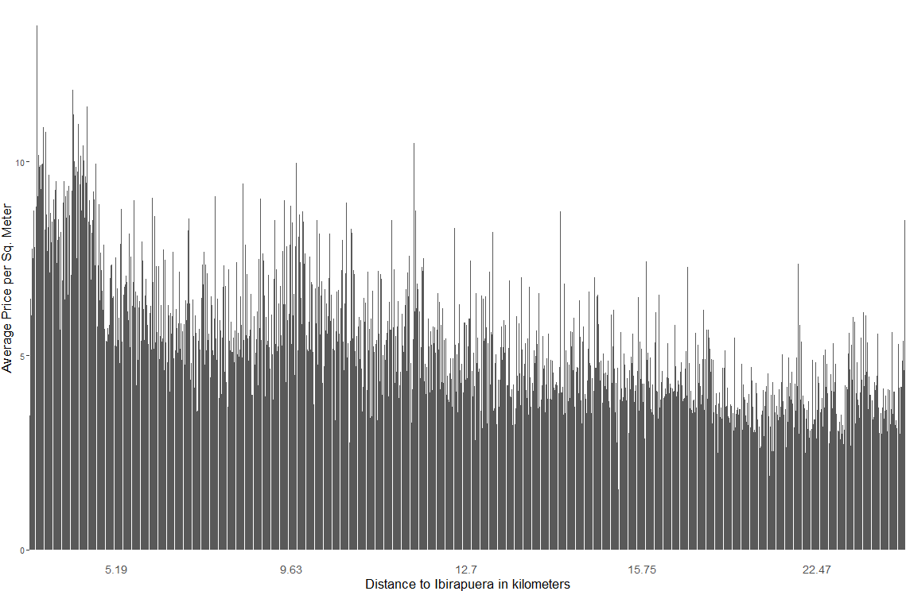{style="max-height:470px"}
:::

## Distribuição Observada

- O preço cai com a distância ao parque, e a queda é bem visível.
- **Mas por quê?** O parque em si, ou o que costuma vir junto com um parque?
- [Segurança, escola, metrô, restaurante, vizinho rico.]{.fragment fragment-index=1}
- [Esse é o problema da aula inteira, e vamos precisar do modelo antes de
  atacá-lo.]{.fragment fragment-index=2}

## Seis apartamentos e uma tabela de preços

::: {.diagram}
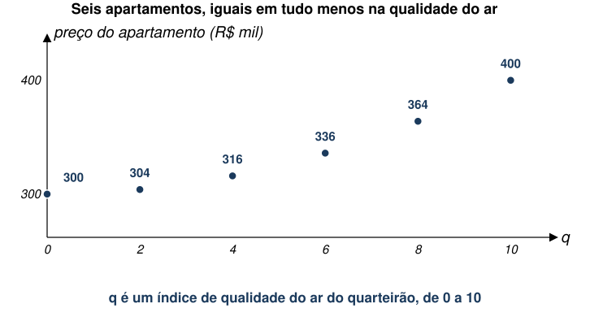{style="height:430px;max-height:430px"}
:::

- Para montar a intuição, um mercado de brinquedo: seis apartamentos idênticos
  em tudo, menos na qualidade do ar $q$ do quarteirão.
- Os preços estão aí. O que este desenho diz sobre quanto vale o ar limpo?

## O cardápio do mercado

::: {.diagram}
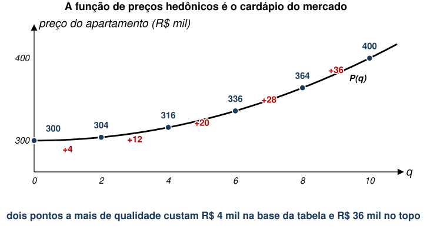{style="height:430px;max-height:430px"}
:::

- Ligando os pontos, sai a **função de preços hedônicos** $P(q)$.
- Note o que ela faz: dois pontos de qualidade custam R\$ 4 mil embaixo e
  R\$ 36 mil em cima.

## Parece uma curva de demanda, e não é

::: {.no-bullet}
Se $P(q)$ fosse uma demanda inversa por qualidade do ar, ela estaria dizendo
que as pessoas pagam **mais** por unidade quanto **mais** ar limpo já têm. Isso
contraria tudo o que este curso fez desde a aula 02.
:::

- $P(q)$ **não é** a demanda de ninguém, nem a oferta de ninguém.
- $P(q)$ **é** o cardápio: o que o mercado cobra hoje por cada nível de $q$.
- Nenhum comprador e nenhum vendedor escolhe $P(q)$. Todos a tomam como dada e
  escolhem **um ponto** dela.

::: {.no-bullet}
[O que ela tem de útil é a **inclinação no ponto que alguém
escolheu**.]{.fragment fragment-index=1}
:::

## O cardápio do café

::: {.no-bullet}
A padaria cobra R\$ 6 pelo café pequeno, R\$ 8 pelo médio e R\$ 11 pelo grande.
Você pede o médio.
:::

- O cardápio tem inclinação crescente: o segundo aumento de tamanho custa mais
  que o primeiro.
- Isso não diz nada sobre o seu apetite. Diz sobre a padaria.
- [O que a **sua escolha** revela: passar de pequeno a médio vale mais de R\$ 2
  para você, e passar de médio a grande vale menos de R\$ 3.]{.fragment fragment-index=1}
- [É exatamente isso que o modelo hedônico faz, com apartamentos no lugar de
  cafés e ar limpo no lugar de mililitros.]{.fragment fragment-index=2}

## Premissas

- Assume-se que um imóvel possa ser totalmente descrito por um vetor finito de
  características e um termo para o bem ambiental.
  - O vetor $x$ inclui $J$ características.
  - O valor $q$ corresponde ao bem ambiental.
- As preferências dos consumidores são em relação aos atributos, não ao bem
  imóvel em si.
- O preço do imóvel é uma função $P(x,q)$.

## Demanda {.section-cover}

## Demanda

- O consumidor maximiza utilidade $U(x,q,z,s)$.
  - $x$ é o vetor de características não-ambientais;
  - $q$ é o bem ambiental;
  - $z$ é o bem numerário;
  - $s$ representa características pessoais de cada consumidor (preferências
    heterogêneas).
- A restrição orçamentária é dada por $y=P\left(x,q\right)+z$.
- O consumidor resolve:

::: {.eq-block}
$$\max_{x,q,z} U(x,q,z,s) \text{ s.a. } y=P\left(x,q\right)+z$$
:::

## Demanda

- Note que o consumidor pode escolher o valor de $q$.
- Note, também, que qualquer combinação de $x$ e $q$ é possível.
  - Isto é uma abstração: nem sempre é possível escolher cada característica
    separadamente.
- Condições de primeira ordem são:

::: {.eq-block}
$$\frac{\partial U\left(x,q,z,s\right)}{\partial {x}_{j}}=\lambda \frac{\partial P\left(x,q\right)}{\partial {x}_{j}} \qquad \frac{\partial U\left(x,q,z,s\right)}{\partial q}=\lambda \frac{\partial P\left(x,q\right)}{\partial q} \qquad \frac{\partial U\left(x,q,z,s\right)}{\partial z}=\lambda$$
:::

## Demanda

- Combinando as 2 últimas CPOs, temos:

::: {.eq-block}
$$\frac{\partial U\left(x,q,z,s\right)/\partial q}{\partial U\left(x,q,z,s\right)/\partial z} = \frac{\partial P\left(x,q\right)}{\partial q}$$
:::

::: {.no-bullet}
À esquerda, a **disposição marginal a pagar por $q$**. À direita, o **preço
marginal implícito de $q$**.
:::

- [Esta é a equação da aula inteira, e ela é uma igualdade entre uma coisa que
  ninguém observa e uma coisa que se estima com dados de
  cartório.]{.fragment fragment-index=1}

## Demanda

- Considere um nível de utilidade de referência $\overline{u}$.
- Defina uma quantidade $b$ a ser gasta com o imóvel de modo que $z=y-b$.
- Assim, teremos:

::: {.eq-block}
$$\overline{u}=U(x,q,y-b,s)$$
:::

- Finalmente, podemos inverter a função para obtermos:

::: {.eq-block}
$$y-b={U}^{-1}(x,q,\overline{u},s)$$
:::

## Demanda

- O objetivo desta manipulação é definir uma "bid function"
  $b\left(x,q,y,s,\overline{u}\right)$.
  - É o lance (oferta) que o comprador fará ao vendedor de um imóvel.

::: {.eq-block}
$$b\left(x,q,y,s,\overline{u}\right)=y-{U}^{-1}(x,q,\overline{u},s)$$
:::

- Por fim, se diferenciarmos
  $\overline{u}=U[x,q,y-b\left(x,q,y,s,\overline{u}\right),s]$ em relação a $q$,
  teremos:

::: {.eq-block}
$$0=\frac{\partial U}{\partial q}-\frac{\partial U}{\partial z}\frac{\partial b}{\partial q}$$
:::

::: {.no-bullet}
(Lembrando que $z=y-b$.)
:::

## Demanda

- Rearranjando os termos, chegamos a:

::: {.eq-block}
$$\frac{\partial U/\partial q}{\partial U/\partial z} = \frac{\partial b\left(x,q,y,s,\overline{u}\right)}{\partial q} = \frac{\partial P}{\partial q}$$
:::

::: {.no-bullet}
Ou seja, conseguimos estimar a **disposição marginal a pagar por $q$** para um
nível de referência fixo de utilidade $\overline{u}$.
:::

## As curvas de lance do consumidor 1

::: {.diagram}
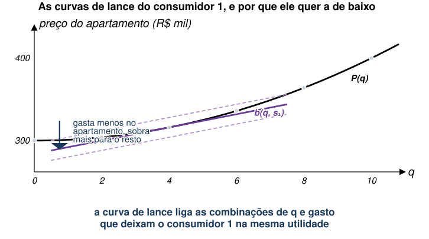{style="height:410px;max-height:410px"}
:::

- Cada curva de lance liga as combinações de $q$ e **gasto com o imóvel** que
  deixam o consumidor na mesma utilidade.
- Cuidado com a leitura: o eixo vertical é **gasto**, então curva mais **baixa**
  é utilidade mais **alta**.
- A curva mais baixa de todas não é alcançável: nenhum apartamento é vendido
  por aquele preço.

## Ele para onde o lance encosta no cardápio

::: {.diagram}
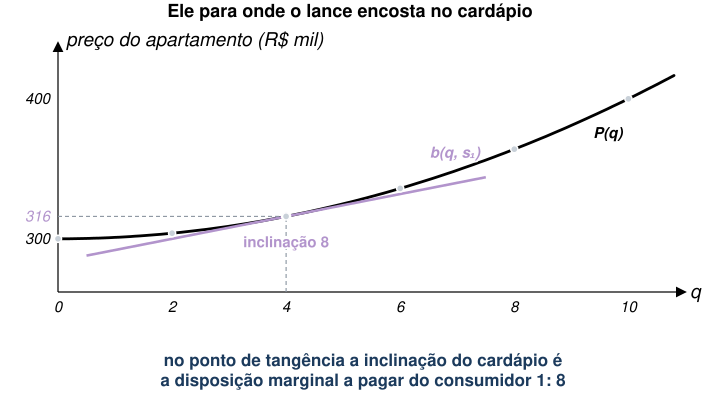{style="height:420px;max-height:420px"}
:::

- A melhor curva alcançável é a que **tangencia** o cardápio, e a tangência é a
  escolha: $q=4$, ao preço de R\$ 316 mil.
- No ponto de tangência, $\partial b/\partial q = \partial P/\partial q = 8$.
- É a mesma equação do slide anterior, agora como um desenho.

## Dois consumidores, dois pontos, o mesmo cardápio

::: {.diagram}
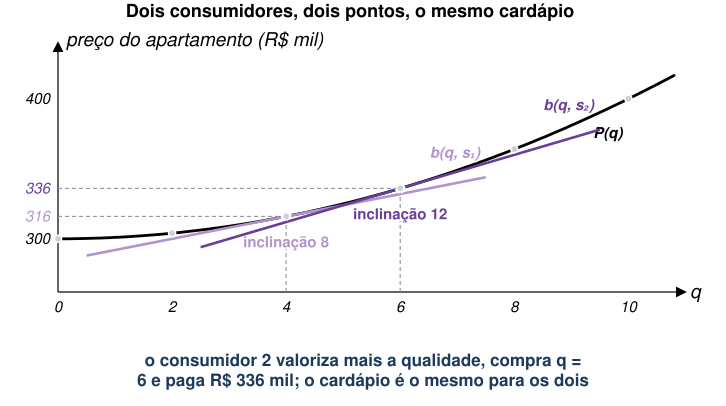{style="height:430px;max-height:430px"}
:::

- O consumidor 2 valoriza mais a qualidade do ar, e por isso encosta no cardápio
  mais adiante: $q=6$, a R\$ 336 mil.
- Os dois enfrentam **o mesmo** cardápio e leem dele números diferentes: 8 e 12.

## Oferta {.section-cover}

## Oferta

- E a oferta de imóveis?
- Suponha que uma firma produza cada imóvel a um custo $C(x,q,v)$.
  - $v$ representa características individuais da firma.
- O problema de maximização de lucro será:

::: {.eq-block}
$$\max_{x,q} \Pi =P\left(x,q\right)-C(x,q,v)$$
:::

- Com CPOs $\frac{\partial P}{\partial q}=\frac{\partial C}{\partial q}$ e
  $\frac{\partial P}{\partial {x}_{j}}=\frac{\partial C}{\partial {x}_{j}}$.

## Oferta

- Analogamente ao caso do consumidor, defina uma quantidade $\theta$ que a firma
  está disposta a aceitar pelo imóvel:

::: {.eq-block}
$$\overline{\Pi }=\theta -C(x,q,v)$$
:::

- Novamente, teremos:

::: {.eq-block}
$$\frac{\partial \theta \left(x,q,v,\overline{\Pi }\right)}{\partial q}=\frac{\partial P}{\partial q}=\frac{\partial C}{\partial q}$$
:::

## As curvas de oferta encostam por cima

::: {.diagram}
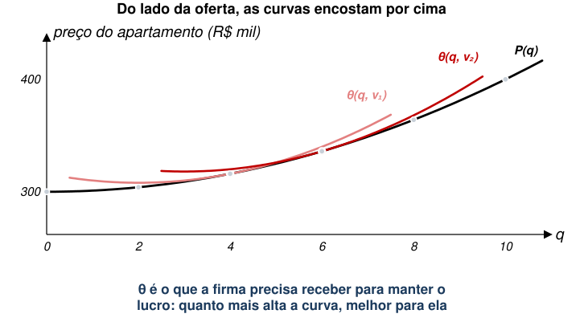{style="height:420px;max-height:420px"}
:::

- $\theta$ é o que a firma precisa **receber** para manter o lucro, então curva
  mais **alta** é lucro mais **alto**.
- A melhor alcançável é, de novo, a tangente: a firma 1 entrega $q=4$ e a firma
  2 entrega $q=6$.
- É a imagem espelhada da página anterior.

## Pontos de Equilíbrio

- Os pontos onde há transação entre, por exemplo, o indivíduo 1 e a firma 1 é
  dado por:

::: {.eq-block}
$$\frac{\partial b\left(x,q,y,{s}_{1},{u}^{0}\right)}{\partial q}=\frac{\partial \theta \left(x,q,{v}_{1},{\Pi }^{0} \right)}{\partial q}$$
:::

- Esse ponto vai estar associado a um determinado nível de $q={q}_{1}$.
  - E a um valor $P(x,{q}_{1})$ pago pelo imóvel que tem $q={q}_{1}$.

## O cardápio é o que sobra

::: {.diagram}
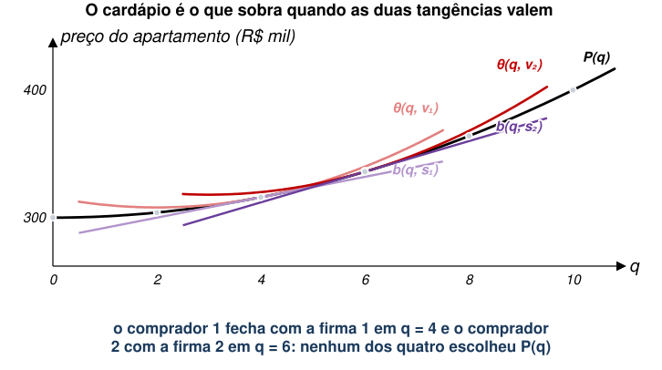{style="height:420px;max-height:420px"}
:::

- Cada comprador encosta por baixo, cada vendedor encosta por cima, e o cardápio
  passa exatamente por todos os pontos de encosto.
- **Ninguém escolheu $P(q)$.** Ela é a curva que faz todas as tangências valerem
  ao mesmo tempo, e o nome disso é envoltória [@rosen1974].

## O cardápio e a inclinação dele

::: {.diagram}
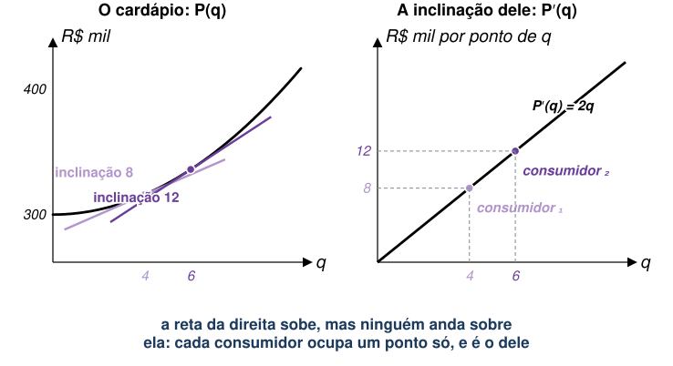{style="height:410px;max-height:410px"}
:::

- À direita está $P′(q)$, o preço implícito de um ponto a mais de qualidade.
- Ela sobe, e **ninguém anda sobre ela**: cada consumidor ocupa um ponto só, e é
  o dele.
- A demanda de cada consumidor por $q$, aqui, é **horizontal**. A reta que sobe
  é a fila de consumidores, ordenada por quanto valorizam o ar limpo.

## Estimando Disposição Marginal a Pagar {.section-cover}

## Estimando Disposição Marginal a Pagar

- No fim, queremos estimar:

::: {.eq-block}
$$MWTP=\frac{\partial P\left(x,q\right)}{\partial q}$$
:::

- Como?

## Estimando Disposição Marginal a Pagar

- Suponha que você tenha dados sobre o preço de cada imóvel na cidade e suas
  características.
- Suponha, ainda, que o preço é uma função linear das características.
- Então, temos:

::: {.eq-block}
$${p}_{i}=f\left({X}_{i},{q}_{i},{\varepsilon }_{i},\beta \right)={\beta }_{0}+\sum_{j=1}^{J} {\beta }_{j}{x}_{j}+\alpha {q}_{i}+{\varepsilon }_{i}$$
:::

## Estimando Disposição Marginal a Pagar

- Qual é o parâmetro estimado de interesse?

::: {.eq-block}
$$\alpha =\frac{\partial p}{\partial q}$$
:::

- Ao estimarmos o modelo, temos:

::: {.eq-block}
$${\hat{p}}_{i}={\hat{\beta }}_{0}+\sum_{j=1}^{J} {\hat{\beta }}_{j}{x}_{j}+\hat{\alpha }{q}_{i}$$
:::

- E $\hat{\alpha }$ é a estimativa da disposição marginal a pagar por $q$.

## De quem, exatamente?

::: {.diagram}
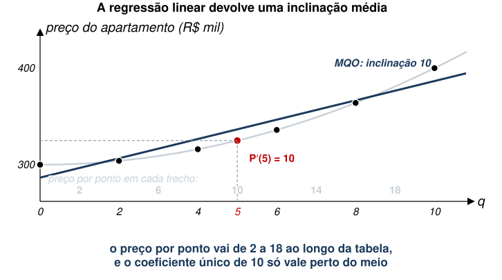{style="height:410px;max-height:410px"}
:::

- Rodando o MQO nos seis apartamentos do começo da aula, sai exatamente **10**.
- Mas o preço por ponto de qualidade vai de 2 a 18 ao longo da tabela, e 10 é o
  valor em $q=5$, o meio da amostra.
- $\hat{\alpha }$ é uma **média**, e ela é a disposição marginal a pagar de
  quem escolheu o meio do cardápio.

## As duas advertências, e elas são diferentes

::: {.cmp}
| | problema | como se ataca |
|---|---|---|
| Interpretação | $\hat{\alpha }$ é o preço implícito no ponto médio, e não a demanda por $q$ | reconhecer que a medida é local e não extrapolar |
| Identificação | o que está no $\varepsilon$ pode andar junto com $q$ | achar variação em $q$ que seja quase aleatória |
:::

- O primeiro é um problema de **leitura**, e existe mesmo com dados perfeitos.
- O segundo é um problema de **dados**, e é o que derruba a maioria das
  estimativas hedônicas.
- [A alternativa (c) da votação de abertura é sobre o segundo.]{.fragment fragment-index=1}

## Aplicação I

::: {.no-bullet}
[@ramirez2022] estudam disposição a pagar para morar próximo a áreas verdes em
Sevilha.
:::

- Mil anúncios de imóveis da cidade, com preço, área útil, número de cômodos,
  idade e banheiros.
- A variável ambiental é o tamanho da área verde próxima, medida com um sistema
  de informação geográfica.

## Aplicação I

- Proximidade a áreas verdes aumenta valor da propriedade.
- Coeficiente é medida de disposição marginal a pagar por áreas verdes.
- [O trabalho compara várias formas funcionais, e quais variáveis importam
  depende do modelo escolhido.]{.fragment fragment-index=1}
- [Isso é uma pista do que vem nas próximas aplicações: a fragilidade não está
  na teoria, está no que sobra no erro.]{.fragment fragment-index=2}

## Aplicação II

::: {.no-bullet}
[@chakraborty2023] analisam o valor de estruturas para conter erosão do solo, na
Nigéria.
:::

- Efeito no preço dos lotes agrícolas.
- Mede-se como esse valor varia dependendo da exposição dos lotes a climas mais
  úmidos.
  - Mais chuvas causam mais erosão, elevando o valor de tecnologias adaptativas.
- Dados de valor da terra declarados pelos próprios domicílios, na pesquisa de
  padrão de vida da Nigéria de 2015-2016 e 2018-2019.

## Aplicação II

- Controle de erosão tem valor maior em regiões com chuvas mais intensas.
- O preço implícito estimado é de cerca de **26% do valor médio da terra**, o
  equivalente a meio ano de renda de um domicílio agrícola nigeriano.
- Em locais com chuvas extremas, não parece haver efeito. Por quê?
  - Pode ser que controle de erosão seja impraticável nessas áreas.

::: {.no-bullet}
[Repare que o preço implícito **varia com o contexto**. É exatamente o que a
figura do cardápio previa: a inclinação não é um número só.]{.fragment fragment-index=1}
:::

## Aplicação III

::: {.no-bullet}
[@greenstone2008] estudam disposição a pagar por morar perto de locais de
descarte de lixo tóxico.
:::

- Exploram uma política de limpeza desses locais implementada na década de 1980
  nos EUA, o programa Superfund.
- Ideia é que locais afetados pela limpeza experimentariam aumento de preço do
  imóvel.
- Este aumento poderia ser atribuído à eliminação da externalidade negativa.
- [Até 2000, cerca de US\$ 30 bilhões já tinham sido gastos em limpezas, a um
  custo médio de US\$ 43 milhões por local.]{.fragment fragment-index=1}

## Aplicação III

- Autores fazem primeiro uma regressão de preços hedônicos baseada na distância
  aos lixões tóxicos.
- Encontram que a limpeza aumentaria preço em cerca de **7%**.
  - Após controlar pelas características dos imóveis.

::: {.no-bullet}
É a estimativa que o modelo desta aula manda fazer, feita com cuidado. Ela
parece resolver a questão.
:::

## Aplicação III

- Entretanto, há alguns problemas.
  - Primeiro, locais que receberam a política podem ser muito diferentes de
    outros lugares por diversos motivos.
  - Segundo, as estimativas variam muito dependendo da amostra e dos controles
    escolhidos.
- Sendo assim, voltam-se para uma abordagem mais robusta.

## Aplicação III

- Aproveitam o fato de que a política criou quase-aleatoriedades.
  - Alguns locais foram "tratados" antes dos outros por conta de regra
    arbitrária.
- Com orçamento limitado, a Environmental Protection Agency (EPA) dos EUA
  selecionou os **400 locais** de descarte de lixo tóxico **mais perigosos**.
  - Estes locais foram priorizados para limpeza, deixando os outros para depois.
  - São locais que receberam uma nota 28,5 ou mais na escala criada pela EPA.
- Ideia é comparar locais priorizados com os outros.
  - Provavelmente, são mais comparáveis do que locais que não precisam de
    limpeza.

## O desenho, e o que ele achou

::: {.diagram}
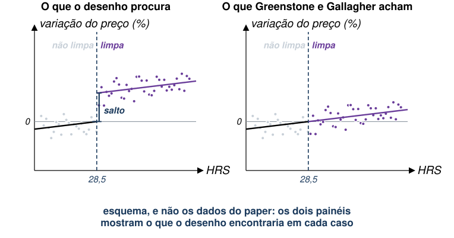{style="height:430px;max-height:430px"}
:::

- À esquerda, o que uma descontinuidade encontraria se a limpeza valorizasse os
  imóveis: um salto no corte de 28,5.
- À direita, o que os autores encontram: nada que se distinga de zero.

## Aplicação III

- Com abordagem mais robusta, encontram efeitos de cerca de **4%**.
- Com RDD, efeito local fica em torno de **2%**.
- [**E nenhum dos dois é estatisticamente distinguível de zero.** Quase duas
  décadas depois, não se rejeita que a limpeza não teve efeito nenhum sobre o
  preço.]{.fragment fragment-index=1}
- [Os benefícios medidos pelo mercado imobiliário ficam **bem abaixo** dos
  US\$ 43 milhões de custo médio por limpeza.]{.fragment fragment-index=2}

## O que aconteceu com os 7%

- Os 7% da primeira regressão não eram o valor do lixão: eram tudo o que anda
  junto com um lixão e não estava nos controles.
- O corte de 28,5 substitui a comparação "perto de lixão contra longe de lixão"
  por "quase entrou na lista contra entrou raspando".
- [Isso não diz que preços hedônicos não funcionam. Diz que $\hat{\alpha }$ só
  vale quando a variação em $q$ não carrega mais nada junto.]{.fragment fragment-index=1}
- [E há uma leitura alternativa, que os autores levantam: talvez os moradores
  simplesmente não acreditassem que a limpeza tivesse reduzido o
  risco.]{.fragment fragment-index=2}

## Exercício: quem compra qual apartamento

::: {.no-bullet}
Os seis apartamentos do começo da aula, com o preço em R\$ mil. Quatro
compradores, cada um valorizando **cada ponto** de qualidade do ar em $s$ mil
reais, sempre o mesmo valor.
:::

::: {.tabela}
| $q$ | 0 | 2 | 4 | 6 | 8 | 10 |
|---|---|---|---|---|---|---|
| Preço | 300 | 304 | 316 | 336 | 364 | 400 |
:::

- **(a)** Com $s = 4, 8, 12$ e $16$, qual apartamento cada um leva?
- **(b)** O comprador com $s=12$ está em qual apartamento? Vale a pena ele subir
  para $q=8$?
- **(c)** Você regride preço contra $q$ nos seis apartamentos. Que inclinação
  obtém?
- **(d)** Essa inclinação é a disposição marginal a pagar de quem?

## Solução

::: {.diagram}
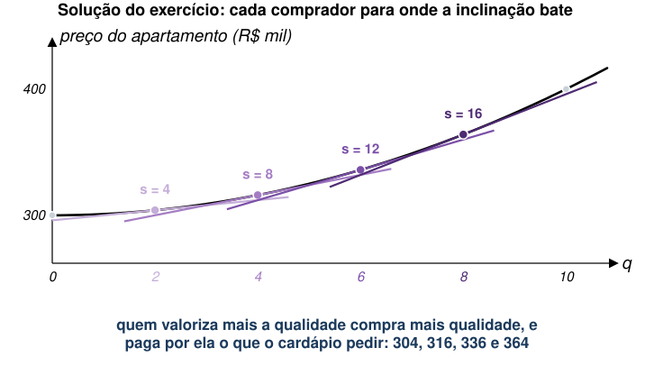{style="max-height:300px"}
:::

- **(a)** Cada um para onde o degrau do cardápio passa a custar mais do que
  $s$ vale: $q = 2, 4, 6$ e $8$, a 304, 316, 336 e 364.
- [**(b)** Ele está em $q=6$. Subir para 8 lhe entrega $12\times 2=24$ e custa
  $364-336=28$. **Não vale**, e ele fica onde está.]{.fragment fragment-index=1}
- [**(c)** A inclinação de MQO é exatamente **10**.]{.fragment fragment-index=2}
- [**(d)** De ninguém desses quatro. É o preço implícito em $q=5$, e nenhum
  comprador está lá.]{.fragment fragment-index=3}

## O que o exercício mostra

::: {.tabela}
| comprador | $s$ | compra $q$ | paga | $P′(q)$ no ponto dele |
|---|---|---|---|---|
| 1 | 4 | 2 | 304 | 4 |
| 2 | 8 | 4 | 316 | 8 |
| 3 | 12 | 6 | 336 | 12 |
| 4 | 16 | 8 | 364 | 16 |
| **MQO** | | | | **10** |
:::

- A coluna da direita bate com a de $s$ em todas as linhas: o modelo funciona, e
  a tangência entrega a disposição marginal a pagar de cada um.
- O 10 da última linha não bate com ninguém, e também não está errado: é a média
  ponderada dos quatro, e é o que uma regressão linear devolve.
- **É por isso que o efeito de RDD de Greenstone e Gallagher é local.** Ele vale
  perto do corte, e não para a cidade inteira.

## Voltando à pergunta da abertura

::: {.no-bullet}
**O apartamento perto do parque custa 15% mais. O que esses 15% medem?**
:::

::: {.opcoes}
- Se a proximidade do parque fosse a única coisa diferente entre os dois
  imóveis, a resposta seria **(a)**: a disposição marginal a pagar de quem
  escolheu morar ali.

- Nunca seria **(b)**: a média da cidade exigiria conhecer as curvas de lance de
  todo mundo, e a regressão só entrega tangências.

- Na prática, quase sempre é **(c)** em parte, e o resto da aula foi sobre como
  saber quanto.
:::

## Concluindo

- A função de preços hedônicos $P(x,q)$ é o **cardápio** do mercado, e é a
  envoltória das curvas de lance e de oferta.
- Sua inclinação em cada ponto iguala a disposição marginal a pagar de quem
  comprou ali com o custo marginal de quem vendeu.
- Estimar $\hat{\alpha }$ dá o preço implícito **médio**, que é uma medida local
  e não a curva de demanda por qualidade ambiental.
- E $\hat{\alpha }$ só mede o bem ambiental se a variação em $q$ não vier
  acompanhada de outra coisa, o que quase nunca é verdade sem um desenho de
  pesquisa.
- Com os três métodos das duas aulas (complementares, substitutos e
  diferenciados), o dano marginal do modelo de custos e danos deixa de ser
  hipótese e passa a ser estimativa.
- [Fica a pergunta: e quando não há mercado nenhum onde procurar, nem viagem,
  nem filtro, nem imóvel?]{.fragment fragment-index=1}

## Referências

::: {#refs}
:::
