## Um apartamento perto do parque custa 15% mais

::: {.no-bullet}
Considere dois apartamentos com a mesma metragem, o mesmo número de quartos e o mesmo
andar. Um está a 500 metros de um parque e custa 15% mais que o outro. O que
esses 15% medem?
:::

::: {.opcoes}
**(a)** A disposição a pagar pelo parque de quem comprou o apartamento mais
próximo.

**(b)** A disposição a pagar média da cidade pelo parque.

**(c)** Nada em particular: bairros com parque tendem a ser melhores em outros
atributos, que também entram nos 15%.
:::

## Aula Passada

- Revisão: Medidas de Bem-Estar
  - Demandas Marshalliana e Hicksiana
  - Variação Compensada e Variação Equivalente
- Como Medir Valor de Bens Ambientais
  - Peculiaridade de Bens Ambientais
- Medidas Indiretas
  - Preferência Revelada
  - Bens Complementares
  - Bens Substitutos

::: {.no-bullet}
Referência: Phaneuf e Requate, caps. 14 e 15
:::

## Agenda

- Bens com qualidade diferenciada
  - Distribuição Observada
- Modelo de Preços Hedônicos
  - Premissas
  - Demanda
  - Oferta
  - Pontos de Equilíbrio
- Estimando Disposição Marginal a Pagar
  - Modelo Econométrico
  - Aplicações

::: {.no-bullet}
Referência: Phaneuf e Requate, caps. 15 e 18
:::

## Onde estamos no curso

:::::: step-map
::: step
**1. Complementares.** O valor da praia aparece no gasto com a viagem.
:::

::: step
**2. Substitutos.** O valor do ar aparece no gasto com o purificador.
:::

::: {.step .now}
**3. Diferenciados.** O valor do ar está **embutido** no preço do apartamento,
que tem mercado próprio.
:::

::: {.step .now}
**4. Novo problema:** separar o efeito do ar do efeito do bairro.
:::
::::::

## Bens com Qualidade Diferenciada {.section-cover}

## Bens com Qualidade Diferenciada {style="font-size:0.94em"}

::: {.no-bullet}
Estudaremos agora o caso em que o bem ambiental afeta o preço do bem privado.
:::

::: {.no-bullet}
**Exemplo 1:** mercado imobiliário.
:::

- Preço de apartamento depende de metragem, nº de quartos, andar.
- Mas também de proximidade do metrô, centro da cidade.
- E, ainda, da qualidade do ar no local, proximidade a um lixão, a um rio
  poluído etc.

::: {.no-bullet}
**Exemplo 2:** salário.
:::

- Salário que trabalhador aceita depende de várias coisas.
- Depende do tipo de trabalho, do esforço esperado.
- Mas também das condições de trabalho: riscos à saúde, qualidade do ar no local
  e outras possíveis insalubridades.

## Bens com Qualidade Diferenciada

::: {.no-bullet}
A diferença deste caso com os dois anteriores é que, agora, o consumidor está
comprando (indiretamente) o bem ambiental.
:::

::: {.no-bullet}
No que segue, trataremos de um modelo teórico para fundamentar o **modelo
empírico de preços hedônicos**.
:::

- Na aula passada, o valor do bem ambiental era inferido do gasto com um bem
  relacionado (viagem, purificador).
- Agora o bem ambiental está **embutido** no preço do imóvel. A tarefa é
  isolá-lo.

## Distribuição Observada

::: {.no-bullet}
Preço por metro quadrado (valor venal) em 2019 e distância ao Ibirapuera.
:::

::: {.diagram}
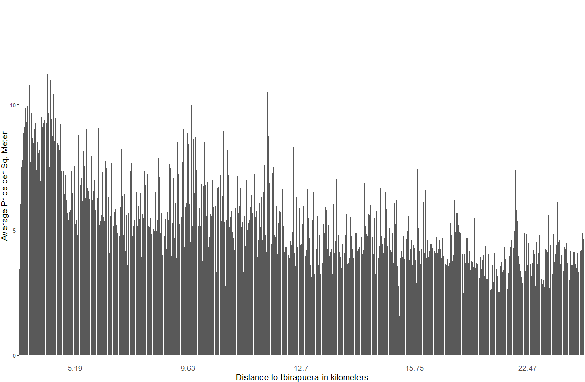{style="max-height:470px"}
:::

## Distribuição Observada

- O preço por metro quadrado cai com a distância ao parque.
- **Mas por quê?** Pelo parque ou pelo que costuma acompanhá-lo?
- [Segurança, escolas, metrô, comércio, renda da
  vizinhança.]{.fragment fragment-index=1}
- [Esse é o problema central da aula. Antes de enfrentá-lo, precisamos de um
  modelo.]{.fragment fragment-index=2}

## Seis apartamentos e uma tabela de preços

::: {.diagram}
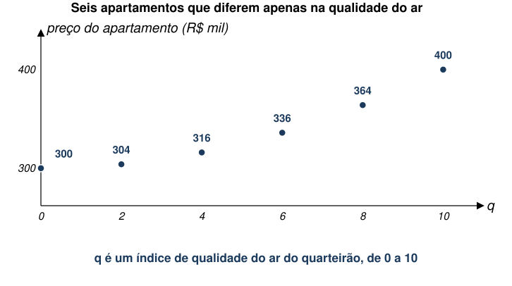{style="height:360px;max-height:360px"}
:::

- Exemplo: seis apartamentos idênticos, exceto pela qualidade do ar $q$ do
  quarteirão.
- O que esses preços dizem sobre o valor do ar limpo?

## O cardápio do mercado

::: {.diagram}
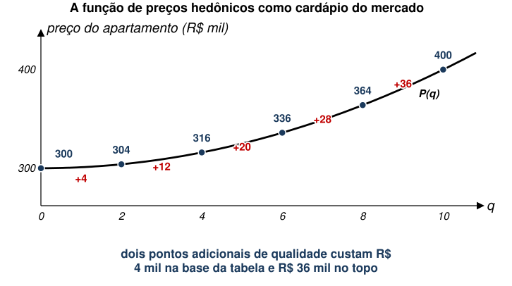{style="height:360px;max-height:360px"}
:::

- Ligando os pontos, obtém-se a **função de preços hedônicos** $P(q)$.
- O acréscimo de preço cresce com $q$: R\$ 4 mil na base, R\$ 36 mil no topo.

## Parece uma curva de demanda, mas não é

::: {.no-bullet}
Se $P(q)$ fosse uma demanda inversa por qualidade do ar, as pessoas pagariam
**mais** por unidade quanto **mais** ar limpo já tivessem. Isso contraria a
teoria do consumidor vista desde a aula 02.
:::

- $P(q)$ **não é** a demanda nem a oferta de nenhum agente.
- $P(q)$ **é** um cardápio: o preço que o mercado cobra por cada nível de $q$.
- Compradores e vendedores tomam $P(q)$ como dada e escolhem **um ponto** da
  curva.

::: {.no-bullet}
[O que interessa é a **inclinação de $P(q)$ no ponto
escolhido**.]{.fragment fragment-index=1}
:::

## O cardápio do café

::: {.no-bullet}
A padaria cobra R\$ 6 pelo café pequeno, R\$ 8 pelo médio e R\$ 11 pelo grande.
Você pede o médio.
:::

- O cardápio tem inclinação crescente: o segundo aumento de tamanho custa mais
  que o primeiro.
- Isso descreve a padaria, não o seu apetite.
- [A **sua escolha** revela: de pequeno para médio vale mais de R\$ 2; de médio
  para grande, menos de R\$ 3.]{.fragment fragment-index=1}
- [O modelo hedônico segue a mesma lógica: apartamentos no lugar de cafés,
  qualidade do ar no lugar de mililitros.]{.fragment fragment-index=2}

## Premissas

- Assume-se que um imóvel possa ser totalmente descrito por um vetor finito de
  características e um termo para o bem ambiental.
  - O vetor $x$ inclui $J$ características.
  - O valor $q$ corresponde ao bem ambiental.
- As preferências dos consumidores são em relação aos atributos, não ao bem
  imóvel em si.
- O preço do imóvel é uma função $P(x,q)$.

## Demanda {.section-cover}

## Demanda

- O consumidor maximiza utilidade $U(x,q,z,s)$.
  - $x$ é o vetor de características não-ambientais;
  - $q$ é o bem ambiental;
  - $z$ é o bem numerário;
  - $s$ representa características pessoais de cada consumidor (preferências
    heterogêneas).
- A restrição orçamentária é dada por $y=P\left(x,q\right)+z$.
- O consumidor resolve:

::: {.eq-block}
$$\max_{x,q,z} U(x,q,z,s) \text{ s.a. } y=P\left(x,q\right)+z$$
:::

## Demanda

- Note que o consumidor pode escolher o valor de $q$.
- Note, também, que qualquer combinação de $x$ e $q$ é possível.
  - Isto é uma abstração: nem sempre é possível escolher cada característica
    separadamente.
- Condições de primeira ordem são:

::: {.eq-block}
$$\frac{\partial U\left(x,q,z,s\right)}{\partial {x}_{j}}=\lambda \frac{\partial P\left(x,q\right)}{\partial {x}_{j}} \qquad \frac{\partial U\left(x,q,z,s\right)}{\partial q}=\lambda \frac{\partial P\left(x,q\right)}{\partial q}$$
:::

::: {.eq-block}
$$\frac{\partial U\left(x,q,z,s\right)}{\partial z}=\lambda$$
:::

## Demanda

- Combinando as 2 últimas CPOs, temos:

::: {.eq-block}
$$\frac{\partial U\left(x,q,z,s\right)/\partial q}{\partial U\left(x,q,z,s\right)/\partial z} = \frac{\partial P\left(x,q\right)}{\partial q}$$
:::

::: {.no-bullet}
À esquerda, a **disposição marginal a pagar por $q$**. À direita, o **preço
marginal implícito de $q$**.
:::

- [Esta é a equação central da aula: iguala algo não observável a algo que se
  estima com dados de transações imobiliárias.]{.fragment fragment-index=1}

## Demanda

- Considere um nível de utilidade de referência $\overline{u}$.
- Defina uma quantidade $b$ a ser gasta com o imóvel de modo que $z=y-b$.
- Assim, teremos:

::: {.eq-block}
$$\overline{u}=U(x,q,y-b,s)$$
:::

- Finalmente, podemos inverter a função para obtermos:

::: {.eq-block}
$$y-b={U}^{-1}(x,q,\overline{u},s)$$
:::

## Demanda

- O objetivo desta manipulação é definir uma "bid function"
  $b\left(x,q,y,s,\overline{u}\right)$.
  - É o lance (oferta) que o comprador fará ao vendedor de um imóvel.

::: {.eq-block}
$$b\left(x,q,y,s,\overline{u}\right)=y-{U}^{-1}(x,q,\overline{u},s)$$
:::

- Por fim, se diferenciarmos
  $\overline{u}=U[x,q,y-b\left(x,q,y,s,\overline{u}\right),s]$ em relação a $q$,
  teremos:

::: {.eq-block}
$$0=\frac{\partial U}{\partial q}-\frac{\partial U}{\partial z}\frac{\partial b}{\partial q}$$
:::

::: {.no-bullet}
(Lembrando que $z=y-b$.)
:::

## Demanda

- Rearranjando os termos, chegamos a:

::: {.eq-block}
$$\frac{\partial U/\partial q}{\partial U/\partial z} = \frac{\partial b\left(x,q,y,s,\overline{u}\right)}{\partial q} = \frac{\partial P}{\partial q}$$
:::

::: {.no-bullet}
Ou seja, conseguimos estimar a **disposição marginal a pagar por $q$** para um
nível de referência fixo de utilidade $\overline{u}$.
:::

## As curvas de lance do consumidor 1

::: {.diagram}
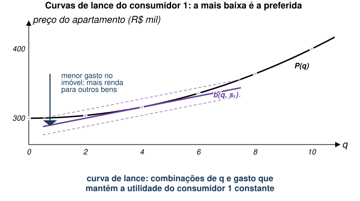{style="height:360px;max-height:360px"}
:::

- Curva de lance: combinações de $q$ e **gasto com o imóvel** com utilidade
  constante.
- O eixo vertical é **gasto**: curva mais **baixa**, utilidade mais **alta**.
- A curva mais baixa não é alcançável: nenhum imóvel é vendido a esse preço.

## A escolha ótima é o ponto de tangência

::: {.diagram}
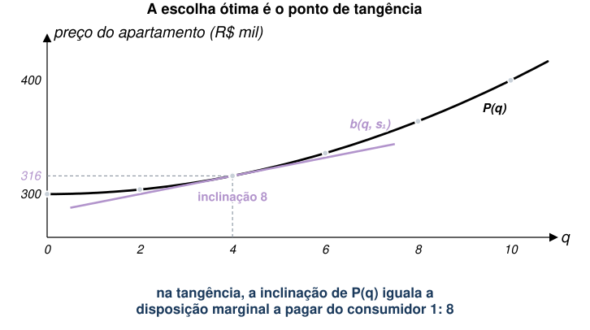{style="height:360px;max-height:360px"}
:::

- A melhor curva alcançável **tangencia** $P(q)$: $q=4$, a R\$ 316 mil.
- Na tangência, $\partial b/\partial q = \partial P/\partial q = 8$: a
  condição de primeira ordem em forma gráfica.

## Dois consumidores, a mesma função de preços

::: {.diagram}
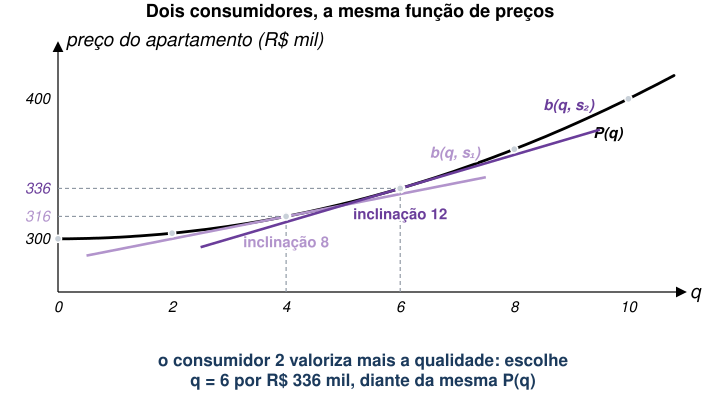{style="height:360px;max-height:360px"}
:::

- O consumidor 2 valoriza mais a qualidade do ar. Escolhe $q=6$, a R\$ 336 mil.
- Ambos enfrentam a **mesma** $P(q)$, mas as inclinações nos pontos escolhidos
  diferem: 8 e 12.

## Oferta {.section-cover}

## Oferta

- E a oferta de imóveis?
- Suponha que uma firma produza cada imóvel a um custo $C(x,q,v)$.
  - $v$ representa características individuais da firma.
- O problema de maximização de lucro será:

::: {.eq-block}
$$\max_{x,q} \Pi =P\left(x,q\right)-C(x,q,v)$$
:::

- Com CPOs $\frac{\partial P}{\partial q}=\frac{\partial C}{\partial q}$ e
  $\frac{\partial P}{\partial {x}_{j}}=\frac{\partial C}{\partial {x}_{j}}$.

## Oferta

- Analogamente ao caso do consumidor, defina uma quantidade $\theta$ que a firma
  está disposta a aceitar pelo imóvel:

::: {.eq-block}
$$\overline{\Pi }=\theta -C(x,q,v)$$
:::

- Novamente, teremos:

::: {.eq-block}
$$\frac{\partial \theta \left(x,q,v,\overline{\Pi }\right)}{\partial q}=\frac{\partial P}{\partial q}=\frac{\partial C}{\partial q}$$
:::

## Oferta: tangência por cima

::: {.diagram}
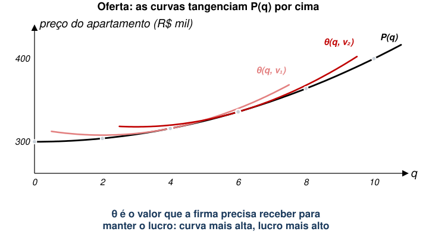{style="height:360px;max-height:360px"}
:::

- $\theta$ é o valor que a firma precisa **receber**: curva mais **alta**,
  lucro mais **alto**.
- Novamente, a melhor curva alcançável é a tangente: a firma 1 oferta $q=4$; a
  firma 2, $q=6$.

## Pontos de Equilíbrio

- O ponto onde há transação entre, por exemplo, o indivíduo 1 e a firma 1 é
  dado por

::: {.eq-block}
$$\frac{\partial b\left(x,q,y,{s}_{1},{u}^{0}\right)}{\partial q}=\frac{\partial \theta \left(x,q,{v}_{1},{\Pi }^{0} \right)}{\partial q}$$
:::

- Esse ponto vai estar associado a um determinado nível de $q={q}_{1}$.
  - E a um valor $P(x,{q}_{1})$ pago pelo imóvel que tem $q={q}_{1}$.

## $P(q)$ é uma envoltória

::: {.diagram}
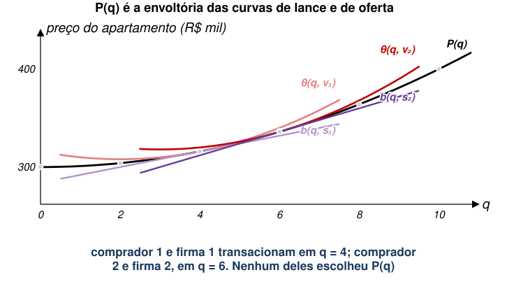{style="height:360px;max-height:360px"}
:::

- Compradores tangenciam $P(q)$ por baixo; vendedores, por cima.
- **Nenhum agente escolhe $P(q)$.** Ela é a envoltória que torna todas as
  tangências compatíveis [@rosen1974].

## A função de preços e sua inclinação

::: {.diagram}
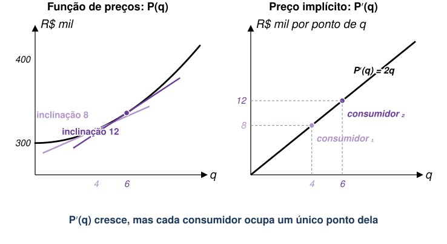{style="height:360px;max-height:360px"}
:::

- $P′(q)$: preço implícito de um ponto adicional de qualidade.
- A demanda individual por $q$ é **horizontal**. A reta crescente apenas ordena
  os consumidores pela valoração do ar limpo.

## Estimando Disposição Marginal a Pagar {.section-cover}

## Estimando Disposição Marginal a Pagar

- No fim, queremos estimar:

::: {.eq-block}
$$MWTP=\frac{\partial P\left(x,q\right)}{\partial q}$$
:::

- Como?

## Estimando Disposição Marginal a Pagar

- Suponha que você tenha dados sobre o preço de cada imóvel na cidade e suas
  características.
- Suponha, ainda, que o preço é uma função linear das características.
- Então, temos:

::: {.eq-block}
$${p}_{i}=f\left({X}_{i},{q}_{i},{\varepsilon }_{i},\beta \right)={\beta }_{0}+\sum_{j=1}^{J} {\beta }_{j}{x}_{j}+\alpha {q}_{i}+{\varepsilon }_{i}$$
:::

## Estimando Disposição Marginal a Pagar

- Qual é o parâmetro estimado de interesse?

::: {.eq-block}
$$\alpha =\frac{\partial p}{\partial q}$$
:::

- Ao estimarmos o modelo, temos:

::: {.eq-block}
$${\hat{p}}_{i}={\hat{\beta }}_{0}+\sum_{j=1}^{J} {\hat{\beta }}_{j}{x}_{j}+\hat{\alpha }{q}_{i}$$
:::

- E $\hat{\alpha }$ é a estimativa da disposição marginal a pagar por $q$.

## De quem é essa disposição a pagar?

::: {.diagram}
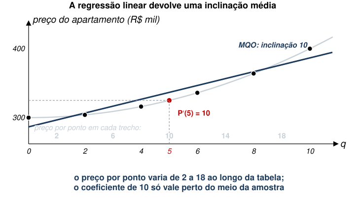{style="height:360px;max-height:360px"}
:::

- MQO nos seis apartamentos do exemplo: $\hat{\alpha }=10$, exatamente.
- $\hat{\alpha }$ é uma **média**: o preço implícito em $q=5$, o meio da
  amostra.

## Duas advertências distintas

::: {.cmp}
| | problema | tratamento |
|---|---|---|
| Interpretação | $\hat{\alpha }$ é o preço implícito no ponto médio, não a demanda por $q$ | tratar a medida como local; não extrapolar |
| Identificação | variáveis omitidas em $\varepsilon$ podem ser correlacionadas com $q$ | buscar variação em $q$ quase aleatória |
:::

- A primeira é um problema de **interpretação**: existe mesmo com dados
  perfeitos.
- A segunda é um problema de **identificação**: compromete a maioria das
  estimativas hedônicas.
- [A alternativa (c) da votação inicial refere-se à
  segunda.]{.fragment fragment-index=1}

## Aplicação I

::: {.no-bullet}
[@ramirez2022] estudam disposição a pagar para morar próximo a áreas verdes em
Sevilha.
:::

- Dados: mil anúncios de imóveis da cidade (preço, área útil, cômodos, idade,
  banheiros).
- Variável ambiental: tamanho da área verde próxima, medida por sistema de
  informação geográfica.

## Aplicação I

- Proximidade a áreas verdes aumenta valor da propriedade.
- Coeficiente é medida de disposição marginal a pagar por áreas verdes.
- [O trabalho compara diversas formas funcionais. A significância das variáveis
  depende do modelo escolhido.]{.fragment fragment-index=1}
- [Isso antecipa as próximas aplicações: a fragilidade não está na teoria, mas
  no que permanece no termo de erro.]{.fragment fragment-index=2}

## Aplicação II

::: {.no-bullet}
[@chakraborty2023] analisam o valor de estruturas para conter erosão do solo, na
Nigéria.
:::

- Efeito no preço dos lotes agrícolas.
- Mede-se como esse valor varia dependendo da exposição dos lotes a climas mais
  úmidos.
  - Mais chuvas causam mais erosão, elevando o valor de tecnologias adaptativas.
- Dados: valor da terra declarado pelos domicílios na pesquisa de padrão de
  vida da Nigéria (2015-2016 e 2018-2019).

## Aplicação II

- Controle de erosão tem valor maior em regiões com chuvas mais intensas.
- Preço implícito estimado: cerca de **26% do valor médio da terra**,
  equivalente a meio ano de renda de um domicílio agrícola.
- Em locais com chuvas extremas, não parece haver efeito. Por quê?
  - Pode ser que controle de erosão seja impraticável nessas áreas.

::: {.no-bullet}
[O preço implícito **varia com o contexto**, como prevê o modelo: a inclinação
de $P(q)$ não é constante.]{.fragment fragment-index=1}
:::

## Aplicação III

::: {.no-bullet}
[@greenstone2008] estudam disposição a pagar por morar perto de locais de
descarte de lixo tóxico.
:::

- Exploram uma política de limpeza desses locais implementada na década de 1980
  nos EUA, o programa Superfund.
- Ideia é que locais afetados pela limpeza experimentariam aumento de preço do
  imóvel.
- Este aumento poderia ser atribuído à eliminação da externalidade negativa.
- [Até 2000, foram gastos cerca de US\$ 30 bilhões em limpezas, com custo médio
  de US\$ 43 milhões por local.]{.fragment fragment-index=1}

## Aplicação III

- Autores fazem primeiro uma regressão de preços hedônicos baseada na distância
  aos lixões tóxicos.
- Encontram que a limpeza aumentaria preço em cerca de **7%**.
  - Após controlar pelas características dos imóveis.

::: {.no-bullet}
Trata-se exatamente da estimativa prescrita pelo modelo desta aula. A questão
parece resolvida.
:::

## Aplicação III

- Entretanto, há alguns problemas.
  - Primeiro, locais que receberam a política podem ser muito diferentes de
    outros lugares por diversos motivos.
  - Segundo, as estimativas variam muito dependendo da amostra e dos controles
    escolhidos.
- Sendo assim, voltam-se para uma abordagem mais robusta.

## Aplicação III

- Aproveitam o fato de que a política criou quase-aleatoriedades.
  - Alguns locais foram "tratados" antes dos outros por conta de regra
    arbitrária.
- Com orçamento limitado, a Environmental Protection Agency (EPA) dos EUA
  selecionou os **400 locais** de descarte de lixo tóxico **mais perigosos**.
  - Estes locais foram priorizados para limpeza, deixando os outros para depois.
  - São locais que receberam uma nota 28,5 ou mais na escala criada pela EPA.
- Ideia é comparar locais priorizados com os outros.
  - Provavelmente, são mais comparáveis do que locais que não precisam de
    limpeza.

## Desenho de descontinuidade e resultado

::: {.diagram}
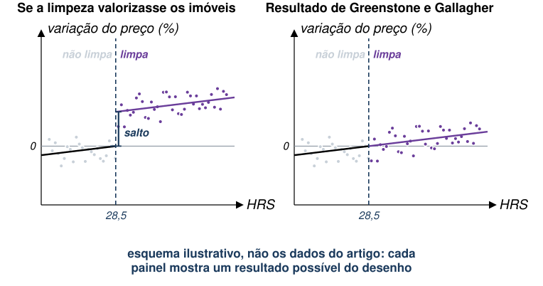{style="height:380px;max-height:380px"}
:::

- À esquerda, o resultado esperado caso a limpeza valorizasse os imóveis: um
  salto no corte de 28,5.
- À direita, o resultado dos autores: nenhum salto distinguível de zero.

## Aplicação III

- Com abordagem mais robusta, encontram efeitos de cerca de **4%**.
- Com RDD, efeito local fica em torno de **2%**.
- [**Nenhuma das duas estimativas é estatisticamente diferente de zero.** Não se
  rejeita a hipótese de efeito nulo da limpeza sobre o preço, mesmo duas
  décadas depois.]{.fragment fragment-index=1}
- [Os benefícios captados pelo mercado imobiliário ficam **muito abaixo** do
  custo médio de US\$ 43 milhões por limpeza.]{.fragment fragment-index=2}

## O que aconteceu com os 7%

- Os 7% da primeira regressão não mediam o valor da limpeza. Capturavam o que se
  correlaciona com a proximidade do lixão e não estava nos controles.
- O corte de 28,5 substitui a comparação "perto contra longe do lixão" por
  "logo acima contra logo abaixo do corte".
- [Isso não invalida o método de preços hedônicos. Mostra que $\hat{\alpha }$
  só é válido se a variação em $q$ não for correlacionada com outros
  determinantes do preço.]{.fragment fragment-index=1}
- [Leitura alternativa, levantada pelos autores: os moradores talvez não
  acreditassem que a limpeza tivesse reduzido o risco.]{.fragment fragment-index=2}

## Exercício: quem compra qual apartamento {style="font-size:0.94em"}

::: {.no-bullet}
Considere os seis apartamentos do início da aula (preços em R\$ mil) e quatro
compradores. Cada comprador valoriza **cada ponto** de qualidade do ar em $s$
mil reais, valor constante.
:::

::: {.tabela}
| $q$ | 0 | 2 | 4 | 6 | 8 | 10 |
|---|---|---|---|---|---|---|
| Preço | 300 | 304 | 316 | 336 | 364 | 400 |
:::

- **(a)** Com $s = 4, 8, 12$ e $16$, qual apartamento cada um leva?
- **(b)** Em qual apartamento está o comprador com $s=12$? Vale a pena passar
  para $q=8$?
- **(c)** Estime por MQO o preço contra $q$ nos seis apartamentos. Qual é a
  inclinação? Lembre que
  $\hat{\alpha }=\dfrac{\widehat{\mathrm{Cov}}(q,P)}{\widehat{\mathrm{Var}}(q)}=\dfrac{\sum_{i}({q}_{i}-\bar{q})({P}_{i}-\bar{P})}{\sum_{i}{({q}_{i}-\bar{q})}^{2}}$.
- **(d)** Essa inclinação é a disposição marginal a pagar de qual comprador?

## Solução {.smaller}

::: {.diagram}
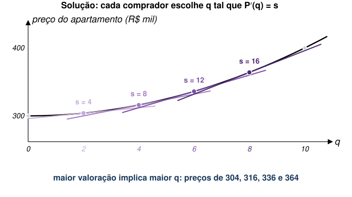{style="height:360px;max-height:360px"}
:::

- **(a)** Cada comprador sobe enquanto o acréscimo de preço for menor que $2s$:
  $q = 2, 4, 6$ e $8$, a 304, 316, 336 e 364.
- [**(b)** Está em $q=6$. Passar a $q=8$ gera $12\times 2=24$ e custa
  $364-336=28$. **Não vale a pena.**]{.fragment fragment-index=1}
- [**(c)** Inclinação de MQO: exatamente **10**.]{.fragment fragment-index=2}
- [**(d)** De nenhum dos quatro. É o preço implícito em $q=5$, ponto que nenhum
  comprador escolheu.]{.fragment fragment-index=3}

## O que o exercício mostra

::: {.tabela}
| comprador | $s$ | compra $q$ | paga | $P′(q)$ no ponto escolhido |
|---|---|---|---|---|
| 1 | 4 | 2 | 304 | 4 |
| 2 | 8 | 4 | 316 | 8 |
| 3 | 12 | 6 | 336 | 12 |
| 4 | 16 | 8 | 364 | 16 |
| **MQO** | | | | **10** |
:::

- A última coluna coincide com $s$ em todas as linhas: a tangência revela a
  disposição marginal a pagar de cada comprador.
- O 10 da linha de MQO não corresponde a nenhum comprador, mas não está errado:
  é a média que a regressão linear devolve.
- **Por isso o efeito de RDD em Greenstone e Gallagher é local:** vale perto do
  corte, não para a cidade inteira.

## Voltando à pergunta da abertura

::: {.no-bullet}
**O apartamento perto do parque custa 15% mais. O que esses 15% medem?**
:::

::: {.opcoes}
- Se a proximidade do parque fosse a única diferença entre os imóveis, a
  resposta seria **(a)**: a disposição marginal a pagar de quem escolheu morar
  ali.

- Nunca seria **(b)**: a média da cidade exigiria conhecer as curvas de lance de
  todos os moradores. A regressão revela apenas tangências.

- Na prática, a resposta é quase sempre **(c)**, em parte. 
:::

## Concluindo

- A função de preços hedônicos $P(x,q)$ é a **envoltória** das curvas de lance
  e de oferta.
- Em cada ponto, sua inclinação iguala a disposição marginal a pagar do
  comprador ao custo marginal do vendedor.
- $\hat{\alpha }$ estima o preço implícito **médio**: medida local, não a curva
  de demanda por qualidade ambiental.
- $\hat{\alpha }$ só mede o valor do bem ambiental se a variação em $q$ não for
  correlacionada com outros determinantes do preço.
- Os três métodos (complementares, substitutos, diferenciados) permitem estimar
  o dano marginal do modelo de custos e danos.

## Referências

::: {#refs}
:::
